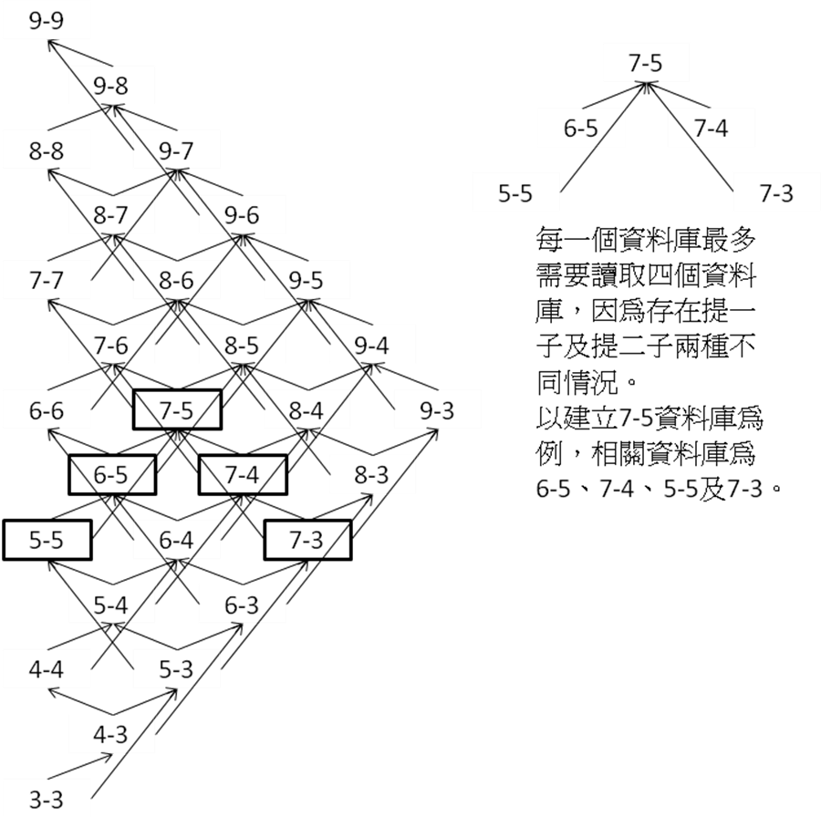
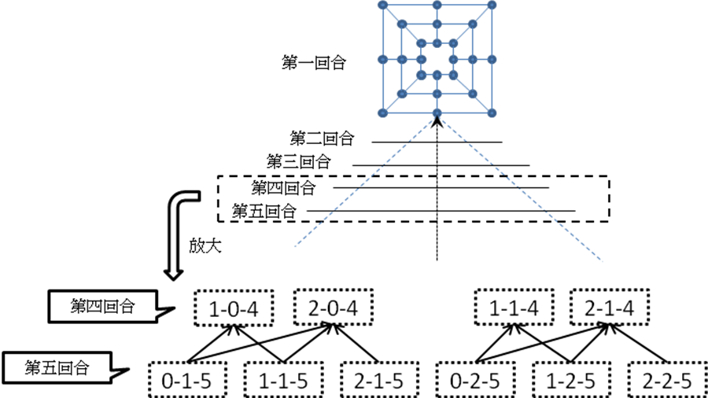

台湾直棋的胜负问题之研究
-----------------------------------------

台湾师范大学
资讯工程研究所硕士论文

指导教授：林顺喜 博士

The Study of the Taiwan Morris games
研究生： 李明臻 撰

2012年1月

摘要
=====

台湾直棋的胜负问题之研究

李明臻

计算机棋类游戏在人工智能领域中是很重要的，各种棋类游戏研究层出不穷。直棋(Morris)游戏属于双人游戏的一种，自从 Ralph Gasser 教授在 1996 年提出破解 Nine Men\'s Morris的结果之后，有关 Morris games 更高一层或其它版本的研究，相关文献就十分少见。

台湾规则的直棋游戏是 Twelve Men\'s Morris 在台湾的变体。在本论文中，我们使用 CPU 规格为 Intel Xeon E5520 2.27GHz (双处理器)，内存总量为 36GB 的机器，证明了台湾规则的直棋游戏在开始双方各拿六子及九子的情况，其结果都为和棋。

我们除了找到台湾规则的直棋游戏在开始双方各拿六颗棋子及九颗棋子的胜负结果是和棋，更从破解 Nine Men\'s Morris 的方法中，在放子阶段提出跟原本作法不同的破解方法。在研究台湾规则的直棋游戏的过程中，找到了将数据库分割得更细的方法以及加速旋转对称运算的方法，并且将其运用在数据库技术及回溯分析算法上。

关键词：计算机直棋、回溯分析算法、人工智能

**ABSTRACT**
============

The Study of the Taiwan Morris games
by
Li, Ming-Zhen

Computer chess games are very important in the field of artificial intelligence. There are very few research results on Morris in higher dimensions or in other variations since Professor Ralph Gasser solved Nine Men\'s Morris in 1996.

The board of Taiwan Morris game is same as the board of Twelve Men\'s Morris. In this thesis, a personal computer equipped with AMD Athlon64 X2 4000+ 2.1GHz CPU and 36 GBytes RAM is utilized to conduct our experiments. Thus, it gets the results of Taiwan Morris game that each player starts with six or nine pieces are a first-player draw.

In addition, we find some skills for improving the performance of our programs. We used retrograde analysis algorithm and databases in the opening stage of Taiwan Morris games. We also describe some methods employed to accelerate the calculation, such as rotation and symmetry permutation.

致谢
=====

感谢指导教授林顺喜博士，指导本论文之研究内容及写作方向，并且教导许多算法与人工智能领域相关的知识。

还要感谢在实验室里的其它成员给予的帮助，感谢潘典台学长、魏仲良学长、黄士杰学长、黄立德学长、庄台宝学长、赵义雄学长、刘云青学长、白圣群学长、叶俊廷学长和黄信翰学长，感谢詹杰淳同学、赖昱臣同学、谢政孝同学、陈俊佑同学、李启峰同学和陈冠明同学，感谢劳永祥学弟、陈志宏学弟、蔡宗贤学弟、唐心皓学妹、林立学弟、施宣丞学弟和李万和学弟。

特别感谢林顺喜教授，以及潘典台学长、黄士杰学长跟劳永祥学弟在实作程序时给予我良好的建议及方向。

最后感谢我的家人包容我的一切失败，尽心尽力地支持我的一切需要，让我无所顾忌的投入研究之中，直到我顺利完成学业，仅将此论文献给我敬爱的父母。

第一章 绪论
=============

第一节 简介
-------------
直棋 (Morris) ，是起源于公元前一千四百年的古埃及，相传是罗马经由贸易将直棋游戏流传于各国。直棋游戏为一个双人游戏，通常棋盘为同心的数个正方形，并用直线或斜线将不同的正方形相连结，如图 1-1。

直棋 (Morris) 游戏广泛流传于世界各地，因而发展出各种不同规则的变形游戏，流传于华人地区的是 Twelve Men\'s Morris 的变体。在各地有不同名称，例如：闽台称为直棋、放直棋、行直棋，闽南语俗谚『仙棋乞丐直』，意思是下棋是有钱有闲人的娱乐，没钱的穷苦民众只能以简单的直棋自娱。北京称为连儿棋；四川称为三棋；湘西土家族称为打三棋，其他地区还有花窗棋、删棋、三子棋等称呼。

图1-1 Twelve Men\'s Morris盘面

各地直棋游戏变体都依循的共通游戏规则为开始将手中的棋子以双方轮流的顺序放入棋盘上。当手中的棋子都已经放完后，才可以移动棋子。因此直棋游戏至少拥有两个不同阶段。如果造成三个己方棋子连成一线，俗称此情况为“直”，就可以拿掉棋盘上对方的一颗棋子，并且拿掉的棋子不能再放回棋盘上，本篇论文将拿掉棋盘上对方棋子的行为称为“吃子”。

图1-2 “直”的图示

第二节 研究动机
-----------------

Ralph Gasser \[1\]\[2\] 利用回溯分析法及建立残局库的方式，证明了 Nine Men\'s Morris 的结果为和棋，而台湾直棋流行于台湾地区已经很久，却一直都鲜有人对其研究。因此我们参考 Ralph Gasser 的作法加以改良为适合台湾直棋的算法，进而证明台湾直棋的结果。

由于台湾直棋的状态空间复杂度是 O(3^24)≈O(2^39^)，如何运用现阶段的计算机解决台湾直棋的胜负问题，就变成一种有挑战性的问题。在解决此类问题时，需要使用到辅助内存来帮助我们解决，而我们在探索及尝试各种算法增进破解台湾直棋程序的速度时，所发现的方法，也期望能运用在其它相似的棋类游戏破解之上，从而在计算机博弈领域中贡献绵薄之力。

第三节 论文组织
-----------------

本论文共分为六章。第一章为绪论，简述前言、研究动机及论文架构。第二章介绍什么是台湾直棋及先前跟直棋相关的研究，并说明其基础理论及如何应用。第三章介绍一些破解台湾直棋所使用到的算法及其设计理念。第四章介绍尝试加速破解台湾直棋程序的方法。第五章为我们的研究成果。第六章为结论及未来研究方向。

第二章 相关研究探讨
=====================

第一节 台湾直棋
-----------------

各种不同地区的直棋(Morris)游戏的规则都存在着些许的不同，在此篇论文主要研究的问题是直棋的台湾规则，于此篇论文称之为台湾直棋。台湾直棋是 Twelve Men\'s Morris 的变体之一，依照 Twelve Men\'s Morris的规则双方各有 12颗棋子，其棋盘是由 24 个点组成的三同心的正方形，直斜线交叉，棋盘上有穿越正方形的线有八条，沿正方形边而成的线有十二条。

图2-1 Twelve Men\'s Morris 盘面

Twelve Men\'s Morris 游戏规则为开始双方手中各拥有 12 颗棋子，轮流将棋子放置于棋盘之上，当双方手中已经无棋子时，就开始轮流移动棋盘上的棋子。

Twelve Men\'s Morris 在游戏过程中只有一种“吃子”情况，即为“直”。当在放置棋子的阶段发生“直”时，限制不能吃掉三颗棋子连成一线中的任何一颗棋子；当在移动棋子的阶段发生“直”时，则无此限制。游戏进行至某一方无棋子可移动或是盘面上的棋子少于两颗，则该方判定为输。

台湾直棋游戏规则特别之处在于游戏进行中发生吃子的情况，除了“直”之外还有“担”和“杠”，并且于游戏过程中，同时满足多种可以吃子的情况时，只能选择一种吃子情况来吃子。

“直”：当己方主动有三颗棋子连成一线，吃掉对方任何一枚棋子。如图 2-2。

图2-2 “直”的图示，当黑方产生此情况时，可以拿掉盘面上任一白方棋子

“杠”：当己方主动在穿越矩形的在线有两枚棋子夹住一枚敌棋，吃掉对方该枚棋子。“杠”只能限定在八条穿越正方形的放射在线，而不能发生在围成正方形的线段上。如图 2-3。

图2-3 “杠”的图示，黑方玩家将棋子移到圆圈的位置可以吃掉中间的棋子

“担”：当己方主动在沿着正方形的线段上有一枚棋子至两枚敌棋的中间，吃掉敌方该两枚棋子。“担”只能限定在围成正方形的线段上。如图 2-4。

图2-4 “担”的图示，白方玩家将棋子移到圆圈的位置可以吃掉左右两边的黑棋

台湾直棋游戏一开始的阶段于此篇论文称为放子阶段，放子阶段双方轮流放置手上的棋子于棋盘之上。在放子阶段时，将棋子放置于棋盘上线段的交叉点上，但不可放置在已经有棋子的点上，已放置的棋子在此阶段是不可移动的。因此在此阶段等同于为接下来的行子阶段先布局，此阶段也可以产生三种“吃子”的情况，而且在此阶段不会产生结束盘面。

当手中无棋子时，开始移动盘面上的棋子，于此篇论文称为行子阶段，于行子阶段时不会再增加盘面上双方的棋子数，双方开始利用移动盘面上的棋子来产生“吃子”的情况，直到某方棋子数量少于三个或是某方没有可以移动的棋子时，就判定为输棋，此时就结束游戏。移动棋子方式限定只能将棋子沿着线段往临近的交叉点上移动，当两个交叉点间没有线段连接的状况，则棋子不能由两点中一点往另一点移动。

图2-5 直棋游戏最短的循环路径

因为双方轮流移动棋子，所以有机会发生走过的盘面又再一次出现，造成循环的盘面，如图 2-5所示。在双方都不改变行子方式的情形下有可能产生和棋的结果。

自从 Ralph Gasser 在 1996 年提出破解 Nine Men\'s Morris 的结果之后，一直都没有人对于台湾直棋研究其胜负结果，本论文参考 Nine Men\'s Morris 的作法，并且加以改良，得到六子及九子的台湾直棋结果为和棋。

第二节 直棋(Morris)相关研究成果
---------------------------------

1982年，许舜钦教授于台湾大学工程学刊上发表了\"直棋的计算机解法及其实现\"论文\[7\]，其中所指的“直棋”为台湾本土所流行的台湾直棋。于论文中描述利用计算机来下台湾直棋所采用的数据结构，以及算法、思考策略。其中强调一个强而有力的估值函数。

估值函数是对盘面上的棋子分布加以估值。当棋子将被置于盘面上某一点时，盘面上原有各棋子都受其影响而发生作用，依其远近距离之不同，这些作用可以分成三类：

1. 直接作用：与置放点同一直在线的棋子发生直接作用；

2. 间接作用：与直接作用点同一直在线的棋子发间接作用；

3. 微弱作用：盘面上的其它各位置上的棋子，对于目前放置的棋子，仅有微弱作用。

对于各个作用的支线上也有各种不同的情况出现。将这些不同情况加以整理，得出 15 个具体的等级：

1. 提取对方两子；

2. 解除对方提取两子的威胁；

3. 提取对方一子；

4. 解除对方提一子的威胁；

5. 强烈威胁提子(对方无法防守)；

6. 威胁对方两子；

7. 威胁提子；

8. 阻止对方发展；

9. 使我方具有发展性；

10. 稍有利于我方；

11. 平分秋色；

12. 稍不利于我方；

13. 对方有发展性；

14. 受对方提一子的威胁；

15. 受对方提两子的威胁。

把直接作用支线与间接作用支线依其不同情况，加总统计利弊得失，借此可找出较最佳着法。

实作程序的观察力略约可算是和一般人不相上下了，但是由于全盘周详的考虑使程序显得比一般人还细心，因此程序的得胜率高达八成。但是其程序尚未能产生最佳着法。

1996 年，Ralph Gasser 教授发表了《Solving Nine Men\'s Morris》论文 [2\]，于此论文中，运用 retrograde analysis、endgame databases 跟 alpha-beta search 的方法解决 Nine Men\'s Morris 的问题。求解 Nine Men\'s Morris 过程中依照 Morris 的游戏特性分成两阶段求解，在放子阶段使用 alpha-beta search算法，在行子阶段使用 retrograde analysis 算法及 endgame databases 的技术。

在放子阶段不会出现循环盘面并且使用树搜寻的深度固定，但因为计算机硬件的限制，Ralph Gasser 针对 Nine Men\'s Morris问题提出了减少程序内存使用量的方法。

Nine Men\'s Morris 游戏的放子阶段共有十八回合，即双方手中各九颗棋子并且轮流放置棋子到盘面上，去除不可能产生的盘面，将所有在行子阶段经由回溯分析算法求得的结果读入内存里还需要 9 GB 的内存空间。

首先改善数据库在内存储存方式以缩小内存使用空间，于数据库里储存的信息包括盘面胜负值、至结束盘面所需最少回合数等，但在放子阶段并不需要计算至结束盘面所需最少回合数，因此在将数据库读进内存时，不需要读最少回合数。

盘面胜负结果有“赢”、“输”跟“和”三种，因此一个盘面的“胜”、“负”跟“和”都会用到 2 Bits 的空间储存。每一个不同盘面都有其胜负结果，因为盘面数量还是太过庞大，以致于还是无法将数据库完全存入内存内。为了解决内存的问题，更进一步使用 1 Bit 来表示盘面胜负值，将八个盘面胜负结果使用 1 Byte 储存，如此可以原需要 9 GB 的内存空间压缩成 1 GB 的内存空间。

图2-6 储存盘面胜负结果示意图

1 Bit 的空间只能表示两种状态，为配合数据库盘面胜负结果以 1 Bit 储存的方式写入内存，特别将搜寻算法进行改良。搜寻的目的是想要搜寻在一开始的盘面先手是必胜、必输还是和棋，原本只要搜寻一次的算法，为了配合减少内存的使用，而改变为搜寻两次，第一次搜寻先手是否必胜，将盘面的胜负结果储存为先手胜或是先手不会胜两种状态，第二次搜寻先手是否必败，将盘面的胜负结果储存为先手必败或是先手不会必败两种状态，经过两次搜寻之后，就可以确认先手是必胜、必败或是和棋。

观察玩家实际玩 Nine Men\'s Morris 的情形，发现到放子阶段结束时的盘面大多是盘面上还存在的白子跟黑子数量都为九子或八子的盘面，在求解放子阶段时，能将需要读取的行子阶段数据库缩减至8子对9子、9子对8子、8子对8子的数据库，这样一来将需要的内存空间缩减至 115 MB，而对于不存在于8子对9子、9子对8子或8子对8子数据库的盘面利用估值函数的方式给与一个值。

图2-7 放子阶段搜索树示意图

为了减少读取数据库的次数，特别在搜索树第十六层的地方加上 Transposition table，因为为所有层数都制作 Transposition table 会过于庞大，所以只在第十六层，并且在搜索树的前八层制作一个开局库，先计算出所有可能出现的盘面和到达盘面的路径，如此可以减少计算机计算的时间，以加速求解 Nine Men\'s Morris 问题的速度。

第三节 回溯分析算法
---------------------

回溯分析算法是利用已知的结果反过来推出前一个情况结果的方法，从最后结果开始反过来寻找前一个情况的结果，最理想情况可以一路反过来推到一开始的状态。回溯分析算法最常被用来解决棋类游戏中盘面循环的问题，而直棋游戏在行子阶段就存在盘面循环的问题，即于游戏过程中存在回到已经走过盘面的问题。

计算 Nine Men\' s Morris 问题行子阶段的所有盘面结果，依照回溯分析算法的程序：

- 初始化

- 输盘面回溯

-   赢盘面回溯

初始化即产生所有盘面，并且赋予每一个盘面一个值表示“赢”、“输”、“和”或“未知”。跟据 Nine Men\'s Morris的游戏规则决定初始盘面的值，例如某方棋子已经无空位可以移动就可以将其设为已输盘面。

图2-8 输盘面回溯的示意图

第二步搜寻输的盘面，由盘面胜负值为输的盘面可以回溯至上一个盘面并设定上一个盘面胜负值为赢。较直觉的想法就是在上一个盘面时，知道有一种走法可以走到对方必输的盘面，那么只要选择该走法，己方必定会赢。

图2-9 赢盘面回溯示意图

第三步搜寻赢的盘面，现实玩家都会避免走到让对方会赢的盘面，因此在赢盘面回溯至上一个盘面的时候，程序必需要判断上一个盘面的其它还可选择的走步是否都是已知结果为赢的盘面。

一直不断循环第二步和第三步直到最后所有盘面的胜负结果都不变才停止程序，最后储存结果时，将未知跟和都存为和棋。

本论文将一个盘面可以产生的所有结果为非赢的盘面数量称之为“分支度“，Ralph Gasser在赢盘面回溯程序时，为每一个赢盘面回溯至的盘面额外增加一个内存空间用来储存该盘面的分支度。

每一个赢盘面在回溯到前一个盘面时，都会读取前一个盘面的分支度，并将其分支度减一，当分支度降至为零时，表示前一个盘面的所有可以产生的盘面胜负结果都为赢，就可以将前一个盘面的胜负结果设为输。

Ralph Gasser 使用一个 buffer 来储存已知结果为“赢”跟已知结果为“输”的盘面，初始化时将判定输赢的盘面存入 buffer。当初始化结束之后，从 buffer 里取出一个盘面，若盘面胜负结果为“输”，则进行输盘面回溯程序，并且将原本结果“未知”改变为“赢”的盘面在存入 buffer；若盘面胜负结果为“赢”，则进行赢盘面回溯程序，并且将原本结果“未知”改变为“输”的盘面在存入 buffer。直到存在 buffer 里面的盘面都被取出来计算后就停止程序，当 buffer 里的盘面数量变为零时，就表示完成赢盘面回溯及输盘面回溯后没有改变任何盘面胜负结
果。

第四节 残局库
---------------
Nine Men\'s Morris 行子阶段的所有盘面数量非常的庞大，如果要一次处理所有的盘面几乎是不可能的事，因此如何将盘面分开来处理就变的非常重要了，在《Applying Retrograde Analysis to Nine Men\'s Morris》论文中，将残局库以盘面上双方子力数量分割成许多小数据库。

在行子阶段时，移动棋子可能产生可以吃子的情况，本论文中称之为“吃子步”；而移动棋子不能产生可以吃子的情况，则称之为“走子步”。“吃子步”是不会造成盘面循环的情形，因为被吃的棋子不能再回到棋盘上，而“走子步”因为盘面双方棋子都不会减少，很有机会产生盘面循环的情形。依照“吃子步”跟“走子步”的特性以双方棋子数量为分割依据将数据库分割成较小的数据库。

图2-10 Ralph Gasser 的数据库分类

不同数据库之间以“吃子步”连结，五子对四子的盘面只可能会到达四子对四子或是五子对三子两种盘面，因此数据库的相互关系链接如图 2-10。又因为利用回溯分析算法来求盘面胜负结果，所以是从三子对三子的盘面开始慢慢一步一步往双方更多棋子的盘面回溯。

相同棋子的盘面还可以分为轮到黑方移动棋子和轮到白方移动棋子两种，双方子力分布跟攻守互换，得到的答案也会是相同。例如黑方现在拥有四子，白方拥有三子的盘面轮到黑方移动棋子的结果是黑方赢，棋子的位置不变，将黑色棋子变白色，白色棋子变黑色，轮到黑方变成轮到白方移动棋子，则最后结果仍是白方赢。数据库里存的是盘面的棋子跟现在是轮到哪一方移动棋子，因为黑白双方互换也可以得到相同的结果，所以四子对三子的数据库可以当作三子对四子使用。

图2-11 A 跟 B 的盘面胜负结果其实是相同

Ralph Gasser 证明了 Nine Men\'s Morris 是先手必和的游戏，在放子阶段运用了 alpha-beta search 算法；在行子阶段运用了回溯分析算法跟残局库。在此基础上，我们为了得知台湾直棋游戏是先手必胜、先手必败还是和棋的问题，特别针对台湾直棋的特性对回溯分析算法及残局库进行改良。

第三章 如何破解台湾直棋
=========================

台湾直棋是 Twelve Men\'s Morris 的变体的一种，流行于台湾地区的乡土游戏，双方各有 12 颗棋子，其棋盘是由 24个点组成的三同心的正方形，直斜线交叉，棋盘上有穿越矩形的线有八条，沿矩形的线有十二条。有三种方式可以吃子，“直”之外还有“担”和“杠”，于两阶段都可以适用三种吃子方式，当满足两种以上吃子情况时，只能选一种方式吃子。

以下列出台湾直棋的规则：

-   台湾直棋为 2 人玩之游戏棋，双方各执 12 个棋子；
-   开始时每人每次下一个棋子于棋盘上，若三个棋子成一直线则可拿掉对方任何一颗棋子；
-   若己方主动造成“担”的情形，则可拿掉左右对方的棋子；
-   若己方主动造成“杠”的情形，则可拿掉中间对方的棋子；
-   待 12 个棋子下完，则可移动己方任何一个棋子，使成上述情况直到对方只剩
    2 个棋子时为胜方。

本论文中特别为台湾直棋将《Solving Nine Men\'s Morris》所提到的算法加以修改成适合台湾直棋，并且加入提升指令周期的方法。

第一节 回溯分析算法的改良
---------------------------

回溯分析算法主要分成两个部分，即初始化部分跟回溯部分，在初始化时需要产生所有盘面，并给予一个值表示盘面胜负。决定盘面胜负的方式依照规则来决定，有两个规则可以在初始化就决定胜负结果，其一为轮到走子的那方无棋子可以移动时，判定该方为输，其二为当轮到走子的那方于盘面上的棋子数少于三颗时，判定该方为输。

当产生的盘面存在吃子步时就需要读取吃子步产生盘面的数据库，为了准确的判断此盘面的胜负结果，需要将所有吃子步生成的盘面都看一次，如果吃子步生成的盘面有一个的胜负结果为输，则可以将产生的盘面胜负结果设定为赢。但是如果每一个吃子步生成的盘面胜负结果均为输，也不保证产生的盘面胜负结果为输，再者如果吃子步生成的盘面有一个为和棋，只保证产生的盘面不会为输，但是不保证产生的盘面为和棋。

图3-1 吃子步跟走子步示意图

在回溯程序时，利用“分支度”来表示一个盘面还可以产生多少胜负结果不为赢的盘面，将计算分支度的动作提前到初始化阶段时进行，如此可以一并计算吃子步的结果。

读取数据库可以配合数据库储存的方式而改变读取的方式，我们特别将读取数据库的程序从初始化程序中脱离开来。在初始化程序跟回溯程序中间加入读取数据库的程序，如此做的原因在于实作程序时需要读取很多数据库，为了节省内存的使用量，特别将读取数据库的行为独立出来。

当读取数据库里的盘面时，每一次只读一个数据库进内存，在数据库里每读取一个盘面胜负结果为“输”，就利用输盘面回溯的方式，将可能产生此盘面的上一个盘面胜负结果设为“赢”；反之读取到“赢”盘面时，就需要判断上一个盘面还有没有吃子步可以产生其它盘面。如此一次只需要读取一个数据库，当数据库里的盘面都搜寻过一次后，这个数据库就再也不会被读取到了，换而言之其占用的空间可以释放出来。

图3-2 程序的流程图

盘面胜负结果有“赢”、“输”、“和”跟“未知”四种，在回溯程序中“赢”跟“输”是确定不会改变的结果，因为盘面胜负结果为“赢”需要可能生成的盘面群中有一个盘面的胜负结果为“输”；而盘面胜负结果为“输”的盘面需要任何一个生成盘面的胜负结果都为“赢”。

图3-3 回溯程序时判定输赢示意图

但是“和”跟“未知”有可能会变成“赢”或是“输”，所以程序的重点就在“和”跟“未知”的处理上，在最后结束回溯程序的时候，会将“和”跟“未知”同样视为和棋，因为“未知”表示与胜负完全不相关。

配合数据库读取的方式，我们特别将“未知”跟“和”的意义作一个区分，“未知”定义为吃子后的所有盘面胜负结果都为“赢”；“和”定义为吃子后的所有盘面胜负结果中至少有一个盘面的胜负结果为“和”。在开始阶段将为“赢”或“输”的盘面其胜负值设为“和”，在读取数据库时，利用赢盘面回溯的方式将原本设定为“和”的盘面修改成“未知”，如此区分在结束读取数据库的程序之后，“输”盘面回溯会修改“和”及“未知”的盘面，而“赢”盘面回溯只会修改“未知”的盘面，以期能减少存取内存的次数。

图3-4 于读取数据库时设定盘面胜负示意图

因为在回溯程序的“赢”盘面回溯时，会需要知道此盘面经由吃子步是否能到达胜负值为“和”的盘面。如果发现回溯的盘面其胜负值为“和”，则不用修改任何信息，直接略过此盘面。

第二节 残局数据库的改良
-------------------------

因为台湾直棋有“直”、“担”跟“杠”三种吃子的情况，其中“担”是当己方主动在沿着正方形的线段上，己方一枚棋子主动出现在两枚对方棋子的中间位置，进而吃掉敌方该两枚棋子。因此台湾直棋有一次吃两子的可能性，需要对残局库相互之间的连结关系作调整，以配合台湾直棋游戏的特色。

图3-5 台湾直棋残局库部分关系图

台湾直棋残局库之间的连结也是使用“吃子步”作为连结，跟 Nine Men\'s Morris 不同处在于台湾直棋的吃子情况有“直”、“杠”和“担”三种，因此要生成其中一个残局库时，需要读取的残局库比 Nine Men\'s Morris 多了一倍。

因为在台湾直棋游戏规则中，双方在开始的时候都拥有十二颗棋子，所以盘面需要考虑到十二子对十二子的情形，虽然十二子对十二子是刚好把盘面所有空点填满，双方都无棋子可移动，因而不用计算，但是对于十二子对十一子的情形，还是需要采用回溯分析演算来计算盘面的结果，考虑到内存空间的限制，我们打算再对残局库进行一次分割。

观察直棋游戏过程中的盘面，发现到一个现象，在行子阶段出现循环盘面时，在同样的盘面是绝对轮到同一方玩家移动棋子。因此发现到直棋游戏具有如 8-puzzle 一样拥有两种盘面及其产生盘面的集合彼此互斥，进而将此特性运用在残局库，使得残局库能以棋子在盘面上位置分布的不同来分割。

图3-6 将交叉点涂上黑白两色

如上图，将交叉点涂上黑白两种颜色作为区分，假设现在轮到黑方可以移动棋子，此时黑方只有三个白色交叉点可以选择，当黑方选择移动黑色棋子到上方白点后，空着的黑色交叉点就有 12 个，空着的白色交叉点就有 10 个。然后轮到白方可以移动棋子，当白方选择移动白色棋子之后，空着的黑色交叉点就剩 11个，空着的白色交叉点就增加为 11 个。

图3-7 分割方法示意图

如此进行下去，就可以发现当轮到黑方移动棋子时，在盘面上，空着的黑色交叉点总数为奇数；轮到白方移动棋子时，在盘面上，空着的黑色交叉点总数为偶数。

如何运用程序来实现这个想法，我们将盘面 24 个交叉点以 0 到 23 编号，将单数跟偶数点彼此交错，让移动棋子只能从单数交叉点移动到偶数交叉点，要计算单数交叉点的数量只需要运用加法运算跟 and 运算，就可以得到单数交叉点的总数量是奇数还是偶数。

将数据库更细的分类之后，将原本一个数据库存的数据分开成两个数据库储存。其单一数据库需要储存的盘面数为原本的一半，但是总共数据库数量也变为原本的两倍。造成要生成一个新的残局库需要读取8个已生成的残局库，即原本需要读取的四个数据库经过此分割后变为8个数据库。

第三节 放子阶段的作法
-----------------------

放子阶段是指将手中的棋子放置在盘面上的空白交叉点上，其搜寻深度固定加上不会出现循环盘面影响树搜寻算法的效率\[6\]，因此放子阶段使用树搜寻的方式求得第一步最佳放置棋子的位置，似乎是一件非常容易的事情。

树搜寻的速度取决于一个节点的分支数跟搜寻深度，虽然在放子阶段的搜寻深度是固定的，但节点分支数的大小却不是固定的，因为吃子步数量最大可以是非吃子步两倍，存在吃子步的盘面搜寻时间是不存在吃子步盘面搜寻时间的两到三倍。我们一开始考虑采取 MIN-MAX search 算法\[4\]进行裁剪，在 Six Men\'Morris 的放子阶段采用 MIN-MAX search 算法实验之后，发现到使用树搜寻的方式并不足够有效率的得到解答。

有鉴于此，我们尝试在放子阶段也使用回溯分析算法寻找第一步最佳放置棋子的位置，首先对应放子阶段的特性改良原本的回溯分析算法，回溯分析演算法的主要观念是从结束往开始回溯，在放子阶段的结束即是行子阶段的开始，因此结束盘面胜负结果就是行子阶段盘面的胜负结果。放子阶段时，还要考虑到的是现在双方手中还有几颗棋子还未放置于棋盘上，因为不同盘面表示的不止棋子在盘面上的分布情形。

图3-8 放子阶段回溯分析算法示意图

配合放子阶段特色改良的回溯分析算法跟行子阶段的差别，在于没有初始化跟回溯的阶段，只留下读取数据库部分。不需要初始化的原因在于放子阶段不会出现结束盘面，也就是说在放子阶段中每一个盘面都一定存在下一个盘面，反而言之就是放子阶段的盘面都可以由其下一个盘面往回产生，因此不需要初始化程序。因为不会发生循环的情形，所以不会需要重复检查盘面胜负值是否有改变，只要将数据库的盘面读完，剩下的就是所有盘面的结果了。

储存数据的方式是采用数据库的想法，因为盘面数量太多而内存无法储存所有盘面，所以需要将数据库作一个分割，分割数据库的方式是依据回合数量跟盘面双方棋子数分配，不管有没有吃子行为发生都会跳到另外一个数据库。

图3-9 放子阶段的数据库部分关系图

残局数据库以盘面上双方棋子数及存在的回合数为命名，例如 1-0-4 表示第 4回合盘面上黑方玩家棋子数为 1 颗；白方玩家棋子数为 0 颗。

放子阶段存取硬盘的次数远比行子阶段还要多很多，由上图可以发现要制作第 4回合盘面黑方一个棋子白方一个棋子 (1-1-4) 的所有盘面胜负数据库时，需要读取两个数据库，然而在制作下 2-1-4 的所有盘面胜负数据库时，也会重复读取相同的数据库。为了减少从硬盘抓数据到内存的次数，将制作数据库顺序依使用时间先后次序排序，并且已经读进内存的数据库一直保留到确定没有其它资料库还需要读取其内容的时候，再将其存在的空间留给其它尚未读取到的数据库使用。如此在理想状态下可以使得将硬盘数据读进内存的次数减少为原本的三分之一。

第四节 Zobrist hashing 算法
-----------------------------

为了配合各种大小不同的数据库，在 hash table 的设计时考虑最大需要的空间跟碰撞机率，我们采用 Zobrist hashing 算法，期望达到同一个 hash table 能够计算所有的数据库。Zobrist hashing 的作法是将每一个特征都给予一个随机值当作那个特征转换的 hash key 值，在计算盘面 hash key 值的时候，先取得盘面里存在哪些特征，再将每一个特征转换成的 hash key 值运用 XOR 运算后产生的就是盘面的 hash key 值。

图3-10 同个 hash table 在程序运用示意图

Hash table 每次计算完一个数据库都清空一次，让下一个数据库计算时，使用的 hash table 的空间不会被上一个数据库的数据占用。例如计算完(4-3)的数据库并存入硬盘之后，就将 hash table 里面的所有数据清除，再进行下一个数据库的计算。

程序所取的特征为盘面上棋子的所在位置以及棋子属于哪一方来转换成 Zobrist hash key。Hash table 算法的好处在于对于整体数量相当庞大的数据，而在计算时只需使用到一部分数据。用在棋类游戏时，能有效的减少储存需要的空间，如暗棋\[5\]。Zobrist hash 演算是利用 rand 的方式，希望达到将数据以一对一的方式对应到 hash-table 里，理想状况是每笔数据在 table 里的位置都不相同，并且数据在 hash table 里的分布是均匀的。Zobrist hash 的好处是只要拥有足够大的 hash table，相同的特征键值就可以适用各种不同大小的数据库。

第四章 其它加速方法
=====================

第一节 旋转及对称
-------------------

台湾直棋游戏盘面由三个同心正方形组成，双方棋子也没有编号，因此有许多盘面经过旋转及对称运算之后，其实是相同盘面。对于相同的盘面可以不需要再重新计算结果一次，运用旋转及对称运算可以大幅度缩小我们计算的盘面数量，同时能减少内存的使用跟计算的时间。

图4-1 相似盘面的例子

“相似”方式除了旋转 (可转 90 度、180 度、270 度) 跟左右对称 (以斜线跟正方形的中线为中心) 之外，还有最里面的正方型跟最外面的正方型的对称，因此可以说存在 16个盘面是相似的，而且第一步只需要考虑四个位置放置棋子。而相似盘面的点和点是采取1 对 1 对应，因此可以放置棋子的点也是相同的，能产生的下一个盘面也是相似的盘面，在本论文中定义“相似”的意义为对应点产生对应的走步因而产生相同的结果，换句话说相似盘面所得到的结果必定相同。

回溯分析算法中，对于盘面胜负结果为“赢”跟“输”的盘面都会做一次回溯的运算，如果没有利用旋转及对称运算，则会在相似盘面上重复相同的动作只为了得到其实早就已经完成的结果。

图4-2 16 个相似盘面

我们用数学符号 Ω0~Ω15 表示 16 种旋转及对称运算，并将棋盘上的每一个交叉点编号，使用数学式子表示旋转及对称运算，数学式子可以帮助我们明白地看出 Ω0~Ω15 中各存在着什么样的盘面会经过旋转及对称运算之后，会回到运算前的盘面，如此不止可以计算各个数据库最大需要计算的盘面数量，更可以利用此特性加速旋转及对称运算。

图4-3 相似盘面数学表示法示意图

如此编号的方式是考虑上一章所提到存在两种盘面及产生子盘面的集合彼此互斥，以及后面会提到的加速旋转及对称运算方法。以此种编号方式将每一个旋转及对称运算转换数学表示式，如下表。

表一 旋转及对称数学表示式

| 旋转及对称方式   | 文字表示   | 数学表示式   |
| ------------ | ------------ | ------------ |
| Ω0 | 无旋转及对称 |  0) (1) (2) (3) (4) (5) (6) (7) (8) (9) (10) (11) (12) (13) (14) (15) (16) (17) (18) (20) (19) (22) (21) (23) |
| Ω1 | 旋转90度 | (0 2 4 6) (1 3 5 7) (8 10 12 14) (9 11 13 15) (16 18 20 22) (17 19 21 23) |
| Ω2 | 旋转180度 | (0 4) (1 5) (2 6) (3 7) (8 12) (9 13) (10 14) (11 15) (16 20) (17 21) (18 22) (19 23) |
| Ω3 | 旋转270度 | (0 6 4 2) (1 7 5 3) (8 14 12 10) (9 15 13 11) (16 22 20 18) (17 23 21 19) |
| Ω4 | 左右对称 | (0 2) (1) (3 7) (4 6) (5) (8 10) (9) (11 15) (12 14) (13) (16) (17 23) (18 22) (19 21) (20) |
| Ω5 | 左右对称+旋转90度 | (0 4) (1 3) (2) (5 7) (6) (8 12) (9 11) (10) (13 15) (14) (16 18) (17) (19 23) (20 22) (21) |
| Ω6 | 左右对称+旋转180度 | (0 6) (1 5) (2 4) (3) (7) (8 14) (9 13) (10 12) (11) (15) (16 20) (17 19) (18) (21 23) (22) |
| Ω7 | 左右对称+旋转270度 | (0) (1 7) (2 6) (3 5) (4) (8) (9 15) (10 14) (11 13) (12) (16 22) (17 21) (18 20) (19) (23) |
| Ω8 | 里外对称 | (0 8) (1 9) (2 10) (3 11) (4 12) (5 13) (6 14) (7 15) (16) (17) (18) (19) (20) (21) (22) (23) |
| Ω9 | 里外对称+旋转90度 | (0 10 4 14) (1 11 5 15) (2 12 6 8) (3 13 7 9) (16 18 20 22) (17 19 21 23) |
| Ω10 | 里外对称+旋转180度 | (0 12) (1 13) (2 14) (3 15) (4 8) (5 9) (6 10) (7 11) (16 20) (17 21) (18 22) (19 23) |
| Ω11 | 里外对称+旋转270度 | (0 14 4 10) (1 15 5 11) (2 8 6 12) (3 9 7 13) (16 22 20 18) (17 23 21 19) |
| Ω12 | 里外对称+左右对称 | (0 10) (1 9) (2 8) (3 15) (4 14) (5 13) (6 12) (7 11) (16) (17 23) (18 22) (19 21) (20) |
| Ω13 | 里外对称+左右对称+旋转90度 | (0 12) (1 11) (2 10) (3 9) (4 8) (5 15) (6 14) (7 13) (16 18) (17) (19 23) (20 22) (21) |
| Ω14 | 90度 里外对称+左右对称+旋转180度 | (0 14) (1 13) (2 12) (3 11) (4 10) (5 9) (6 8) (7 15) (16 20) (17 19) (18) (21 23) (22) |
| Ω15 | 里外对称+左右对称+旋转270度 | (0 8) (1 15) (2 14) (3 13) (4 12) (5 11) (6 10) (7 9) (16 22) (17 21) (18 20) (19) (23) |

数学表示式如何便于我们找出经旋转及对称运算后还是同样盘面的盘面？以 Ω~15~为例，数学表示式为(0 8) (1 15) (2 14) (3 13) (4 12) (5 11) (6 10) (7 9) (16 22) (17 21) (18 20) (19) (23)，将括号内的位置编号放上相同的颜色的棋子，即是经过Ω~15~运算还是回到自己本身的盘面。

如果将相似盘面视为相同盘面，想要计算其所有盘面数量，需要先找出每一种旋转及对称运算会转回原本盘面的盘面，并计算其数量，将所有数量相加之后除以旋转及对称运算的种类数量：

G：表示相似运算的集合，G = { Ω0, Ω1, ... , Ω14, Ω15 }

|G\|：表示相似运算的数量。

Ψ(Ω)：表示 Ω 运算之后回到原本盘面的盘面数量。

计算将相似盘面视为同一种盘面的所有盘面数量公式：

第二节 回溯分析算法运用旋转及对称
-----------------------------------

如何判断相似盘面又在何时判断相似盘面可以省去不必要的时间呢？回溯分析算法是由已知胜负结果的盘面，往能够产生此盘面的盘面回溯结果，因此存在一个动作是计算能够产生当下盘面的所有盘面，我们称产生当下盘面的盘面为前一个盘面。在计算分支度的时候，是计算当下盘面能产生的所有盘面的胜负结果不为“赢”的数量。在初始化阶段是生成数据库需要的所有盘面并且给予一个暂时的盘面胜负结果，此阶段一定需要计算生成的盘面是不是已生成盘面的相似盘面，若是相似盘面则当成不存在的盘面。

在计算分支度的时候，可能产生两个彼此相似的盘面，如果不记录产生过的盘面或不考虑相似盘面，就会因为相似盘面的关系而造成分支度计算错误。举个例子来说明，B盘面为 A 盘面的下一个盘面，意指某方在 A 盘面上移动了该方棋子生成了 B 盘面。B 盘面的相似盘面 C 也为 A 盘面的下一个盘面，如此在计算 A 盘面的分支度时，会将 B 盘面跟 C 盘面当作两个不同盘面，但是在初始化阶段，B 盘面跟 C 盘面只会有一个盘面视为存在，假设 C 盘面是不存在的盘面，对于A 盘面来说它会认为它拥有 B 盘面跟 C 盘面，而程序看不到也不会对 C 盘面执行回溯程序，进而造成 A 盘面以为它还有一个 C 盘面未知，到程序执行结后，A盘面的胜负结果就会变成“和”。

图4-4 计算分支度错误原因示意图

在计算分支度的地方加入了比较相似盘面后，在执行回溯程序时就出现同样是相似盘面的问题。举例说明，B 盘面为 A 盘面的上一个盘面，意指某方在 B 盘面上移动了该方棋子生成了 A 盘面，B 盘面的相似盘面 C 也为 A 盘面的上一个盘面，而程序会因为 C 盘面是不存在的盘面，转而找 C 盘面的相似盘面 B。如此在执行 A 盘面回溯程序时，如果不对相似盘面作比较并将所有相似当作相同盘面处理，会造成 A 盘面对 B 盘面执行两次同样的回溯程序，B 盘面的分支度就会被减两次。但是在计算 B 盘面分支度时，只将 A 盘面视为一个盘面，如此一来分支度失去原本用来表示还有多少盘面胜负结果不为“赢”的作用，进而 B盘面胜负结果的计算就会出错。

图4-5 相似盘面于回溯程序的问题示意图

解决办法是在回溯程序里加入相似盘面的比较并且将所有的相似盘面看作一个盘面处理或不使用旋转及对称运算。

第三节 加速相似运算
---------------------

在初始化、计算分支度跟回溯程序里加入了比较盘面是否为已存在盘面的相似盘面，如果单纯将盘面用十六种旋转及对称运算再比较有没有出现相似盘面，那么在整个程序执行的时间上不仅没有减少反而会增加计算时间，因为一个经过双方移动一、两棋子就会输的盘面，在初始化阶段会先经过十六种旋转及对称运算，再来是在赢盘面回溯程序时至少经过十六种旋转及对称运算，最后计算分支度的时候又会至少再经过十六种旋转及对称运算。如果没有办法加速该运算，反而会造成程序运行时间的增加。

如何加速旋转及对称运算？主要的想法在程序开始时建立一个旋转及对称的表格，将相似盘面统一成一个基础盘面，只要记录相似盘面需要运用哪一种相似运算到达基础盘面，如此就不需要做十六次的盘面重排的动作，然而总共存在有 282429536481 (= 3^24)个盘面，一个盘面的信息用 1 Byte 来储存也需要 282 GB 的空间，于是开始思考能不能以小部分的盘面就可以知道其相似盘面。观察旋转及对称的方式发现到对大部分的相似盘面来说，将位于中间的正方形拿掉，对 16 种相似运算没有影响。

图4-6 去掉中间正方形不会改变相似运算的例子

因此可以只需要看最外圈和最内圈的正方形上棋子分布决定需要使用哪一种相似运算，这样一来就能够将 282 GBytes 的内存空间需求减少为 43 MB 的内存空间需求。

但是对小部分盘面来说，以最外圈和最内圈的正方形来判断就会影响到其相似运算种类，特别观察此类小部分盘面会发现到一个特点，此类盘面若只看最外圈和最内圈的正方形，看到的其实是相同盘面，而若以整体来看，则是看到不一样的盘面。也就是说只看最外圈和最内圈的正方形时，此类盘面具有经过运算是会回到原本盘面的特性，因此特别为那些在看最外圈和内圈正方形时，经过旋转运算会回到自己的盘面，作一个分类记录。

图4-7 掉中间正方形影响到相似运算

表二 有相似计算跟没相似计算的比较

| 黑子数 | 白子数 | 相似盘面为相同的所有盘面数量 | 相似盘面为不同的所有盘面数量 | 缩小比例 |
|-|-|-|-|-|
|3|3|169626|2691920|0.063013017|
|4|3|760398|12113640|0.062772049|
|5|3|2580390|41186376|0.062651543|
|6|3|6875320|109830336|0.062599463|
|7|3|14725688|235350720|0.062569122||
|8|3|25763836|411863760|0.062554268|
|9|3|37209228|594914320|0.062545524|
|4|4|3225597|51482970|0.06265367|
|5|4|10310496|164745504|0.062584385|
|6|4|25765792|411863760|0.062559017|
|7|4|51516520|823727520|0.062540729|
|8|4|83705798|1338557220|0.062534344|
|9|4|111597612|1784742960|0.062528675|
|5|5|30914424|494236512|0.062549859|
|6|5|72116072|1153218528|0.062534611|
|7|5|133910896|2141691552|0.062525762|
|8|5|200852988|3212537328|0.062521604|
|9|5|245479248|3926434512|0.062519634|
|6|6|156229360|2498640144|0.062525754|
|7|6|267793288|4283383104|0.062519107|
|8|6|368205516|5889651768|0.062517366|
|9|6|409106740|6544057520|0.062515762|
|7|7|420793096|6731030592|0.062515404|
|8|7|525919400|8413788240|0.06250685|
|9|7|525919400|8413788240|0.06250685|

分类的目的是为了清楚有哪几种相似运算会转回原本的盘面，在进行相似盘面比较时，只需要额外确认分类存在的相似运算是不是会产生相似盘面。改进之后的相似盘面比较，在大部分盘面的情况下，只需要重排盘面一次，而需要重排16 次的盘面只有 19638 个盘面。将各个数据库经过旋转及对称运算之后，缩小的比例制成表二。

经由旋转及对称运算的帮助使得需要用到的内存空间几乎减少为原本的 1/16，大部分的盘面只看最内圈正方形和最外圈正方形就足够决定旋转及对称的方式，因此使用旋转及对称运算能提升程序执行的速度。

第五章 实验成果
=================

第一节 实验设计
-----------------

台湾直棋的规定是一开始每人手中各拥有 12 个棋子，为了测詴运算结果的正确性，我们稍微修改了此规则。将台湾直棋修改成三种版本的游戏，分别为一开始每人六颗棋子、九颗棋子及十二颗棋子。对于放子阶段产生的数据库，因为玩家手上的棋子数不同，造成三种版本放子阶段占用的回合数也不同，因此在放子阶段三种版本之间是不能共享相同数据库，但对于行子阶段的数据库，却因为三种版本都是放完手上的棋子才开始行子阶段，所以能够使用相同数据库。

因此可以在计算台湾直棋游戏行子阶段的残局数据库途中，从已完成的数据库里面拿出每人六个棋子的台湾直棋会用到的部分，另外开始计算每人六个棋子台湾直棋的胜负问题。并且以每人拿六颗棋子台湾直棋的结果验证数据库的正确性；以每人拿九颗棋子台湾直棋的结果来确定是此作法是否能够让计算机计算十二颗棋子台湾直棋。

第二节 六子台湾直棋
---------------------

我们使用 CPU 规格为 Intel Xeon E5520 2.27GHz(双处理器)，内存总量为 36 GB 的机器，在求解每人各拿六颗棋子时，因为盘面数量不多，只花了接近 24 小时就完成了两个阶段数据库的建立。

台湾直棋游戏在开始盘面时因为旋转及对称的关系只有四个不同的位置可以选，而第二步只有14个位置可以选。

图5-1 每人六个棋子的台湾直棋游戏初始选择

以坐标表示棋子位置，行用英文字母表示；列用阿拉伯数字表示，如果黑方玩家选择 B2 点放置黑色棋子，白方玩家就会得到胜利，表三为其中一条路径展示。

表三 六子台湾直棋后手胜利的其中一条路径

| 回合 | 盘面                   | 敘述                                                         |
| ---- | ---------------------- | ------------------------------------------------------------ |
| 1    |  | 黑方挑选 B2 放置棋子，以下展示白方胜利的其中一条路径。       |
| 2    |                        | 白方放置棋子于 A1 会赢，放置棋子于 A4 会和棋，其它位置则会输。 |
| 3    |                       | 白方已威胁黑方于 B2 上的棋子，因此在第三回合，黑方选择 C3 的点解除威胁。 |
| 4    |                        | 如果白方玩家将棋子放置在 A4 想要作“直”的情况则结果为和棋，如果放置于其它位置的话则会输，C4 位置反而是唯一能造成白方胜利的位置。 |
| 5    |                        | 黑方能作“直”的有 B4、B5、D2、D3、E3、 F2 六个点，其中 B4、B5、E3、F2 的位置在下一回合都会被白方提掉，因此保守的选择是 D2、D3，在此我们选择 D2。 |
| 6    |                        | 在第六回合时如果白方玩家不将棋子放置于 A4 的位置上，而去抵挡黑方玩家作“直”的情况，则白方玩家反而会“输”。 |
| 7    |                        | 此回合黑方产生“直”然后吃掉 A4 位置上的白子。               |
| 8    |                        | 如果白方玩家将棋子放置于 A4 以外的位置上就会“输”。         |
| 9    |                        | 上一回合白方强烈威胁提子，黑方已知至少会被吃掉一个棋子。在此展示黑方将棋子放置于 A7 位置。 |
| 10   |                        | 在第十回合时白方将棋子放置 B4 拿掉 A7  逼黑方玩家再将棋子放置于 A7。 |
| 11   |                        | 黑色玩家不将棋子放置于 A7 挡住白方玩家形成“直”的情况，则在进入行子阶段后，白方玩家会先胜利。 |
| 12   |                        | 在此时白方玩家将棋子放置于 D3 位置上，造成黑方玩家在下一次轮到白方玩家移动棋子时势必会被拿掉至少一个棋子 |

进入行子阶段之后，白方已经准备好要造成“杠”的情况拿掉 D2 的棋子，如果黑方想要阻止“杠”的情况，只剩下将 D2 的棋子移到 D1的作法。但是如此作的话，白方玩家就可以移动 D3 至 D2 造成“担”的情况，而拿掉 B2 及 F2的黑方棋子。因此黑方玩家在下回合必会失去棋子。在第12回合就可以看出黑方玩家已经没有胜利的机会，白方玩家拥有的吃子手段不止一种而黑方玩家却没有能造成吃子的情况。

第三节 九子台湾直棋
---------------------

我们使用 CPU 规格为 Intel Xeon E5520 2.27GHz(双处理器)，内存总量为 36 GB 的机器。在求解每人各拿9颗棋子总共花费约一个月的时间在建残局资料库，其中最大的残局数据库为8子对8子的数据库，约有五亿八千多个盘面。台湾直棋游戏在开始盘面时因为旋转及对称的关系只有四个不同的位置可以选，而第二步只有14个位置可以选。

图5-2 九子台湾直棋游戏初始选择

以放子阶段第一回合的数据库来看，可以得知先手有两个位置会造成输棋，即是 B1 跟 B4 位置，而且不存在先手必胜的走法。因此从数据库来看，我们可得知九子台湾直棋的结果为和棋。

放子阶段总共产生了 614 个残局数据库，行子阶段总共产生了 110 个残局资料库。表四为先手选择 A1 放置第一颗棋子和棋的路径。

表四 九子台湾直棋和棋的其中一条部分路径

| 回合  | 盘面                   | 敘述                                                         |
| ----- | ---------------------- | ------------------------------------------------------------ |
| A1 C3 |  | 黑色玩家将棋子放置于 A1。白色玩家只有一种对应放置位置为 C3。 |
| A4 A7 |  | 黑方玩家有 A4、D7、G7、C4、C5、D5、 B6 跟 F6 的位置可以和棋。若选择 A4，则白方玩家只一个对应的放置位置为 A7。 |
| E4 D5 |  | 黑方玩家拥有 G7、G5、C5 跟 E4 的位置可以和棋，我们在此选择 E4。白方玩家拥有 D7、G4、C4、D5、E5、D3、 B6、D6、F6 跟 F2 的位置可以和棋，我们选择较功击性较高的 D5 位置 |
| D7 E5 |  | 黑方玩家拥有 D7、G7 跟 F4 的位置可以和棋，我们在此选择防御性较高的 D7。 白方玩家拥有 G7、G4、C4、E5、D3、B6 跟 D6 的位置可以和棋，我们选择较功击性较高的 E5 位置。 |
| D1 G1 |  | 黑方玩家只有将棋子放置 D1 才会和棋。 白方玩家却有很多选择可以和棋。在此选择G1 阻挡黑方吃子。 |
| C5 D3 |   | 黑方玩家此时只剩 C5 才会和棋。 白方玩家却有很多选择可以和棋。在此选择G1 阻挡黑方吃子。 |
| E3 G4 |  | 黑方玩家只有将棋放置于 E3 位置可以和棋。白方玩家拥有 G4、B6、D6 及 F6 位置可以和棋。 |

到14回合已经可以看出黑白双方玩家棋子彼此牵制，因为“担”跟“杠”的关系，限制了棋子的移动，让黑白双方很难作出“直”的情况。一旦进入了行子阶段则会变成彼此都不想让对方吃子也无法产生吃子情况，进而变为和棋。

第六章 结论与未来研究方向
===========================

第一节 结论
-------------

本论文提出每人拿六个棋子以及每人拿九个棋子的台湾直棋都为和棋。由于台湾直棋的状态空间复杂度是 `O(3^24)≈O(2^39)`，我们使用 CPU 规格为Intel Xeon E5520 2.27GHz(双处理器)，内存总量为 36 GB 的计算机破解台湾直棋的胜负问题。其中运用了回溯分析演算及残局库的技术，针对台湾直棋的特性，提出节省程序运算的时间及内存空间的作法。而我们在探索及尝试各种算法增进破解台湾直棋程序的速度时，所发现加速旋转及对称的方法，或许也能运用在其它相似的棋类游戏破解之上，从而在计算机博奕领域中贡献绵薄之力。

第二节 未来研究方向
---------------------

未来希望运用本论文的作法破解十二子台湾直棋。十二子台湾直棋的最大残局数据库为八子对八子的数据库，利用九子台湾直棋之行子阶段的数据库可以省去计算的时间。相信本论文的作法是可以应用于十二子台湾直棋游戏上。经由六子及九子台湾直棋的结果为和棋，预估十二子台湾直棋的结果应该也为和棋。直棋游戏流传于世界各地还有许多变体，每种变体的规则不完全相同，在研究初期希望能找出一套破解所有直棋游戏变体的算法，但是因为规则不同的关系，使得我们很难找出能够套用在所有直棋游戏变体上的算法。因此期望能继续研究破解直棋游戏的其它变体。

参考著作
========

1.  Ralph Gasser, \"Applying Retrograde Analysis to Nine Men's Morris"，Heuristic Programming in Artificial Intelligence; The Second Computer Olympiad, D.N.L. Levy and D.F. Beal (ed.), Ellis Horwood, London, 1991, 161-173.
2.  Ralph Gasser, [\"Solving Nine Men\'s Morris](http://onlinelibrary.wiley.com/doi/10.1111/j.1467-8640.1996.tb00251.x/pdf)\"，R.J. Nowakowski (Ed.), Games of No Chance. MSRI Publications, Vol.29, Cambridge University Press, Cambridge, MA, 1996, pp. 101-113.
3.  白圣群， \"八层三角杀棋的胜负问题之研究\"，台湾师范大学资讯工程研究所硕士论文，2009。
4.  黄文樟， \"计算机象棋深象中局程序的设计与实作\"，台湾师范大学资讯工程研究所硕士论文，2006。
5.  谢曜安， \"计算机暗棋之设计及实作\"，台湾师范大学资讯工程研究所硕士论文，2008。
6.  吴光哲， \"计算机象棋搜寻图历史交互作用问题之研究\"，台湾大学信息工学研究所硕士论文，2005。
7.  许舜钦， \"直棋的计算机解法及其实现\"，台湾大学工程学刊，第三十二期，第 1-10 页，1982。
