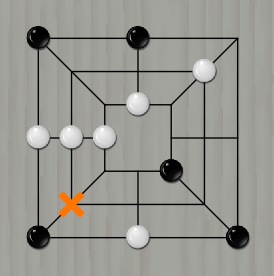

# 九联棋 NineChess
## 古老的游戏
### 莫里斯九子棋


九子棋（Nine Men's Morris）是一个非常古老的智力的游戏。其历史甚至可以追溯到公元前1400多年的古埃及时代。

+ 棋盘有24个格点，对弈双方各有九个棋子，轮流下到棋盘的空位上。
+ 如果一方有三个棋子连成一线，就可以选择吃掉对方的一个棋子。被吃的棋子不可以是位于对方所形成的三连之内，除非对方所有棋子都形成了三连。
+ 在九个棋子都布放到棋盘上以后，可以沿棋盘上的线条移动到相邻的位置来形成三连以吃掉对方的棋子。一个三连可以开开合合重复使用。如果一方所剩下的棋子只有三个时，棋子可以飞到任意空位。
+ 当一方的棋子少于三枚，则告负，游戏结束。

此外，国内还有几个九子棋的变种：成三棋、打三棋（12子棋）、九连棋等。

### 成三棋
+ 与莫里斯九子棋类似，但一方仅剩3子时不能飞子。

### 打三棋（12子棋）


1. 双方各12颗子，棋盘有斜线；
2. 摆棋阶段被提子的位置不能再摆子，直到走棋阶段；
3. 摆棋阶段，摆满棋盘算先手负；
4. 走棋阶段，后摆棋的一方先走；
5. 一步出现几个“三连”就可以提几个子；
6. 其它规则与成三棋基本相同。

### 九连棋


1. 规则与成三棋基本相同，只是它的棋子有序号；
2. 相同序号、位置的“三连”不能重复提子；
3. 走棋阶段不能行动（被“闷”），则由对手继续走棋；
4. 一步出现几个“三连”就可以提几个子。

## 应用程序说明
### 用户界面


### 系统支持
+ Windows版支持64位Windows 7、8、10系统，不支持32位系统及Windows XP。
+ Linux版支持Debian系列（如Ubuntu、Deepin等等）。

### 程序功能
1. 含四种不同规则的游戏（成三棋，打三棋，九连棋，莫里斯九子棋）;
2. 鼠标放在规则菜单下各规则项，有会有详细的规则提示;
3. 可以限制时间，限制步数;
4. 落子音效，落子动画;
5. 行棋状态栏提示;
6. 棋谱的前后遍历（可以悔棋）;
7. 棋谱的自动演示;
8. 棋局转变（翻转，镜像，旋转），棋子颜色交换;
9. 对战电脑，及不同AI引擎对战（待完善）;
10. 联网对战（待完成）;
11. 文本棋谱显示，打开及保存;
12. 其它。

## 源码说明
### 软件构架
+ GUI框架：Qt5.11，QT5大版本下均可通用。
+ 编译器：MSVC2017，MSVC2013及以上版本可用。
+ 源文件编码：所有头文件（* .h）中和源文件（*的.cpp）采用UTF-8 + BOM编码格式的.pro文件等采用UTF-8无BOM编码。
+ 本程序采用MVC（模型 - 视图 - 控制器）设计规范，对应类如下：
```
 MVC
 ├─Model
 │  ├─NineChess:         用标准C++写的棋类模型，处理下棋过程
 │  └─NineChessAi_ab:    用标准C++写的alpha-beta剪枝算法AI模型，模仿人类下棋
 ├─View
 │  ├─NineChessWindow:   从QMainWindow派生的主窗口类，由Qt自动生成
 │  ├─ManualListView:    从QListView派生的列表框，用于显示棋谱
 │  ├─GameView:          从QGraphicsView派生的视图框，用于显示棋局
 │  ├─GameScene:         从QGraphicsScene派生的场景类
 │  ├─BoardItem:         从QGraphicsItem派生的棋盘图形类
 │  └─PiecedItem:        从QGraphicsItem派生的棋子图形类
 └─Controller
    ├─GameController:    从QObject派生的控制类
    └─AiThread:          从QThread派生的AI线程类
```
这个程序用到了很多Qt的特性，其模式后期可以扩展到各种棋类游戏。

### AI算法说明
相见Wiki目录下的《Alpha-Beta剪枝算法在直棋中的运用》

### 许可协议
**本项目所有类代码全部原创。**  
详见文末Gitee项目内的License文件。请取用的朋友尊重知识产权。

### 更新历史
详见文末Gitee项目内的History文件。

## 作者声明
由于本人非IT科班出身，未经专业培训，也没有现成的QT棋类游戏源码做参考，源码中肯定有很多不合理，不规范之处。望好心的前辈不吝赐教。对于同道初学者，可以参考，相互学习，共同进步。  
多年前上大学那会儿，笔者就打算做这么个程序出来，然而条件比较艰苦：  
一来没有老师教，课上只学了Ç语言和VB，C++是笔者自学的，一个人啃晦涩过时的MFC;  
二来我穷到连个电脑都没有......  
三嘛，就是贪玩......  
工作之后有条件了，我又自学了C＃和Qt，但都很肤浅，没深入学，只用来做几个小工具而已。  
这个项目，我在2013年用标准C++写了个模型类，然后扔了不管；2015年自学Qt写了个简单的界面，又扔了不管；直到2018年5月才重新开始做。  
如果你发现本程序有什么问题或好的建议，请与本人联系。我的邮箱是：liuweilhy@163.com  
>                                            by liuweilhy 2018年11月26日

## 项目源码及发行版下载
+ 源码下载（Gitee）：[https://gitee.com/liuweilhy/NineChess](https://gitee.com/liuweilhy/NineChess)
+ 发行版下载（Gitee），请选择最新版：[https://gitee.com/liuweilhy/NineChess/releases](https://gitee.com/liuweilhy/NineChess/releases)
+ 如果你没有Gitee账号，可以在本人CSDN资源下载（非最新版）：(链接待补充)
+ 如果你以上都没有，那么用百度云盘（非最新版）：(链接待补充)
