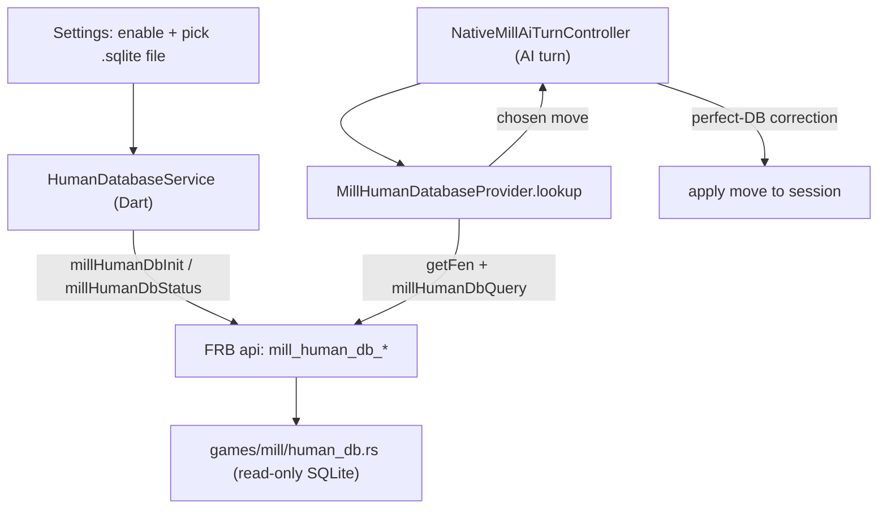
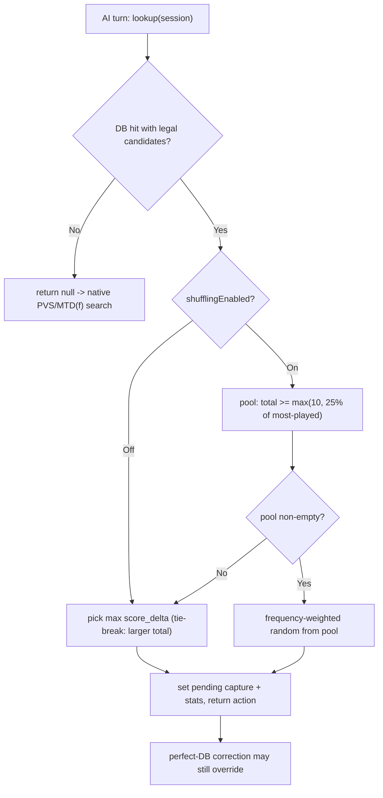

# Human Database Integration

This document describes the optional **Human Database** (Human DB) feature:
what it is, how it is wired through the Flutter app and the Rust/FRB engine,
the SQLite format it expects, how a move is selected, and its known
characteristics and limitations.

## Overview

The Human Database is an external SQLite file compiled from a large corpus of
human-vs-human games. For a given board position it stores, per move, how often
human players chose that move and how those games turned out (win / draw / loss
from the mover's perspective).

Sanmill uses it as an **advisory move book for the AI**: on an AI turn, if the
current position is present in the database, the AI plays a human move directly
instead of running the native search. It is consulted **after** the built-in
opening book and **before** the native search, and a configured perfect
database can still override its choice (see
[Interaction with other move sources](#interaction-with-other-move-sources)).

Key points:

- The database is **not bundled** with the app. The user selects a `.sqlite`
  file from the Flutter settings page.
- It is opened **read-only**; Sanmill never writes to it.
- It applies to **standard Nine Men's Morris** only.
- It is a **hard move book** (it picks and plays a move), not a soft hint added
  to the search score.

## Architecture and data flow



Layers:

- Flutter UI: the "Use human game database" switch, the file picker, and the
  "Show human database stats on board" switch live in the AI play-style card of
  the general settings page.
- `lib/shared/services/human_database_service.dart`: validates the path and
  initializes / re-initializes the native database for the selected file.
- `lib/games/mill/mill_human_database_provider.dart`: implements
  `OpeningBookProvider.lookup`, queries the database for the current FEN, and
  selects the move to play.
- `crates/tgf-frb/src/api/simple.rs`: the FRB surface
  (`mill_human_db_init`, `mill_human_db_status`, `mill_human_db_query`,
  `mill_human_db_deinit`).
- `crates/tgf-frb/src/games/mill/human_db.rs`: opens the SQLite file read-only,
  validates the schema, computes the canonical position key, and runs the query.

## Settings

All settings live in `GeneralSettings` and the AI play-style settings card.

- `humanDatabaseEnabled` (bool): master switch for consulting the database.
- `humanDatabaseFilePath` (String): absolute path to the selected SQLite file.
- `showHumanDatabaseStats` (bool): show the win / draw / loss / sample-count
  line for the latest AI move that came from the database.
- `shufflingEnabled` ("Move randomly", bool): controls move selection (see
  [Move selection](#move-selection)). This existing switch is shared with the
  opening book and the native search move ordering.

## Database format

The database is produced by an external tool and must contain at least the
`meta`, `positions`, and `moves` tables. Sanmill validates these on open.

### `meta`

| key             | meaning                                  |
| --------------- | ---------------------------------------- |
| `schema_version`| schema version string                    |
| `build_date`    | ISO-8601 build timestamp                 |
| `total_games`   | number of games indexed (parsed as int)  |

### `positions`

`state_key` (primary key), `total_games`, `wins`, `losses`, `draws`, and
optional annotation columns (`malom_wdl`, `malom_dtw`,
`canonical_winning_move`). Sanmill reads only the row count for status; move
selection uses the `moves` table.

### `moves`

Primary key `(state_key, notation)` with `wins`, `losses`, `draws`, `total`,
and optional annotation columns. Sanmill reads `notation`, `wins`, `losses`,
`draws`, and `total`. Win / loss / draw counts are from the perspective of the
side to move at `state_key`.

### Position key (`state_key`)

A position is reduced to a canonical key so that transpositions and symmetric
positions share one entry:

```
{canon}|{turn}|{phase}|{placed_w}|{placed_b}|{on_w}|{on_b}
```

- `canon`: 24-character board string (`.` empty, `W` white, `B` black) in the
  fixed outer / middle / inner ring order, reduced to its lexicographically
  smallest D4 (rotation + reflection) form.
- `turn`: `W` or `B` (side to move).
- `phase`: `place`, `move`, or `fly` for the side to move.
- `placed_w` / `placed_b`: cumulative pieces placed by each side.
- `on_w` / `on_b`: pieces currently on the board for each side.

### D4 canonicalization

`human_db.rs` maps the engine board to the standard Nine Men's Morris
coordinates, enumerates the 8 D4 symmetries, and picks the
lexicographically smallest board string (lowest symmetry index breaks ties).
The same symmetry index is used to map stored canonical move notations back to
the current board orientation via the inverse transform, so the returned moves
are always legal in the real position. The empty board key is
`........................|W|place|0|0|0|0`.

## Move selection

The provider asks the engine for up to 24 candidate moves with at least
`min_samples = 3` plays each, then chooses one based on the "Move randomly"
switch.



- "Move randomly" off: choose the candidate with the highest confidence-weighted
  `score_delta` (ties broken by the larger sample count). `score_delta` is the
  draw-weighted win rate centered at zero and scaled by a confidence factor that
  grows with the sample count, so a thinly-sampled fluke does not outrank a
  well-supported move.
- "Move randomly" on: draw a move at random, weighted by play frequency, from
  the **mainstream pool** -- candidates played at least 10 times and at least
  25% as often as the most-played move. If that pool is empty (rare position),
  fall back to the highest-score move.

Because roughly 90% of stored positions hold only a single move (see
[Coverage](#coverage-characteristics)), the random variety is mostly visible in
the opening, where popular positions offer several mainstream alternatives.

### Captures (mills)

Database notations combine a base move with a capture, for example
`d6-d7xa4` or `d2xa4`. Sanmill applies the base move first and remembers the
`xa4` capture; on the following remove turn the remembered capture is played.
If a perfect-database correction replaces the chosen move, the pending capture
is discarded.

## Interaction with other move sources

On an AI turn the order is: opening book, then Human Database, then native
search. When a Human Database move is chosen and the perfect database is
enabled and returns a different best action, the perfect move is played instead
(the move is then labelled as a perfect-database move). As a result, where the
perfect database covers the position, the "Move randomly" variety from the
Human Database is suppressed; the variety is fully visible when the perfect
database is off or has no entry for the position.

## UI surfaces

- Header icon: when the AI's last move came from the Human Database, the bot
  glyph in the game header becomes the "book database" icon
  (`AiMoveType.humanDatabase`). The icon updates immediately after the AI moves.
- Stats line: when "Show human database stats on board" is on, a single line
  under the board shows the move notation and its win / draw / loss percentages
  and sample count. The slot keeps a constant height (it shows a blank
  placeholder between database-sourced moves) so the toolbar does not shift.

## Coverage characteristics

The database only records moves that humans actually played; it does not
enumerate all legal moves. For a representative database of about 150,000 games
(roughly 1.1 million positions and 1.27 million move rows):

- About 90% of positions store only a single move, so a hit usually yields one
  candidate rather than a choice.
- Coverage is dense in the opening and thins out quickly: the first few plies
  are shared by essentially every game, while distinct positions grow
  combinatorially with depth.
- Most move rows have only a handful of samples; high-sample moves are rare.

Consequently the Human Database mainly shapes the opening and early middlegame.
Most of a full game -- especially the middlegame and endgame, and any position
off the beaten path -- falls back to the native PVS / MTD(f) search.

## Limitations and notes

- Standard Nine Men's Morris only. The provider checks the active rule set and
  returns nothing for other variants.
- The file is user-supplied and not bundled; an absent, unreadable, or
  schema-incompatible file simply disables the feature.
- The database is opened read-only. If the builder left it in SQLite WAL mode,
  reading it requires a writable directory (so SQLite can create the `-shm` /
  `-wal` side files). Picked files copied into app-writable storage work; a
  genuinely read-only location can fail to open.
- The `min_samples = 3` floor keeps very rare moves out, but with "Move
  randomly" off the selection can still rest on few samples; the perfect-database
  correction and the native-search fallback bound the practical impact.
- Web builds do not support the Human Database (no native SQLite); the FRB
  entry points report it as unavailable.

## Key files

- `lib/general_settings/widgets/general_settings_page.dart` -- settings UI.
- `lib/shared/services/human_database_service.dart` -- init / status service.
- `lib/games/mill/mill_human_database_provider.dart` -- query and selection.
- `lib/games/mill/native_mill_ai_turn_controller.dart` -- AI-turn wiring and
  perfect-database correction.
- `lib/game_page/widgets/play_area.dart` -- on-board stats line.
- `crates/tgf-frb/src/api/simple.rs` -- FRB entry points.
- `crates/tgf-frb/src/games/mill/human_db.rs` -- read-only SQLite access,
  canonicalization, and query.
