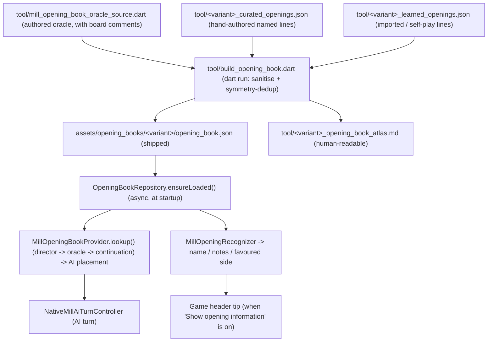

# Opening Book

This document describes Sanmill's **opening book**: a single bundled JSON per
game variant that both drives the AI's opening placement and powers in-game
opening recognition / display. It covers the data model, the runtime
architecture, the settings that control it, and how to maintain or extend it.

## Overview

The opening book is a **frontend-only, advisory** feature. It lives entirely in
the Flutter app; the Rust/TGF engine knows nothing about it. On an AI turn it is
consulted **before** the Human Database and the native search (see
[Interaction with other move sources](#interaction-with-other-move-sources)),
and only during the **placing phase**.

It combines two layers in one asset:

- **Oracle** — a position-keyed best-move table (`canonical FEN -> [moves]`).
  This is the engine-quality data that actually drives AI placement. Each entry
  is stored once for the lexicographically smallest FEN in its 16-way symmetry
  orbit and expanded to all 16 variants at lookup time, so the table stays
  compact without losing coverage.
- **Named openings** — curated and imported lines (`line_moves` plus metadata:
  name, family, source, strategic notes, common blunders, recommended
  responses, branch variations, and which side the line favours). They come in
  three provenance classes — hand-curated `book` lines, imported `book-*` game
  transcriptions, and self-play `novel-*` discoveries (see
  [Named-opening sources](#named-opening-sources-sanitisation-and-dedup)) — and
  power opening **recognition**, the on-board **display**, the optional
  **favoured-opening director**, and an **oracle-miss continuation fallback**
  that lets them guide AI placement beyond the oracle's coverage.

Metadata never lives inside a FEN — a FEN is only ever a lookup key. This mirrors
the chess-world separation of an engine (search), a move book (hash/position ->
move), and an opening-name database (ECO).

It applies to **standard Nine Men's Morris** and **El Filja**. El Filja ships an
oracle only (no curated named lines yet).

## Architecture and data flow



Layers:

- **Authored sources** (`tool/`, build input, not shipped):
  - `tool/mill_opening_book_oracle_source.dart` — the canonical-FEN move oracle,
    keeping ASCII board diagrams in comments for readability.
  - `tool/<variant>_curated_openings.json` — hand-authored named lines in the
    source schema (snake_case, NMM_LLM-compatible). Only `nmm` has one today.
  - `tool/<variant>_learned_openings.json` — imported `book-*` game
    transcriptions and self-play `novel-*` lines, a committed mirror of the
    NMM_LLM export (legacy array schema). Only `nmm` has one today.
- **Build tool** `tool/build_opening_book.dart` (`dart run`): copies the oracle
  verbatim, then merges the curated and learned lines — sanitising each to a
  valid placement line and removing 16-way symmetry duplicates — into the
  shipped JSON, and emits a human-readable atlas.
- **Shipped asset** `assets/opening_books/<variant>/opening_book.json`: the only
  runtime artefact, registered in `pubspec.yaml`.
- **Runtime (Dart)**:
  - `lib/games/mill/opening_book/opening_book_models.dart` — the data model.
  - `lib/games/mill/opening_book/opening_book_repository.dart` — loads the asset
    once (singleton) and exposes the oracle and named openings.
  - `lib/games/mill/mill_opening_book_symmetry.dart` — FEN normalisation, 16-way
    canonicalisation, and the symmetry-aware oracle lookup.
  - `lib/games/mill/mill_opening_book_provider.dart` — the move source consulted
    on AI turns (optional favoured-opening director, then the oracle lookup, then
    the named-opening continuation fallback).
  - `lib/games/mill/opening_book/mill_opening_move_selector.dart` — chooses among
    candidate book moves.
  - `lib/games/mill/opening_book/mill_opening_recognizer.dart` — stateless
    opening recognition used for display and the director.

Loading is asynchronous (`rootBundle`), kicked off from `main.dart` via
`OpeningBookRepository.instance.ensureLoaded()`. Every query is synchronous
against the in-memory model, so the AI hot path never blocks; if the book has
not finished loading, a lookup simply misses and the engine search proceeds.

## JSON schema

`opening_book.json` (one per variant):

```jsonc
{
  "schemaVersion": 1,
  "variant": "nmm",            // or "el_filja"
  "symmetry": "ring16",         // Sanmill D4 x inner/outer-ring swap
  "oracle": {
    "<canonical Sanmill FEN>": ["d2", "b4", "d6", "f4", "b2", "b6", "f6", "f2"]
  },
  "openings": [
    {
      "id": "mill-rush-parallel",
      "name": "Mill Rush — Parallel",
      "aliases": ["Parallel Lines"],
      "family": "Mill Rush",
      "side": "W",                 // which colour plays the line: W | B | both
      "source": "book",            // provenance: book | learned | human | oracle
      "sourceReference": "Chapter 15.2 ...",
      "confidence": 1.0,
      "tags": ["aggressive", "placement"],
      "strategicNotes": "…",
      "commonBlunders": ["b4", "a4"],
      "recommendedResponses": { "B": ["b6", "d6", "f6"] },
      "outcomeStats": { "W": 0, "B": 0, "D": 0 },
      "lineMoves": ["d2", "d6", "f4", "b4", "f2", "f6", "b2", "b6"],
      "branchMoves": [
        {
          "branchId": "mill-rush-parallel-b2-alt",
          "deviationPly": 7,
          "deviationMove": "d1",
          "name": "… — d1 Variant",
          "lineContinuation": ["d1", "b6"],
          "strategicNotes": "…",
          "source": "book",
          "outcomeStats": { "W": 0, "B": 0, "D": 0 }
        }
      ],
      "favoredSide": "W"           // who is likely to win: W | B | equal
    }
  ]
}
```

The model (`OpeningEntry.fromJson`) is deliberately tolerant: it accepts both
camelCase and the source snake_case keys, and fills missing fields with neutral
defaults, so hand-edited books and future additions stay loadable.

### `side` vs `favoredSide`

These are different axes and are easy to confuse:

- `side` — which colour **plays** the line (the perspective the moves are
  written from).
- `favoredSide` — who is **likely to win** the line (`W` / `B` / `equal`). This
  is the distilled outcome prior; it drives the display and the favoured-opening
  director.

## Named-opening sources, sanitisation, and dedup

The `openings` array is assembled from two authored files and cleaned before it
ships. Entries fall into three provenance classes (the `source` field plus the
`id` prefix):

| Class | `source` | Typical `id` | Origin | `confidence` |
|-------|----------|--------------|--------|--------------|
| Curated book line | `book` | `mill-rush-parallel` | Hand-authored in `tool/<variant>_curated_openings.json` | `1.0` |
| Imported book game | `learned` | `book-25-b14595` | Full games transcribed from Brandwood's book (via NMM_LLM) | `0.8` |
| Self-play novel line | `learned` | `novel-dcd1704b` | Lines NMM_LLM's recogniser could not match during self-play | `0.3` |

Curated lines live in `tool/<variant>_curated_openings.json`; imported and novel
lines live in `tool/<variant>_learned_openings.json`. Both are **build inputs** —
deleting either makes the next build silently drop those lines.

**Sanitisation.** Each line is truncated to its longest valid *placement* prefix
before bundling. A line is valid while every ply places on an empty square, with
one exception: a square may be re-used after a mill-forming move, because forming
a mill removes an opponent piece (removals are stripped from `line_moves`, so the
build credits one re-placement per mill formed). The placing phase caps at 18
plies (9 per side); anything beyond — or any placement onto an occupied square
with no removal credit — is moving-phase data or noise and is dropped. Lines left
with fewer than two plies are discarded entirely.

**Symmetry dedup.** The cleaned lines are then deduplicated under the full
16-element symmetry group: two lines collapse when one maps onto the other by a
rotation, reflection, or inner/outer-ring swap. The canonical key is the
lexicographically smallest of a line's 16 transformed move sequences. When lines
collapse, the highest-priority representative is kept —
**curated `book` > imported `book-*` > self-play `novel-*`**, then original load
order — so the result is stable and diff-friendly.

**Prefix denoise.** A second pass drops a **non-curated** line whose entire
sequence is a symmetric prefix of a strictly longer kept line of the **same
family**. Such a line adds nothing: the longer same-family line already matches
the shared prefix (recognition still resolves to that family) and offers the
same early moves plus more (the director loses no guidance). Curated lines are
never dropped, and cross-family prefix overlaps — e.g. Battle Lines and the Open
Z Mill genuinely share the `d2 d6 f4 b4` start — are preserved. This trims the
learned long tail that would otherwise inflate the recogniser's candidate set.

## Symmetry handling

Nine Men's Morris has a 16-element board symmetry group (the dihedral group D4
combined with the inner/outer ring swap), implemented in
`lib/game_page/services/transform/transform.dart`.

- The oracle stores **one representative** per orbit, keyed by the
  lexicographically smallest normalised FEN
  (`canonicalOpeningBookFen`). FEN fields 14 (`formed_mills`) and 15 (`rule50`)
  are zeroed so volatile counters do not split equivalent positions.
- `lookupCanonicalOpeningBook` maps a query FEN to its canonical key, fetches the
  stored line, and rotates the moves back into the query's frame with the
  inverse symmetry.
- Recognition and the director apply the same 16 transforms to the played
  placement sequence so a rotated/reflected game is matched as the same opening.

## Move selection

When the oracle returns several candidate moves for a position,
`MillOpeningMoveSelector.select` chooses one:

- **Shuffling off**: deterministic first candidate (the oracle lists best-first)
  — identical to the legacy behaviour.
- **Shuffling on** (`shufflingEnabled`): rank-biased weighted sampling that
  favours the stronger, earlier candidates while still varying the opening.
  The degree of randomness is set by the **Opening randomness** slider
  (`openingRandomness`, 0–100, default **60**), which maps directly to the
  geometric `bias` parameter: `bias = openingRandomness / 100`.

The bias controls how weight decays from the best candidate downward:

| `openingRandomness` | `bias` | Effect |
|---|---|---|
| 0% | 0.0 | Always the top book move (deterministic) |
| 60% (default) | 0.6 | Moderately favours stronger moves |
| 100% | 1.0 | Uniform random among all book candidates |

Because every *oracle* candidate is already a "best" move, the selector can never
weaken the AI on the oracle path — it only changes which equally-good move is
played. The same selector (and the same bias) also applies to the favoured-opening
director and the continuation fallback.

## Opening recognition

`MillOpeningRecognizer.recognize(placementMoves, openings)` is pure and
stateless. It is fed the placement moves played so far (removals filtered out)
and classifies the game, symmetry-aware over all 16 transforms:

- `exact` — the played moves are an in-order prefix of a single line.
- `probable` — an in-order prefix shared by several lines.
- `transposition` — the same squares were occupied by each side in a different
  order (a set match), i.e. the same position reached by another move order.
- `deviation` — a followed line was left, but a named `branchMove` covers the
  deviating move.
- `novel` — nothing matched once enough moves are in (`novelCommitPly`).
- `none` — too early / no book.

**Representative & tie-break.** All openings matching the played prefix (across
every frame) are collected. Naming is confined to the **highest source tier**
present, so when a curated `book` line fits, imported/self-play `learned` lines
never influence the displayed name. Within that tier the representative is the
most authoritative, then the **shortest** line (closest to the live position),
then a stable id — deliberately **not** the longest line, which previously let a
long, loosely-related import outvote the opening actually being played.

**Honest ambiguity.** While several *different families* still fit the shared
start, the result is `probable` and `candidateFamilies` lists them (ranked,
de-duplicated). The header then shows the shortlist — e.g. `Opening: Battle
Lines / Z Mill` — instead of committing to one (possibly wrong) name, until a
divergent move narrows it to a single family. This fixes the report of an Open
Z Mill being shown as "Battle Lines" during their common `d2 d6 f4 b4` prefix.

The result carries the opening's name, family, source, strategic notes, common
blunders, recommended responses, `favoredSide`, the `candidateFamilies`
shortlist, and the book's next move in the live board frame.

## Favoured-opening director (opt-in)

When **Prefer favourable openings** (`preferFavoredOpenings`, default **off**) is
enabled, `MillOpeningBookProvider` consults a director **before** the oracle:

1. `MillOpeningRecognizer.favoredOpeningMoves` finds every named line that
   (a) favours the AI's own colour and (b) is consistent (under all 16
   symmetries) with the placements played so far, and returns their next moves
   in the live frame, best line first.
2. The provider keeps only the legal candidates and picks one with
   `MillOpeningMoveSelector` (so `shufflingEnabled` adds variety).
3. If no favourable, history-consistent line offers a legal move, it falls
   through to the normal oracle lookup.

This makes the AI choose and follow a strategically favourable named opening for
a more human, varied feel. It may deviate from the objectively strongest oracle
move, which is why it is off by default; with it off, AI move behaviour is
exactly the oracle path.

The placement history is supplied to the provider at its construction sites
(`tap_handler.dart` and `game_controller.dart`) via the shared
`openingBookPlacementHistory()` helper.

## Oracle-miss continuation fallback

The oracle is dense in the earliest plies but does not cover every position. When
it has **no** entry for the current placing position, the provider falls back to
the named openings so curated, imported, and self-play lines can still guide AI
placement:

1. `MillOpeningRecognizer.bookContinuationMoves` finds, across all 16
   symmetries, every named line whose `line_moves` extend the placements played
   so far, and returns their next moves in the live frame, ordered by
   `confidence` then line length (so curated `1.0` outranks imported `0.8`, which
   outranks novel `0.3`).
2. The provider keeps the legal candidates and picks one with
   `MillOpeningMoveSelector` (honouring `shufflingEnabled`).

Unlike the favoured-opening director — which runs *before* the oracle and only
considers lines favouring the AI's own colour — this fallback runs *after* the
oracle and is **side-independent**. The full AI-turn order inside the book is
therefore:

**favoured-opening director (opt-in) → oracle → continuation fallback.**

The fallback is active whenever **Use opening book** is on (which is **off** by
default, so default play is unaffected). Because it can play a learned/novel move
rather than an oracle "best", it may be weaker than a pure search; it only fires
when the oracle is silent and the user has opted into the book. To keep it
conservative, candidates are confidence-ordered, so a curated or imported line is
always preferred over a `novel-*` line when both extend the current placements.

## Settings

All three live in the AI play-style card of the general settings page and apply
to Nine Men's Morris / El Filja:

- **Use opening book** (`useOpeningBook`) — master switch; gates the
  favoured-opening director, the oracle, and the continuation fallback.
- **Show opening information** (`showOpeningInfo`, default off) — shows the
  recognised opening name, source, favoured side, blunder warnings, and
  recommended replies in the game header while playing.
- **Prefer favourable openings** (`preferFavoredOpenings`, default off) — enables
  the favoured-opening director described above.
- **Opening randomness** (`openingRandomness`, 0–100%, default 60%, visible only
  when "Move randomly" and "Use opening book" are both on) — controls how varied
  the opening book's move choice is. See [Move selection](#move-selection).

## Interaction with other move sources

On an AI turn the order is: **opening book → Human Database → native search**
(with an optional perfect-database correction layered on the Human Database
move). See [HUMAN_DATABASE.md](HUMAN_DATABASE.md). Within the opening book itself
the order is **favoured-opening director (opt-in) → oracle → continuation
fallback**. When the opening book returns a move, it is applied directly and
tagged `AiMoveType.openingBook`.

## Maintaining and extending the book

The shipped JSON is **generated** — do not hand-edit
`assets/opening_books/**/opening_book.json`. Edit the authored sources and
regenerate:

1. To add/adjust **named openings**:
   - hand-authored lines go in `tool/<variant>_curated_openings.json` (only
     `nmm` exists today; create `el_filja_curated_openings.json` to add El Filja
     lines). Each entry follows the source schema; set `favored_side`
     (`W` / `B` / `equal`) so the display, director, and fallback can use it.
   - imported / self-play lines go in `tool/<variant>_learned_openings.json`
     (the committed NMM_LLM mirror).

   All sources are merged, sanitised to valid placement lines, and
   symmetry-deduplicated at build time (see
   [Named-opening sources](#named-opening-sources-sanitisation-and-dedup)); there
   is no `source`-based filter — every provenance class is bundled.
2. To add/adjust the **move oracle**, edit
   `tool/mill_opening_book_oracle_source.dart`.
3. Regenerate:

   ```bash
   cd src/ui/flutter_app
   dart run tool/build_opening_book.dart
   ```

   This rewrites `assets/opening_books/<variant>/opening_book.json` and the
   `tool/<variant>_opening_book_atlas.md` reference, and runs an oracle parity
   check (the round-tripped JSON must reproduce the authored oracle exactly, so
   AI placement strength is unchanged).

### The atlas

JSON cannot carry the oracle's board diagrams (FEN keys contain `/*` and `*/`,
so comments are unsafe). Instead the build tool emits a committed, human-readable
Markdown atlas per variant (`tool/<variant>_opening_book_atlas.md`) with an ASCII
board for every oracle position and a metadata summary for every named opening.
It renders on GitHub and is regenerated alongside the JSON.

## Limitations and non-goals

- The book covers the **placing phase** only.
- The imported `book-*` and self-play `novel-*` lines are produced **offline**
  (in NMM_LLM) and mirrored into the repo. *Runtime* learning inside Sanmill
  (persisting `outcome_stats`, exploring new lines, adaptive opening swaps, novel
  auto-naming) is not implemented. `outcomeStats` is retained in the model,
  read-only, to support such a subsystem later.
- El Filja ships an oracle only; it has no curated named lines yet.

## Provenance

The named openings and the rich schema (`favoredSide`, `branchMoves`,
`recommendedResponses`, …) are derived from and inspired by Ben Brandwood's
NMM_LLM project, whose three-layer book — hand-curated `book` lines, imported
`book-*` game transcriptions, and self-play `novel-*` lines — is mirrored into
`tool/nmm_curated_openings.json` and `tool/nmm_learned_openings.json`. The move
oracle is Sanmill's own engine-derived table.
