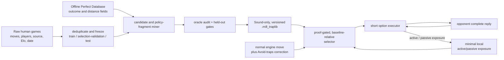

# Trap Setting and Utilization

- Status: design proposal; not approved for release
- Proposal revision: 2
- Initial scope: standard Nine Men's Morris
- Target trap-library format: 1.0
- Target local-exposure profile schema: 1.0
- Last updated: 2026-07-26

## Summary

The only eligible feature in this design is a **Sound Trap**.
Sanmill should actively select one only when all of the following are true:

1. The setup move is proved to preserve Sanmill's game-theoretic result.
2. Human-game data shows that the resulting position causes more mistakes than
   the move Sanmill would otherwise play.
3. That advantage is conservatively positive under the version-1 population
   policy.
4. The current profile has not recently encountered the same exact trap or
   family through active steering or an exact passive decision.
5. The library contains self-contained continuations for both a trap hit and
   every correct defence, through an anchor of an approved assurance class.

The feature is therefore not a scalar "trap score". It is a versioned library
of short policy fragments:

```text
safe setup
  -> opponent reply
     -> utilization after a mistake
     -> recovery after a correct defence
        -> verified exit to normal play
```

The full Perfect Database is an offline build and audit dependency only. It
supplies the safety proof and labels objective mistakes. The Human Database
supplies observed reply probabilities. Optional source-normalized Elo
statistics describe how behaviour varies with strength. A local, private
version-1 profile remembers prior exposure so Sanmill does not present the
same idea repeatedly. The trap subsystem never queries the full database or a
network service at runtime.

The first implementation must use transparent counts and calibrated
uncertainty. A Gap model or Human Preference model may later help discover or
rank candidates, but neither is used by the version-1 selector and neither may
replace a Perfect Database proof.

Deliberately changing a draw into a theoretical loss is outside this design.
The currently exposed `key2`/`steps` fields do not provide the exact terminal
distance semantics that such research would require. Any reconsideration must
start as a separate proposal; it does not add an option class, phase, artifact,
or runtime branch here.

The dominant feasibility risk is abstention rather than an obviously unsafe
setup: exact-state evidence, complete branch coverage, strict anchors, and
artifact-size limits may leave too few eligible parents. Phase 0 must measure
that funnel before any app implementation.

## Motivation

A move can be a theoretically sound way to offer an opponent a difficult
choice while still being a poor practical choice for Sanmill. A scalar
trap-setting policy tends to prefer complicated positions, but the engine must
then navigate the complications it created. If the next engine move is not
protected, the feature can increase Sanmill's own error rate and become
self-defeating.

Repetition is a separate problem. A position may have a high population
mistake rate in historical games, but an individual player who has already
encountered the idea should not be treated as a first-time opponent. Rotating
the board or reaching the same motif through another move order must not reset
that memory.

The proposed design addresses both problems:

- it stores the short continuation needed to exploit or safely abandon the
  trap;
- it compares every candidate with the actual non-trap baseline;
- it reports offline strength-stratified behaviour without requiring a
  version-1 opponent-skill profile;
- it remembers exact and family exposure through deterministic local cooldown;
- it treats uncertainty, missing data, stale artifacts, and history-sensitive
  states as reasons to abstain.

It does not yet establish practical effectiveness. Existing replay evidence
did not meet its pre-registered coverage gate, and the trigger rate of a fully
self-contained selector is unknown.

## Critical feasibility risks

Three risks determine whether the project should proceed beyond research:

| Risk | Current status | Required resolution |
| --- | --- | --- |
| Funnel contraction and runtime abstention | The previous registered replay closed after retaining 151 parents, below its gate of 200; complete fragments can only shrink that set | Require a materially new human corpus, run a cheap optimistic upper-bound screen, and stop before full DAG construction if registered utility floors are unreachable |
| Leakage and adaptive configuration search | High risk because many parents, options, families, bands, thresholds, and anchors can be searched | Register a finite search procedure, log every configuration execution, isolate games and movers, control component selection, and open each selection-validation and test set once |
| Proof and release compatibility | Rule semantics are global, but correction-covered anchors are option-local | Separate global semantic identity from content-addressed proof dependencies, reject only affected shards where safe, and require an automated compatibility job for every related release |

### Funnel contraction and abstention

Exact canonical-state evidence, complete logical replies, independent-game and
independent-mover support, full legal-branch coverage, approved anchors, and
atomic artifact packing can reduce a large parent census to very few usable
options. The likely failure mode is therefore a selector that is structurally
safe but almost always abstains. Phase 0A is a go/no-go feasibility study, not
merely a data-preparation step. Evidence gates must not be weakened to improve
the trigger rate after the funnel is observed.

### Leakage and multiple testing

Train, selection-validation, and test data must have frozen roles. Exact
duplicates are removed before splitting; repeated observations are clustered
by game and mover; cross-split movers, transpositions, near duplicates, and
source effects receive sensitivity analyses. A hash-chained experiment ledger
records every configuration and every access to selection-validation data.
Component eligibility uses a registered multiplicity procedure, while the
final claim rests on the complete frozen selector, including its abstentions,
evaluated once on an independent test set. A materially revised design
requires a new protocol and genuinely new evaluation games rather than
repeated access to the old selection-validation or test sets.

## Project viability and stop rules

This project is intentionally killable. The previous
`sanmill-heldout-v1-20260705` test is consumed and its registered decision was
to close the trap line: 151 parents entered the main pool, below the required
200, despite a positive held-out effect. That corpus may be used for tooling
and sensitivity analysis, but not for a new confirmatory claim. Revival
requires materially new human games or a prospectively collected cohort.

Phase 0A has four progressively more expensive checkpoints before app
integration.

### Checkpoint 0A-0: decision contract and cheap upper bound

Before building a new miner or any policy DAG:

1. sign off a target population, a minimum worthwhile selector effect
   `delta_min`, a maximum confirmatory-study size `N_max`, and engineering
   budgets;
2. draw a frozen, source- and phase-stratified pilot sample from development
   data, never from the future confirmatory set;
3. reuse the existing exact-state, complete-logical-turn, and Human Database
   query paths to count one-decision candidates and their actual baselines;
4. compute an optimistic trigger upper bound by temporarily assuming that
   every supported candidate will survive anchor, branch, and packing gates;
5. run a clustered power analysis for the complete selector.

No DAG is built at this checkpoint. If even the optimistic upper confidence
bound or the power analysis misses a floor, the project stops.

The decision contract states the unit of `delta_min`. The default offline unit
is baseline-relative W/D/L EV averaged over representative games, with every
abstention contributing zero; it is not the larger conditional effect among
option starts. Per-start and per-game effects are both reported but cannot be
swapped after data are observed.

The current proposal uses these prospective product floors:

- at least 200 independently supported exact parents entering the bounded DAG
  pilot, retaining the last registered evidence floor unless a new protocol
  justifies a replacement before new data are inspected;
- a projected first-exposure point estimate of at least 50 starts per 1,000
  representative games and a clustered 95% lower bound of at least 25 per
  1,000 after runtime-equivalent gates;
- at least 20 independent trap families, with no one family contributing more
  than 20% of projected starts;
- at least 80% prospective power at two-sided `alpha = 0.05` for
  `delta_min`, within `N_max`;
- a whole-system paired H2H non-inferiority margin of no worse than `-0.01`
  game points per game, while every oracle-invalid move remains an automatic
  failure.

These are product cancellation thresholds, not universal statistical facts.
The 50-per-1,000 point floor corresponds to roughly one first-exposure start
per 20 representative games; below that, an opt-in trap-setting feature is
unlikely to be observable enough to justify its lifecycle cost. The lower
bound and concentration cap prevent that point estimate from being driven by
sampling noise or one opening family.
They may be replaced only in the signed decision contract before the pilot;
an unset `delta_min` or `N_max` is itself a no-go. Values cannot be weakened
after seeing pilot, validation, or test results.

Before full DAG construction, the family floor uses a provisional
setup/mistake/immediate-utilization motif signature with D4 equivalence.
Checkpoint 0A-3 recomputes the final versioned family IDs from audited options;
the final pack must still meet the floor and concentration cap.

### Checkpoint 0A-1: exact evidence census

Only after 0A-0 passes, run the full development-side exact-state census.
Measure:

- candidates with an observed exact baseline;
- independently supported games and movers;
- source, phase, recency, and trap-family coverage;
- expected starts per 1,000 target games;
- abstention reasons and concentration by parent and family.

If the full census misses a registered floor, stop before DAG construction.

### Checkpoint 0A-2: bounded DAG pilot

Build complete fragments in deterministic, pre-ranked batches rather than for
the entire census. After each registered batch, estimate legal-branch survival,
anchor survival, bytes per option, audit cost, and the most optimistic final
coverage still possible. Stop as soon as that upper bound falls below a floor.
The pilot has a fixed CPU-time and engineering-time cap from the decision
contract.

### Checkpoint 0A-3: complete-pack feasibility

Only a successful bounded pilot unlocks production-scale construction. Publish:

- complete packable options and independent families;
- coverage retained after legal-branch and anchor requirements;
- bytes per option and total mobile artifact size;
- projected lookup, loading, and execution cost;
- expected rebuild, compatibility-audit, and regression-test cost;
- runtime-equivalent trigger rate after history and exposure suppression.

Raw option count alone is not a decision rule. A count such as 50 cannot
replace weighted encounter coverage, family diversity, trigger rate, power,
and maintenance cost.

If any checkpoint fails, work stops before runtime implementation: archive the
result, keep make-traps hidden, and redirect engineering effort to search,
evaluation, and trap avoidance. Evidence, branch, or anchor standards are not
relaxed to rescue the project.

### Why baseline-relative benefit remains mandatory

The corrected baseline may already be game-theoretically optimal, but several
draw-preserving moves can expose humans to very different decisions. The
question is therefore not whether a setup is more optimal than the baseline;
it is whether an equally sound setup creates additional practical value
against humans.

Removing the baseline comparison would count mistakes that normal play already
induces and could recreate the known self-risk failure. The requirement is
non-negotiable for Sound Trap. If the frozen selector cannot improve on the
actual corrected baseline, the correct outcome is to cancel the feature.

Statistical evidence is evaluated at the right level, however. Train and the
single-use selection-validation procedure admit exact options through
pre-registered support, baseline-relative, and component error-control rules.
The final independent test evaluates the complete frozen selector, including
abstentions. Every individual option need not achieve standalone confirmatory
test significance, but no option may bypass the component gate by borrowing
the aggregate effect of stronger options.

## Terminology and value convention

All values in this document are normalized to Sanmill's perspective at the
parent position:

```text
W = +1
D =  0
L = -1
```

The implementation must convert database values to this fixed perspective
before comparing or aggregating them. It must never mix values expressed from
different sides to move.

**Logical turn**
: A placement or movement together with its required capture, if it forms a
  mill. Although the engine may expose the movement and capture as separate
  actions, mining, statistics, policy transitions, and local-memory updates
  treat them as one atomic decision.

**Parent**
: A position in which Sanmill is about to move and may choose a trap setup.

**Baseline**
: The complete logical turn Sanmill would play with trap setting disabled,
  after any enabled trap-avoidance correction. The baseline is evaluated under
  the same engine configuration, search seed policy, database set, and rules as
  the candidate.

**Setup**
: A Sanmill logical turn that leads to an opponent decision with Human
  Database coverage. A Sound setup preserves the baseline's hard
  game-theoretic value and passes the registered distance-risk policy.

**Trap hit**
: In the initial version, a complete opponent reply that changes a
  Perfect-Database draw into a win for Sanmill. The transition is:

```text
Sanmill-to-move D
  -> safe setup
opponent-to-move D
  -> opponent mistake
Sanmill-to-move W
```

The Human Database does not decide whether the reply is a mistake. It records
how often humans selected the reply. The Perfect Database supplies the label.

**Defence**
: An opponent reply that preserves the opponent's best game-theoretic result.
For a sound draw-preserving setup in version 1, a defence leaves the position
drawn from Sanmill's perspective.

**Utilization**
: A stored, database-safe Sanmill continuation after a trap hit. Its purpose is
to retain and convert the newly obtained win without asking the normal search
to rediscover the tactic.

**Recovery**
: A stored, database-safe Sanmill continuation after a correct defence. Its
purpose is to leave the offered complication without reducing Sanmill's
original result. This term applies only to Sound Traps.

**Anchor**
: A position at which the policy fragment may end. Every anchor carries an
  explicit assurance class: `PROVEN`, `CORRECTION_COVERED`, or `EMPIRICAL`.
  These classes must not be reported as equivalent.

**Trap option**
: One complete short policy fragment rooted at a parent.

**Trap family**
: A deterministic structural classification shared by equivalent tactical
ideas. It is used for statistical backoff and repetition control, never for a
safety proof.

## Eligible option class

### Sound Trap

A Sound Trap preserves the hard game-theoretic value of the corrected
baseline:

```text
D -> D setup -> opponent mistake -> Sanmill W
```

Future versions may study `W -> W` setups, but version 1 remains draw-to-win
only.

### Out of scope: deliberate value loss

A `D -> L` setup is not a trap option under this design. The existing
`key2`/`PerfectOutcome.steps` fields are distance-to-conversion values and do
not prove exact fastest-win versus longest-resistance terminal distance.
Research that deliberately loses game-theoretic value would also require a
separate product, trust, UX, ethics, oracle, and evaluation proposal. This
document intentionally specifies none of its thresholds or runtime mechanics.

## Goals

- Create practical winning chances from theoretically equivalent moves.
- Never trade game-theoretic value for trap probability in the Sound class.
- Protect Sanmill's own short-term continuation after offering a trap.
- Prefer traps that are supported by held-out human behaviour, not merely by
  a heuristic notion of complexity.
- Report strength-conditioned effects offline without inferring local player
  strength in version 1.
- Remember exact and structural trap exposure for the current opponent.
- Fail closed when data, provenance, rules, history, or runtime enumeration do
  not match the library.
- Work without the multi-gigabyte Perfect Database at runtime.
- Perform all trap selection and adaptation without network services.
- Keep the correction-only "Avoid traps" asset independent from the
  experimental trap-setting asset.
- Produce deterministic, auditable artifacts and reproducible evaluations.

## Non-goals

- Deliberately trading a draw or win for a move believed to be confusing.
- Assuming that eventual game outcomes in human records identify the move that
  caused a loss.
- Predicting a player's exact public-site Elo from only a few moves.
- Looking up public Elo, linking a profile to a remote identity, or uploading
  games to identify an opponent.
- Setting version-1 traps in positions without exact Human Database evidence,
  regardless of model output.
- Replacing normal search with a full opponent-specific game-playing model.
- Claiming causal human impact from an observational database replay.
- Enabling the feature by default on the strength of engine-versus-engine
  tests alone.
- Sharing local opponent profiles or raw move histories outside the device
  under this feature.

## Sound-Trap safety invariants

These are hard Sound-Trap requirements, not terms in a weighted objective.

1. **Setup preservation.** The setup must preserve the corrected baseline's
   hard outcome fields. Distance and conversion-risk fields must pass a
   separately registered policy. Fields used only for deterministic ordering
   are not automatically safety vetoes.
2. **Response preservation.** At every Sanmill node in a fragment, the stored
   response must preserve the best hard value available at that node and pass
   the applicable distance-risk policy.
3. **Complete opponent coverage.** Every legal opponent logical turn at a
   stored human node must have a stored utilization or recovery response and
   an approved exit. A high observed probability does not permit omission of
   the remaining replies.
4. **Atomic captures.** A setup or response that forms a mill is not evaluated
   or committed until its required capture is included.
5. **No history fabrication.** Positional database labels must not override
   live repetition, no-progress, pending-capture, or terminal state.
6. **Baseline-relative benefit.** A candidate may be selected only when it has
   a positive conservative advantage over the move Sanmill was actually going
   to play under the population policy. Local exposure can suppress selection;
   it cannot manufacture a positive advantage.
7. **No model authority.** A learned model may affect candidate discovery or
   ranking only after the database safety gates pass.
8. **Artifact identity.** Rule, value-convention, logical-turn, or
   canonicalization incompatibility rejects the whole library. A missing
   option-local proof dependency rejects its independently checksummed shard.
   Perfect and Human Database identities are immutable build provenance, not
   runtime services; no mismatch falls back to an approximate interpretation.
9. **No partial packing.** If the artifact budget cannot hold a complete
   option, the packer drops the entire option.
10. **Normal-play fallback.** If no option passes every gate, Sanmill plays the
    corrected baseline exactly as it would with trap setting disabled.

## Existing mechanism and evidence

The current version-4 patch format can attach a four-bit score to at most 16
proved-optimal children. At runtime, "Make traps" can replace the selected move
only with a proved-optimal sibling carrying a strictly higher score. This is a
useful safety property for the setup edge, but the representation cannot store:

- the tempting opponent reply;
- the observed reply distribution;
- strength-conditioned behaviour;
- the move that utilizes a trap hit;
- recovery after a correct defence;
- an assurance-classified exit;
- exact or family-level exposure history.

The current production app also keeps the make-traps control hidden and has no
production trap asset loader. The correction and experimental trap lookups are
already separate, which the new design preserves.

Two archived experiments constrain this proposal:

- A 1,000-game-per-group paired engine proxy found that the ungated
  score-based make-traps configuration underperformed avoid-only play. The
  paired difference was `-0.0400 +/- 0.0290` per pair. Risk gates reduced the
  point-estimate loss but did not establish positive benefit. This shows that
  setup-only scoring does not control Sanmill's follow-up risk.
- A pre-registered train/test Human Database replay found a positive held-out
  one-turn effect among covered candidates: mean delta EV `+0.068173`, with a
  95% cluster-bootstrap interval of `[+0.042055, +0.093609]`. However, only 151
  parents entered the main pool, below the pre-registered requirement of 200.
  The experiment therefore closed that line despite the positive effect.

The new design does not reinterpret either verdict. It requires a new
pre-registered experiment, a larger or better-conditioned corpus, and a
different runtime representation.

## System overview



The offline and runtime responsibilities are deliberately separate:

- Offline mining may use the full Perfect Database and raw game corpus.
- The packed library contains all proofs, branches, statistics, and
  continuations needed by the runtime.
- Runtime selection uses the actual corrected baseline and the in-memory local
  profile.
- Local observations update exposure suppression but never alter the immutable
  global artifact.
- The trap selector and option executor never query the full Perfect Database,
  locally or over a network. A separately configured Perfect Database may
  still participate in Sanmill's ordinary baseline move pipeline, but the trap
  artifact must not depend on its runtime availability.
- Exposure handling and option selection perform no network access.

## Data sources and trust boundaries

### Perfect Database

The Perfect Database is the sole authority for:

- parent and child game-theoretic values;
- hard-outcome preservation and registered distance-risk checks;
- classifying human replies as hits or defences;
- selecting utilization and recovery responses;
- verifying every packed edge;
- detecting terminal anchors.

"Sole authority" is a declared trust boundary, not a claim that a database
snapshot is infallible. Every `PROVEN` label means proved relative to the
pinned rule implementation, adapter contract, sector/value files, and their
hashes. The build audit checks file integrity, D4 consistency, parent/child
minimax consistency, perspective conversion, and all referenced states. A
later database erratum triggers the referenced-state delta scan and shard
revocation/rebuild process; runtime cannot re-prove an edge without the
database and must not pretend otherwise.

Mining should query the database through the sector-corrected adapter. It must
not consume unversioned historical `malom_*` fields from a Human Database.
Persisted Malom labels are usable only when their metadata carries the exact
trusted label version expected by the miner; live oracle queries remain the
preferred path.

Perfect Database positions do not include complete repetition or no-progress
history. Their answers are positional proofs subject to the runtime history
guards described below.

#### Oracle comparison contract

Before mining, the adapter must publish every value field, its exact semantics,
and its comparison direction. Fields are assigned to one of three categories:

| Category | Typical content | Sound-Trap use |
| --- | --- | --- |
| Hard outcome | legality, terminal result, W/D/L | Must preserve the corrected baseline |
| Risk or distance | exact mate/conversion distance, stability measures | Must pass a pre-registered threshold or non-inferiority rule |
| Ordering only | canonical child order, deterministic tie key | May break ties but is not a safety veto |

The actual field list comes from the pinned adapter rather than this table's
examples. No distance field is used until tests and source documentation
establish whether it means distance to terminal mate, distance to conversion,
winning-side-fastest/losing-side-longest optimal distance, or only a heuristic
ranking.

The adapters available at the time of this design expose these concrete
fields:

| Current field | Meaning | Design category |
| --- | --- | --- |
| W/D/L projected from `absolute_key1` and the sector virtual win/loss values | Game-theoretic outcome | Hard outcome |
| `OracleMoveValue.key1` | Primary Malom candidate value corrected into the common parent sector | Risk/quality field whose policy must be registered |
| `OracleMoveValue.key2` / Sanmill `PerfectOutcome.steps` | Context-dependent secondary value; exposed by Sanmill as distance to conversion | Risk/distance field, not a terminal-loss guarantee |
| `sector`, `sector_value`, and `perspective` | Context required to make a valid comparison | Validation fields; mismatches reject comparison |
| Canonical token or child-key order | Stable deterministic tie order | Ordering only |

The Malom comparator first compares `key1`; for equal negative `key1`, larger
`key2` is preferred; for equal positive `key1`, smaller `key2` is preferred;
and for zero `key1`, `key2` is ignored. Bare `key2` is therefore not globally
monotonic. Sanmill's `StrictSteps` projection prefers faster wins and slower
losses while leaving draws tied, whereas `LegacyWdl` ignores steps.

This contract avoids two opposite errors:

- treating WDL equality as sufficient when a distance field exposes a
  material conversion-risk difference;
- promoting a database's deterministic ordering preference into a false
  safety theorem.

### Human Database

Human data supplies behaviour, not truth:

- the count of each complete reply from an exact canonical state;
- optional player identity for grouped validation;
- game identity for deduplication and resampling;
- data source;
- Elo at the time of the game, when available.
- game date or the narrowest defensible source-snapshot interval, when
  available.

The aggregate SQLite format is sufficient for an unconditioned, one-turn
prototype, but it discards player, source, Elo, game, and occurrence history.
The production miner therefore rebuilds occurrence-level examples from the raw
game records.

The miner must:

1. Parse each game with the current rules.
2. Reject illegal or incomplete logical turns.
3. Deduplicate byte-identical games by content hash.
4. Report normalized near-duplicate diagnostics.
5. Freeze all split manifests before candidate selection.
6. Retain source, mover, and date-quality metadata only in offline analysis.
7. Query current Perfect Database labels instead of using eventual game
   results as move labels.
8. Report the dated, interval-dated, and undated fractions by source.
9. Reserve the newest defensible cohort for temporal validation or test.

Recency is not inferred from the database build timestamp. Within train data,
a protocol may compare an unweighted estimate with a prospectively chosen
time-decay model, but the decay half-life and cutoff are configuration choices
subject to the same validation ledger and multiplicity control as any other
model. Effective sample size after weighting is reported.

An option supported only by old or undated games cannot make a claim about
current human behaviour. It remains research-only unless a recent independent
cohort or the randomized human evaluation confirms it. Release reporting
includes effect by game era and flags sign reversal or material decay.

The protocol also sets a behavioural review interval, with 24 months as the
version-1 default. The artifact records its evidence cutoff and review-by date.
Passing that date disables active trap steering until a new recent-data or
human-study review is shipped; it does not affect ordinary search or
correction.

Human win, draw, and loss totals may be reported as descriptive information,
but they do not define a trap hit. A player may lose much later for an
unrelated reason.

### Local opponent data

Local data answers a different question from the global corpus:

> Given what this opponent has already shown, is the population estimate still
> relevant?

It records only compact exact and family exposure in app-private storage. It
does not change global trap probabilities, infer strength, train future
artifacts, or leave the device under this design.

The runtime must not:

- query public Elo or game-platform profiles;
- connect a local profile to a username, IP address, device identity, or
  remote account;
- upload local games or decisions for opponent identification;
- infer identity through a network service.

Permitted version-1 inputs are exposure records already stored in the selected
local profile, exact passive encounters, and active exposures observed in the
current local game.

### Optional learned models

A Gap model may be useful for finding positions where human play is worse than
perfect play. A Human Preference or Human Policy model may estimate reply
probabilities when exact counts are thin. They do not by themselves identify a
safe setup or provide a continuation.

Version 1 does not use either model for eligibility or runtime selection. A
future model-assisted option must meet all of the following:

- train, selection-validation, and test separation by game and, where possible,
  mover;
- complete-choice-set training rather than isolated positive moves;
- probability calibration by phase and strength;
- out-of-distribution detection and abstention;
- an artifact and feature-schema fingerprint;
- proof that model-only candidates add held-out benefit;
- no authority over any safety gate.

An uncalibrated scalar score must never be interpreted as a probability that a
human will make a specific reply.

## Mining short policy fragments

### Version-1 scope

The first pack should deliberately restrict the search space:

| Dimension | Version-1 rule |
| --- | --- |
| Variant | Standard Nine Men's Morris only |
| Parent value | Draw from Sanmill's perspective |
| Option class | Sound Trap only |
| Setup | Same hard outcome as baseline; registered distance-risk policy passes |
| Trap event | One human logical turn changes D to Sanmill W |
| Stored horizon | Setup, one human reply, and one Sanmill response |
| Extension | Only as needed to reach a verified anchor |
| Phases | Placement and normal movement; flying requires a separate gate |
| Behaviour source | Exact Human Database state required |
| Strength model | Offline stratified diagnostic; runtime adjustment deferred |
| Exposure model | Deterministic local cooldown only |
| Learned policy | Not required |

Version 2 may expand selected branches through a second human decision:

```text
setup -> human 1 -> Sanmill 1 -> human 2 -> Sanmill 2 -> anchor
```

The horizon is counted in complete logical turns, not engine actions.

### Step 1: enumerate eligible parents

An eligible parent must satisfy all of the following:

- the current rules and phase are in scope;
- the parent is resolvable by the Perfect Database;
- the normal move pipeline produces a legal corrected baseline;
- the baseline is resolvable by the same oracle and fingerprint;
- at least two distinct complete logical turns preserve the baseline's hard
  outcome and pass the registered distance-risk policy;
- at least one resulting opponent state has train-side Human Database support;
- live history does not already make the position terminal or too close to a
  history-dependent draw boundary for the proposed fragment.

Canonical parent keys are used for lookup, but the miner retains the symmetry
transform required to map complete moves back to a live board.

### Step 2: enumerate complete setup turns

For every legal Sanmill action:

1. Apply the base action.
2. If a mill is formed, enumerate every legal capture and apply it.
3. Treat each base-action/capture combination as a distinct logical turn.
4. Resolve the completed child with the Perfect Database.
5. Normalize the value to the parent's Sanmill perspective.
6. Keep the turn only if it preserves the baseline's hard outcome and passes
   the registered distance-risk policy.
7. Require the completed child to pass control to the opponent.

No same-side, capture-pending child may receive a trap probability.

### Logical-turn integration boundary

The logical-turn requirement does not imply a new Mill state machine. The
repository already provides:

- `all_logical_turn_outcomes_with_database` in
  `crates/perfect-db/src/mill.rs`, which enumerates a primary action plus any
  mandatory removal and returns their database value;
- pending-removal state in TGF snapshots and the session pipeline;
- Human Database validation of combined notation into `full_turn_actions` and
  `remaining_actions`.

Mining must reuse those paths. The trap artifact stores the resulting action
sequence and the runtime executor remains active across its existing
pending-removal boundary. The current version-4 `patch.rs` trap score is
action-level and cannot itself represent this contract; it is not extended by
pretending that a mill-forming primary action is a complete turn.

Checkpoint 0A-0 includes a source-level integration audit of the Perfect DB
adapter, patch/correction ordering, FRB session boundary, and Human Database
codec. Phase 1 adds an adapter around the existing move pipeline, not a rules
rewrite. If the audit finds a required core refactor that exceeds the signed
engineering cap, that is a feasibility failure before DAG construction.

### Step 3: define the actual baseline

Offline comparisons must not use an arbitrary first database move. The
baseline is produced by the same non-trap pipeline used in the target runtime:

```text
opening / Human DB / search / Perfect DB
  -> Avoid-traps correction
  -> corrected baseline
```

The fingerprint includes search algorithm, skill, time or depth budget,
evaluation options, shuffling policy, search seed policy, database identities,
and correction asset identity.

If a runtime mode deliberately randomizes among several safe baselines, the
miner records absolute statistics for each setup. Runtime then compares a
candidate with the concrete baseline selected in that turn. Offline reporting
also includes the expectation over the frozen baseline distribution.

This baseline-relative design avoids the failure mode in which a positive trap
score still performs worse than the move Sanmill would normally choose.

### Step 4: join an opponent state to human replies

Let `H_a` be the canonical opponent-to-move position after setup `a`. For each
occurrence of `H_a` in the train corpus:

1. Read the opponent's complete logical reply `r`.
2. Map `r` from the occurrence orientation into the canonical orientation.
3. Apply the full reply, including capture.
4. Query the resulting position from Sanmill's fixed root perspective.
5. Record the source, mover, Elo, game, and reply label.

For a draw-preserving setup:

```text
label(r) = hit       if V(H_a after r) = W for Sanmill
label(r) = defence   if V(H_a after r) = D for Sanmill
label(r) = invalid   if V(H_a after r) = L for Sanmill
```

An `invalid` result contradicts the setup proof and must reject the candidate
and trigger a sign-chain or state-transition audit.

For strength band `b`, the direct hit estimator is:

```text
             sum of counts of hit replies in band b
p_hit(a,b) = ----------------------------------------
             sum of scored reply counts in band b
```

The one-turn expected value is:

```text
EV(a,b) = sum_r count(a,r,b) * value(a,r)
          ---------------------------------
                sum_r count(a,r,b)
```

Both values are reported. `p_hit` is easy to interpret; `EV` generalizes to
future versions with more than one mistake severity.

### Step 5: compare with the baseline

For a candidate setup `a` and actual baseline `a_ref`:

```text
delta_hit(a,b) = p_hit(a,b) - p_hit(a_ref,b)
delta_EV(a,b)  = EV(a,b)    - EV(a_ref,b)
```

A setup is not useful merely because some humans blunder after it. It must
increase the predicted error or value relative to the baseline.

Candidate discovery and model fitting read train data only. Support,
viability, and product-value thresholds are frozen before
selection-validation.
Exploratory configuration work and nested resampling remain inside train.
Before selection-validation is opened, the protocol registers a finite set of
complete selector configurations and a deterministic choice rule. The default
maximum is eight; exceeding it consumes that selection-validation set and
requires a fresh one. Every execution is written to the experiment ledger.

Selection-validation chooses one registered configuration once. Its estimator,
component-eligibility rule, and resulting option set are then frozen. The final
test must never change:

- which parents are included;
- which setup is selected;
- which replies are expanded;
- the trap-family assignment;
- any support or confidence threshold;
- any runtime score, cooldown parameter, or viability rule.

### Step 6: estimate uncertainty and coverage

Every reported probability includes:

- raw occurrence count;
- scored occurrence count;
- oracle-label coverage;
- number of distinct games;
- number of distinct movers when identities are available;
- source distribution;
- posterior mean;
- a conservative interval;
- effective sample size after clustering and shrinkage.

Exact duplicate games are removed before splitting. Resampling is clustered by
game and mover so that many decisions by one person do not masquerade as many
independent players.

Candidate and concrete-baseline estimates are paired within parent, source,
time stratum, game, and mover wherever the data allow. Posterior draws or
cluster-bootstrap replicates retain that pairing. Independent marginal
intervals are not subtracted.

Hierarchical Beta-binomial or logistic models may be reported as sensitivity
analyses:

```text
population
  -> source-normalized strength band
     -> trap family
        -> exact trap option
```

They cannot create observations. Version 1 requires the exact option and its
actual baseline to pass direct minimum independent-game and independent-mover
gates. A family or strength prior may widen, shrink, or lower the estimate, but
may not make an otherwise unsupported exact option eligible. With little data,
the interval must remain wide and the selector must abstain.

Numeric discovery and release thresholds are miner configuration, not
hard-coded format constants. They must be chosen with train-side power
analysis, written into a pre-registration, fingerprinted in the artifact, and
frozen before test evaluation.

The default component error-control procedure is hierarchical
Benjamini-Yekutieli false-discovery-rate control at `q = 0.10`, first across
trap families and then across exact options inside admitted families, using
one-sided, game/mover-clustered candidate-versus-baseline tests. A protocol may
replace this with a prospectively justified family-wise or Bayesian
false-sign procedure, but it must name one before selection-validation. No
overall selector result can rescue an option that failed the component gate.

### Step 7: construct the policy DAG

After a setup passes the statistical discovery gates, the miner enumerates all
legal opponent logical turns, including replies never observed in human data.
For each reply it creates one of the following branches:

```text
hit branch
  opponent reply creates Sanmill W
  -> store an oracle-optimal utilization response
  -> continue until a W-preserving anchor

defence branch
  opponent reply preserves D
  -> store an oracle-optimal recovery response
  -> continue until a D-preserving anchor

unresolved branch
  reply cannot be proved or represented
  -> reject the entire trap option
```

High-probability observed branches may be expanded farther when doing so is
needed to retain the gained win. Low-probability and unseen legal branches
still require a safe response, but should exit at the earliest acceptable
anchor.

The result is a DAG rather than a single principal variation because:

- humans do not always choose the most frequent reply;
- several concrete actions may transpose to the same canonical node;
- a correct defence and a trap hit need different continuations;
- a later human decision may branch again;
- common suffixes should be stored once.

At each Sanmill node, the miner:

1. enumerates complete legal turns;
2. obtains their hard outcomes and all registered risk fields;
3. discards every value-losing turn;
4. ranks remaining turns for reliable conversion or recovery;
5. tests candidate anchors and short extensions;
6. stores the selected turn and its hard-outcome and risk-policy proof;
7. records alternative safe responses when the primary action cannot be
   reconstructed uniquely at runtime.

### Step 8: classify and verify an anchor

Every anchor has one of these assurance classes:

| Class | Meaning |
| --- | --- |
| `PROVEN` | Terminal state, complete offline proof through the required horizon, or link to a complete audited fragment |
| `CORRECTION_COVERED` | A content-addressed correction proof record provides a specific verified correction at this state |
| `EMPIRICAL` | Frozen budgets, seeds, and replay sets show non-inferior behaviour, but no universal proof exists |

Anchor assurance applies to the explicit exit contract and its protected next
decision or linked fragment. Except for a terminal state, it is not a claim
that the normal engine can never blunder later. Baseline-relative follow-up
risk is therefore still measured for every class.

`CORRECTION_COVERED` describes only the guarantee actually supplied by the
correction record; it must not be presented as proof of the entire future
subtree. Each such anchor stores the canonical state key and a semantic digest
of the exact correction record it relies on: legal-child set, preserving set,
chosen correction, outcome contract, rule identity, and canonicalization
identity. It does not bind to an unrelated patch build timestamp, compression
layout, or whole-file hash.

The current version-4 correction patch exposes only whole-file identity, not a
content-addressed proof manifest. Therefore a production trap library may use
`CORRECTION_COVERED` only after the correction asset or a content-addressed
companion manifest shipped in the same authenticated app package exposes these
record-level digests. Until then, Phase 0 reports how many options depend on
the class, but the production pack retains `PROVEN` anchors only. An exact
whole-patch match is acceptable for a temporary research replay, not as the
release architecture.

A missing or mismatched proof record rejects the containing option shard; it
is never silently downgraded to `EMPIRICAL`. `EMPIRICAL` is evidence, not
proof.

The engine-reliability test must cover every supported runtime budget and a
frozen set of search seeds. It measures value retention for a fixed number of
future Sanmill decisions against both database-optimal and human-weighted
opponent replies. It also reports:

- the number of optimal moves;
- the frequency of unique-only moves;
- mobility and forced-capture structure;
- repetition and no-progress margins;
- value drops by depth, budget, and seed.

Version 1 accepts `PROVEN` anchors and may accept matching
`CORRECTION_COVERED` anchors only after the record-level proof-manifest
prerequisite exists. Later Sound-Trap research may admit an `EMPIRICAL` anchor
only under a separate pre-registered tier, with its incremental self-risk
reported separately and no "proved safe" claim.

If no acceptable anchor is found inside the configured maximum horizon, the
option is rejected. The packer does not truncate it.

### Step 9: assign an exact ID and trap-family ID

`option_id` is a stable hash of:

- canonical parent;
- complete setup turn;
- canonical branch topology;
- stored Sanmill responses;
- rule and canonicalization versions.

`family_id` is a versioned hash of a structural motif signature. The signature
is derived from the causal sequence around the setup, mistake, and utilization
move rather than absolute coordinates. It may include:

- phase and material;
- newly opened or closed mills;
- double threats and forks;
- forced or enabled captures;
- blocked-piece changes;
- mobility-change buckets;
- adjacency and mill-line relations among moved and captured points;
- whether the winning response is forcing or unique.

D4 rotations and reflections must produce the same signature. Equivalent
move-order transpositions should merge only when their causal feature sequence
and winning mechanism agree.

Family matching is deliberately conservative. A false split merely weakens
repetition control; a false merge can suppress a genuinely new idea. Neither
case affects oracle safety because family identity is never used as proof.

### Step 10: accept or reject the option

An option is packable only if:

- every setup and stored Sanmill response preserves the required hard outcome
  and passes its registered risk-field policy;
- all legal opponent replies are represented;
- every branch reaches an anchor allowed for the option class and release
  tier;
- the train-side exact-state support and coverage gates pass;
- its paired baseline-relative estimate passes the pre-registered component
  error-control rule;
- the exact candidate and exact baseline have sufficient independent-game and
  independent-mover support;
- any strength-conditioned claim has direct or conservatively pooled support
  and cannot be rescued by a family prior alone;
- worst-case and human-weighted self-risk are no worse than the baseline;
- the option is deterministic under canonicalization and round-trip move
  mapping;
- its complete serialized form fits the artifact budget;
- every input and configuration fingerprint is present.

The packer sorts accepted options by conservative baseline-relative value,
coverage, and stable ID. Artifact size pressure may remove the lowest-ranked
complete option but may not remove branches from a retained option.

### Step 11: produce the feasibility funnel and size study

Phase 0A must publish a count at every stage:

```text
all Perfect-Database-covered parents
  -> multiple Sound-preserving setup turns
  -> candidate setup has exact human records
  -> actual baseline also has exact human records
  -> minimum independent-game support
  -> minimum independent-mover support
  -> passes registered family/option component gate
  -> complete legal-reply DAG reaches approved anchors
  -> complete option fits the artifact budget
  -> frozen selector meets Phase 0A viability thresholds
  -> independent one-time selector test passes
```

It must also report distributions and rejection counts for:

- legal opponent replies per parent and per human node;
- nodes, edges, and complete logical turns per option;
- serialized bytes per option;
- mean, percentile, and maximum distance to each anchor class;
- candidates rejected for no anchor, unresolved oracle value, branch
  explosion, missing baseline data, and artifact size;
- options and covered parents retained at several pre-registered artifact byte
  budgets;
- projected runtime lookup frequency and abstention reasons.

These measurements precede runtime engineering. If the final funnel or mobile
budget curve leaves too few options to trigger meaningfully, the Sound-Trap
project remains a research result rather than compensating with weaker
evidence gates.

Only after that result may a new protocol study conservative family-level
sharing, auditable structural-feature pooling, a calibrated Human Policy
model. None may replace the offline oracle's move-value proof, and none may be
evaluated by reusing the already-opened confirmatory test set.

## Opponent-strength conditioning

Strength conditioning is a behavioural refinement, not a safety mechanism.
Phase 0A reports it only as an offline stratified analysis. Version 1 stores no
skill posterior, packs no strength-conditioned runtime fields, and never
labels the local player by strength. The selector uses the registered
population distribution or abstains.

### Why a population average is insufficient

Many tactical ideas have a steep skill gradient. A setup that is effective
against inexperienced players may be immediately recognizable to experienced
players. Other ideas may remain difficult at high levels. A single global
mistake rate hides that interaction.

Offline analysis may report:

```text
P(hit | exact trap, source-normalized strength band)
```

not merely:

```text
P(hit | exact trap)
```

### Offline Elo normalization

Raw Elo values from different sites or pools are not directly comparable. The
offline pipeline:

1. retains the rating recorded at the time of each game;
2. removes records identified as bots, corrupted ratings, or non-human games;
3. models each source separately;
4. converts Elo to a source-normalized percentile or latent-strength value;
5. defines broad, frozen strength bands from the train split;
6. places missing-Elo games in the unconditioned population estimate only.

The first implementation should use a small number of broad bands, for example
lower, middle, and upper source-normalized strength. A continuous model is
permitted later, but fine Elo buckets would create misleadingly sparse exact
trap estimates.

For every option, the research output reports the hit and EV distribution by
strength band, together with support, date coverage, and source composition.
The model must not force monotonicity: a particular trap's empirical pattern
may differ from the population trend. Strong non-monotonic results require
additional support and source-stratified diagnostics.

### Boundary for any future local-strength proposal

A future local-strength feature is not an incremental version-1 switch. It
requires a separate privacy review, artifact major version, profile schema,
calibration study, and selector protocol.

That protocol must preserve the population eligibility gate and add a second
one-sided suppression gate. The resulting conservative bias is intentional:
local evidence is a veto against stale population targeting, not a mechanism
for discovering or proving a new trap from a few personal games. It must
estimate candidate and concrete baseline jointly. For joint posterior draw
`s`:

```text
delta_population[s] =
    EV_trap_population[s] - EV_baseline_population[s]

delta_local[s] =
    sum_b pi[s,b] *
        (EV_trap[s,b] - EV_baseline[s,b])
```

The same posterior draw carries the candidate, baseline, band mixture, and
their covariance. Subtracting marginal lower bounds, subtracting independent
posteriors, or taking an unexplained "conservative minimum" is invalid.

The population lower quantile must remain positive. The local lower quantile,
when the local model has enough independently calibrated evidence, must also
be positive; otherwise the extension suppresses the option. The local gate
can never admit an option rejected by the population gate. Until a separate
proposal defines and validates this joint model, version 1 has no local
strength branch at all.

## Local opponent memory

### Purpose

Population statistics estimate first-exposure behaviour. Local memory prevents
Sanmill from repeatedly steering toward an idea that this profile has already
encountered. It does not claim to know whether the player understood or
learned the idea.

The memory is a personalization layer and must not modify the global library.
It records active exposure even when the opponent does not fall for the trap,
because the setup itself may reveal the idea. It also distinguishes a passive
encounter with the same exact root from an actively selected trap.

Version 1 records an observable fact—prior exposure—not an inferred trait. It
does not interpret casual play, experimentation, one mistake, or one correct
defence as evidence of the player's general strength. Exposure can only
suppress repeated trap steering; it cannot promote a candidate.

### Logical schema

```text
OpponentProfile
  local_profile_id
  profile_schema_major
  profile_schema_minor
  game_sequence

FamilyExposure
  family_schema_major
  family_id
  last_active_game_sequence
  last_passive_game_sequence
  cooldown_until_game_sequence

ExactExposure
  option_schema_major
  option_id
  last_active_game_sequence
```

Version 1 persists no hit count, defence count, unresolved count, raw move,
position, Elo, skill posterior, wall-clock timestamp, or remote player
identifier. Diagnostic hit and defence counters may exist in memory for the
current consented experiment, but they are not part of the opponent profile.

Runtime selection uses an in-memory snapshot so no filesystem access is added
to the engine hot path. Persistence is batched atomically after the move or at
game end on a background task. A failed write may lose cooldown memory but
cannot alter move legality or oracle safety.

### Update rules

An option receives an active exposure only when Sanmill deliberately selects
and completes its setup turn. That update writes exact-option and family
recency and starts the registered active cooldown. The opponent's subsequent
hit, defence, interruption, or mismatch does not change the version-1
cooldown; this avoids interpreting an outcome as recognition.

A passive exposure is recorded when exact canonical-state and complete-turn
matching show that ordinary corrected-baseline play presented the same
post-setup decision without trap steering. It updates family recency and may
start a shorter registered passive cooldown, but it never blocks, penalizes,
or relabels the baseline move itself. Merely transposing through a parent
without presenting the stored opponent decision is not exposure.

### Version-1 repetition and cooldown policy

Repeated exposures are not independent and identically distributed: seeing a
trap changes the next response, a correct defence may be accidental, and
different members of one family are not equally similar. Version 1 therefore
uses transparent exposure gates instead of converting outcomes into a new
probability. This is a UX safeguard, not a claim that its schedule is
statistically optimal.

The trap layer applies these deterministic rules:

- never steer toward the same exact option twice in one game;
- do not steer toward the same family twice in one game;
- apply a registered multi-game cooldown after active exposure;
- apply a registered, no-longer-than-active cooldown after an exact passive
  encounter;
- prefer a novel accepted family when several safe options have comparable
  conservative value;
- if the normal baseline independently happens to be the same move, play it
  normally, record only the qualifying passive encounter, and do not count it
  as trap-driven steering.

The target version-1 schedule suppresses an actively shown exact option until
its exposure record expires at 100 profile games, suppresses its family for 10
profile games, and suppresses a passively encountered family for 3 profile
games. These are prospective UX defaults, not learned probabilities. They may
change only through a new registered policy or the randomized exposure study,
and Phase 0A uses the same schedule when projecting repeated-play trigger
rate.

Cooldown changes only the trap bonus. It never forces Sanmill to choose an
oracle-inferior move for novelty.

This baseline non-interference rule also covers move-order transpositions. If
the live game naturally reaches a canonical option root through a different
move order, and the corrected non-trap baseline is the same complete logical
turn as a setup in a cooled exact option or family, Sanmill plays the baseline
without penalty. It does not start the option or increment active trap
counters. If that move presents the stored opponent decision, it records the
passive family encounter and applies only the passive cooldown for future
active steering. Equivalence requires exact canonical-state and logical-turn
mapping; it is not a licence for approximate family or nearest-state matching.

### Deferred probabilistic exposure model

A future exposure or forgetting model cannot be trained causally from ordinary
deployment under deterministic cooldown: which trap is shown is selected, and
unobserved responses during cooldown are missing by design.

Any such study must be a separately consented experiment that randomizes among
pre-audited Sound options, the baseline, and registered cooldown schedules at
the profile or session level. It records assignment probabilities and analyzes
learning, order, time, and family similarity with those propensities. A
non-random deployment log may be used for safety diagnostics only, not to
claim that a probabilistic exposure model is better.

### Opponent identity and privacy

For single-player use, a user-selected local profile is preferred. Without a
profile, Sanmill uses an anonymous device-local default. A guest session keeps
memory only until the game ends.

The application must provide:

- a way to reset learned opponent data;
- a clear indication that adaptive play is local;
- no upload or remote identity lookup;
- no storage of raw games or result histories in the profile;
- automatic expiry after a registered number of profile games, with 100 games
  as the version-1 default;
- app-private, OS-protected storage, excluded from cloud backup where the
  platform supports that flag;
- encryption at rest when the existing platform credential store can protect
  the key without adding a network account;
- versioned migration when family IDs change.

The library contains aggregate statistics only and never contains player
identifiers from the training corpus. This threat model protects against
casual file disclosure and other sandboxed applications; it does not claim to
protect data on a fully compromised operating system. If the platform cannot
provide the required app-private storage guarantees, persistent profiles are
disabled and the session remains in memory only.

## Runtime design

The trap subsystem is self-contained. It makes no full Perfect Database query
and no network request during loading, selection, option execution, or profile
update. If the ordinary Sanmill move pipeline independently has a configured
Perfect Database, that may affect the baseline, but the trap option must remain
valid when that database is absent.

### Runtime minimalism and complexity budget

Version 1 is intentionally smaller than the full research architecture. Its
hot path contains only:

- one exact canonical parent lookup;
- comparison with the already-computed corrected baseline;
- a bounded scan of prepacked Sound options;
- deterministic exact/family cooldown checks;
- exact policy-edge lookup while an option is active;
- live history checks required by the game rules.

It does not perform model inference, Bayesian skill updates, structural-family
similarity, approximate-state matching, database access, network access, or
filesystem I/O during a move. Checks that can be moved out of the hot path are
performed once at load time:

- payload checksum and schema validation;
- rule, canonicalization, and engine fingerprints;
- option-local correction-proof compatibility;
- option-class rejection;
- index and branch-range validation.

Family IDs, option IDs, branch keys, and history-escape edges are computed
offline. Runtime uses immutable sorted indexes, fixed-capacity scratch storage,
and an in-memory snapshot of minimal profile records. Passive transposition
handling is an exact baseline equality check, not a search through similar
motifs.

Shards are a load and release unit, not a per-move abstraction. The loader
merges verified shard indexes into the immutable handle; the hot path neither
walks a compatibility matrix nor hashes correction records. Shard count is
format-capped and included in the load-time budget.

The version-1 format also fixes hard caps for options per parent, nodes and
edges per option, continuation depth, and history escapes per node. The
builder drops a complete option that exceeds a cap; the loader rejects an
artifact that claims otherwise. Phase 0A chooses the caps from observed size
curves, and Phase 1 may accept them only if the reference-device budgets
below pass. This makes worst-case runtime work inspectable rather than merely
small on average.

The target format-1.0 maxima are four options per parent, 64 nodes and 256
edges per option, eight complete logical turns from setup to exit, two history
escapes per node, and 64 shards per library. A prospective 0A-0 contract may
lower these caps, but raising one requires a format-minor feature bit, renewed
size and latency measurements, and a new selector protocol.

Loading is asynchronous after the ordinary engine becomes usable. Until an
immutable handle is fully validated and atomically published, every move uses
the corrected baseline. Trap-library loading never blocks the UI thread or the
first legal AI move.

The initial Phase 1 absolute budgets on the lowest supported reference devices
are:

- cold read, validate, index, and publish: p95 at most 500 ms off the UI
  thread;
- incremental resident memory: at most 32 MiB;
- incremental peak memory during loading: at most 64 MiB;
- parent miss: p99 at most 0.25 ms;
- parent hit plus bounded option selection: p99 at most 1 ms;
- active policy-edge lookup and guards: p99 at most 0.25 ms;
- zero unexplained branch misses or state mismatches in audited replay;
- a signed platform-test and artifact-maintenance budget from checkpoint
  0A-0.

These are feature-overhead budgets, independent of whether the selected AI
think time is one or ten seconds. They may be replaced only in the prospective
0A-0 decision contract before Phase 1 measurements are read; they are not
relaxed per device at runtime to make a slow implementation appear acceptable.

Failure of any budget keeps the feature in shadow mode or removes it. Runtime
complexity is not justified by an offline statistical effect alone. The
ordinary corrected-baseline path remains independently testable.

### Move-pipeline order

The runtime order is:

```text
1. Normal source selects a move.
2. Avoid-traps correction repairs a proved value drop.
3. The corrected move becomes the concrete baseline.
4. Trap selection looks up the canonical parent.
5. Hard safety, history, support, and exposure gates run.
6. A strictly beneficial option may replace the baseline setup.
7. The option executor owns the stored continuation until an anchor.
8. Normal play resumes.
```

Trap setting never runs before correction. It cannot preserve an unsafe
uncorrected move merely because that move has a high human-error estimate.

### Selection algorithm

Conceptual pseudocode:

```text
baseline = corrected_normal_move()
entry = trap_library.lookup(canonical_position)

if entry is absent:
    return baseline

if live_rules_or_history_do_not_match(entry):
    return baseline

passive_match = exact_option_setup_matching(baseline)
if passive_match exists:
    mark_that_option_passive_only

sound_options =
    entry.options_preserving(
        baseline.hard_outcome,
        registered_distance_risk_policy)

for option in sound_options:
    if option.is_marked_passive_only:
        reject_active_option
    if option.is_incomplete:
        reject
    if option.family_is_in_cooldown:
        reject
    if option.exact_option_seen_this_game:
        reject
    if option.support_or_calibration_is_insufficient:
        reject

    candidate_distribution = option.conservative_population_distribution
    baseline_distribution =
        entry.conservative_stats_for(baseline)

    delta =
        joint_population_difference(
            candidate_distribution,
            baseline_distribution)

    if lower_confidence_bound(delta.EV) <= 0:
        reject
    if option.self_risk_is_worse_than_baseline:
        reject

choose the remaining option with the largest conservative delta EV
break ties by lower self-risk, lower repetition, then stable option_id

if no option remains:
    return baseline.with_passive_exposure_after_completed_setup(passive_match)

start option state and return its setup
```

The implementation computes candidate and baseline differences with paired
posterior samples or an equivalent covariance-aware closed form. Subtracting
two marginal lower bounds is not the lower bound of their difference.

The loader accepts Sound options only and rejects any unknown or value-losing
option class.

### Option execution state

The active state is keyed by:

```text
library_fingerprint
option_id
current_node_id
expected_side
expected_canonical_state
pending_logical_turn
root_value
```

After every complete opponent turn, the executor:

1. canonicalizes the live state;
2. validates side, phase, material counters, and history guards;
3. follows the exact action edge when present;
4. otherwise follows a canonical transposition edge when proved equivalent;
5. emits the stored utilization or Sound recovery logical turn;
6. advances to the next node or releases at an anchor.

An active option takes precedence over fresh trap selection. Sanmill must
finish the current audited fragment or reach its approved exit before starting
another. Active exposure is committed once, after the selected setup logical
turn is complete; opponent outcomes do not update the persistent profile.

### Captures and pending removal

The runtime may need two engine actions to execute one stored logical turn.
During that interval:

- the option state remains active;
- no new baseline or trap lookup occurs;
- the pending capture must match the stored compound turn;
- a mismatch aborts the option and invokes the safest available correction;
- active or passive setup exposure is committed only after its capture
  completes;
- experimental branch counters are updated only after the relevant logical
  turn completes.

This matches Human Database combined notation and prevents a partial mill from
being treated as an opponent-facing trap state.

### Live history guards

Before setup and before every stored response, runtime checks:

- the actual side to move;
- pending-capture state;
- repetition history;
- no-progress or move-count rule state;
- terminal status;
- rule options and variant;
- whether the complete stored turn remains legal.

The library header records the history assumptions used during mining. If a
fragment could cross a draw threshold or recreate a repetition in the live
game, runtime does not enter it.

For an active option, live history has priority over completing the remaining
fragment. Before every stored Sanmill turn, runtime simulates the next logical
turn against the actual repetition and no-progress state. If that turn would
trigger a draw or enter the pre-registered near-boundary margin, it takes an
explicitly stored and pre-audited `history_escape` edge:

- from a Sound D branch, use a D-preserving recovery exit;
- after a Sound trap hit, prefer a non-repeating W-preserving utilization exit;

If no applicable history escape exists, runtime aborts to the existing
correction/search pipeline instead of trying to finish the fragment. The event
is recorded as a history abort, not a new hit or defence. This rule prevents a
positionally valid fragment from causing an avoidable draw at a live
repetition boundary.

### Failure behaviour

The following all produce the unmodified corrected baseline before an option
starts:

- library absent or corrupt;
- global semantic mismatch or applicable shard unavailable;
- parent miss;
- child-enumeration drift;
- baseline not in the proved optimal set;
- insufficient human support;
- required behaviour distribution unavailable;
- non-positive conservative delta;
- active or passive exposure cooldown;
- history guard failure;
- incomplete branch or anchor;
- unsupported platform or variant.

Once an option starts, failures have different scopes:

- an expected live-history boundary, terminal transition, or unavailable
  history escape aborts only the active option, suppresses that option for the
  rest of the game, and returns to correction/search;
- a response that is legal under the matching rules but absent from a graph
  that claims complete coverage is an artifact invariant failure; abort and
  quarantine the independently checksummed shard for the rest of the process;
- a global rule, codec, canonicalization, index-directory, or memory-integrity
  invariant failure disables the whole trap subsystem for the process.

None of these failures disables the ordinary engine or correction path. A rare
but anticipated history case therefore does not permanently disable unrelated
traps, while a supposedly impossible missing legal branch is not treated as a
harmless low-probability event. No failure is interpreted through a nearest
state or family match.

## Trap-library artifact

### Separate file

The feature uses a dedicated `.mill_traplib` file. It must not overload the
version-4 correction patch fields:

- correction data has a different release and safety lifecycle;
- a trap option is variable-length and branch-structured;
- reply distributions, branch topology, and family metadata need more than
  four bits;
- local selection needs absolute baseline and candidate distributions;
- a partial fragment is unsafe even if its setup score is valid.

The correction-only asset remains usable when no trap library is installed.
Loading one must not implicitly load or enable the other.

The version-1 `.mill_traplib` contains Sound options only. Its header carries a
Sound class tag, and the loader rejects any other class before publishing the
handle.

### Logical sections

The binary encoding is versioned and divided into independently checksummed
option shards. A small authenticated directory maps parent ranges to shards.
Its logical sections are:

**Header**

- magic, format major/minor, and required-feature bits;
- global semantic identity: rule and variant, value convention, logical-turn
  codec, canonicalization, and symmetry versions;
- Perfect Database identity and label-adapter version;
- oracle comparison-contract hash and exact distance semantics;
- Human corpus and split-manifest hashes;
- behavioural evidence date range, undated fraction, and review-by date;
- miner configuration hash;
- source commit;
- baseline engine fingerprints;
- correction-proof-manifest schema and root digest, or `none`;
- family-signature major/minor;
- profile-migration-table version;
- conservative population-behaviour estimator identity;
- Sound class tag and permitted anchor classes;
- shard directory, section counts, offsets, and payload digests.

Perfect and Human Database fields are build provenance. They are reproduced in
the audit manifest but are not queried at runtime. A build timestamp belongs
in the external release manifest, not the deterministic payload.
`library_fingerprint` is the SHA-256 of the deterministic header, semantic
identity, and expected shard-directory root.

**Parent index**

- canonical parent key;
- option range;
- baseline-statistics range;
- history guard class;
- hard-outcome proof and registered risk-field proof.

**Options**

- stable `option_id`;
- `family_id`;
- Sound class;
- complete setup turn;
- root and post-setup hard outcomes;
- registered distance and risk fields;
- node root;
- supported baseline fingerprints;
- conservative population hit and EV distributions;
- support, coverage, and interval metadata;
- held-out effect summary;
- self-risk and anchor assurance summary;
- option-local proof-dependency range.

**Policy nodes**

- canonical state key;
- side and phase;
- material and placed-piece counters;
- node kind: human, Sanmill, terminal, linked fragment, or anchor;
- anchor assurance class where applicable;
- legal-branch count and range;
- stored response and alternatives for Sanmill nodes;
- history guard;
- optional pre-audited `history_escape` edge;
- next-node reference.

**Opponent edges**

- complete logical reply;
- resulting canonical key;
- hit, defence, or terminal label;
- global reply counts;
- source and effective-sample diagnostics;
- next-node reference.

**Families**

- signature version and `family_id`;
- compact motif features;
- optional human-readable audit label.

**Proof dependencies**

- content-addressed dependency ID;
- anchor state key and correction-record key;
- semantic correction-record digest;
- required proof-manifest schema;
- dependent option-shard IDs.

**Family migration table**

- prior deployed family-schema major;
- every prior family ID;
- one or more successor family IDs, or an explicit `retired` marker;
- migration reason and deterministic mapping digest.

No raw player or game identity is packed.

### Loading and memory

The loader verifies the global directory and semantic identity before reading
shards. The authenticated app compatibility manifest pins the expected
directory digest: a Merkle root over the expected shard digests, not a
whole-file byte hash that would make one damaged shard invalidate every other
shard. Hashes reported only by the file itself are not a trust anchor. A
global rule, value, logical-turn, canonicalization, directory-root, or unknown
required-feature mismatch rejects the whole library. Parent and node indexes
are sorted for deterministic binary search. Version 1 reads every compatible
published shard into immutable memory before exposing the handle. It does not
claim "no move-time filesystem I/O" while relying on unprefaulted, demand-paged
mappings; an mmap implementation must pre-fault its published pages and prove
the same performance property.

An expired behavioural review date leaves the artifact available for audit but
publishes no active steering handle. Expiry is an evidence abstention, not a
claim that the binary or oracle proofs became corrupt.

Each shard is then checksummed and audited independently. A corrupt shard or a
missing option-local correction proof is quarantined; compatible shards remain
available. The loader publishes one immutable handle containing only verified
shards, so a parent can never reference quarantined bytes. Partial loading is
permitted only across these build-time-independent shards, never by dropping a
branch from an option.

Replacing or unloading a correction patch recomputes record-level dependency
compatibility. Only shards whose proof records disappeared or changed are
unpublished. If one contains the active option, execution aborts safely to the
corrected search pipeline. Unrelated correction changes do not invalidate
`PROVEN` options or shards whose semantic record digests are unchanged.

The builder accepts an artifact byte budget. It ranks complete options and
packs them atomically. Runtime never performs allocation proportional to the
number of legal moves in the search hot path; scratch storage is bounded by
Mill's maximum branching factor.

### Version evolution and profile migration

Format version and chess semantics are independent:

- a format-major change may alter mandatory binary layout and is rejected by
  older loaders;
- a format-minor change may add directory-listed optional sections; a loader
  accepts it only when every required-feature bit is understood;
- rule, value, logical-turn, and canonicalization changes receive new global
  semantic IDs even if the binary format is unchanged;
- family-signature changes receive their own major/minor version;
- libraries are addressed by the complete compatibility tuple, allowing the
  old and new versions to coexist for rollback.

A release that follows an already deployed family schema must include a total
migration table for every family ID in that deployed library. On a family
split, the old cooldown is copied to every successor. On a merge, the maximum
remaining cooldown is used. Retired families keep a tombstone for rollback;
genuinely new families begin without exposure. Exact option exposure transfers
only when the stable option hash is unchanged.

If the required migration table is absent or invalid, the new library may run
in shadow mode but cannot actively steer for a persistent profile. The user
may explicitly reset that profile; installation never silently discards
exposure memory. Old namespaced records are retained until rollback support
and the registered expiry window end.

### Release compatibility automation

Every change to Mill rules, canonicalization, logical-turn encoding, a Perfect
Database snapshot or oracle adapter, correction records, or trap-library
schemas runs a compatibility job that:

1. builds the old/new compatibility matrix;
2. re-queries every referenced parent, edge, and anchor when the Perfect
   Database changes, then identifies globally invalid libraries and
   option-local invalid shards;
3. rebuilds and exhaustively re-audits affected shards;
4. validates family migration tables;
5. emits the app/library/correction compatibility manifest and revocation
   list;
6. tests clean install, upgrade, rollback, and correction hot replacement.

A rules or canonicalization change normally requires a full rebuild. An
unrelated correction-record change does not. A new Human or Perfect Database
snapshot creates a new audited artifact but does not make an installed,
self-contained artifact depend on that database at runtime; an identified
soundness error adds the affected artifact or shard to the next app release's
revocation list.

Core correctness fixes always take priority. If compatible trap shards are not
ready, the release ships the fix with those shards disabled and ordinary
correction/search intact. Trap availability can never block a bug fix.

## Validation

### Data split

A new protocol must be registered before its test run. At minimum:

1. Exact duplicate games are removed by content SHA-256.
2. Games are assigned before position extraction, with mover isolation where
   identities permit and a newest-cohort temporal holdout where dates permit.
3. Candidate generation, exploratory analysis, and estimator fitting use
   train only; nested resampling does not create a new external split.
4. Support, viability, product-value, component-error, recency, and
   concentration thresholds are frozen before selection-validation.
5. At most the registered finite selector configurations are executed on the
   single-use selection-validation set; an immutable ledger records all
   attempts, including failures.
6. The deterministic choice rule freezes one complete selector.
7. Test is opened once for the selector-level gate and cannot alter a
   component.
8. Repeated observations and uncertainty estimates are clustered by game and
   mover.
9. Source-, era-, and player-isolated diagnostics are reported where metadata
   permit.
10. The final manifests pin every game list, database, script, source commit,
    configuration ledger, and access audit.

Near duplicates and cross-split player overlap do not disappear merely because
games have different hashes. Their rates must be measured and included in a
sensitivity analysis. If dated records are too sparse for a temporal holdout,
the limitation is explicit and recent randomized human evidence is required
before release.

### Multiplicity and researcher degrees of freedom

The design contains many potential choices: parent, setup, family, strength
band, support threshold, recency model, anchor class, horizon, and artifact
budget. A fixed dataset can become indirectly overfit across repeated
redesigns even when each individual run has train, selection-validation, and
test files.

Pre-registration is an executable run manifest, not a prose promise. It lists
the hashes of every allowed configuration, the maximum number of
selection-validation executions, the component error-control method, and the
deterministic selector-choice rule. The runner refuses an unregistered
configuration and appends start, completion, output hash, and failure status to
a hash-chained ledger. A manual or failed execution still counts as access.
Changing the family definition, thresholds, shrinkage, anchors, or recency
model after access burns the selection-validation set.

Each protocol must pre-register and report:

- candidates before train filtering;
- all registered configurations and every selection-validation execution;
- candidates entering selection-validation;
- frozen options and parents entering the final test;
- component-gate rejections and the realized family/option false-discovery
  procedure;
- confirmation that the final test was opened only once;
- the distinction between option-level discovery tests and the primary
  frozen-selector test;
- the primary selector-level effect and coverage, including every abstention;
- effect concentration and leave-one-family-out sensitivity;
- cross-split mover overlap;
- similar, transposed, and near-duplicate game leakage diagnostics;
- era coverage, age-weighting effective sample size, and temporal drift;
- every design change made after a failed protocol;
- whether a genuinely independent new game corpus was introduced before the
  next confirmatory test.

Every deployed option must pass the registered component gate; a few strong
options cannot statistically carry arbitrary weak components into the
artifact. Component control does not replace the release endpoint: the primary
effectiveness claim still comes from the complete frozen selector over an
independent test population, with zero-effect abstentions included.

### Offline behavioural replay

Primary metrics:

- held-out delta EV versus the frozen baseline;
- held-out delta hit probability;
- conservative interval for both;
- exact-state and strength-band coverage;
- calibration by strength, phase, source, game era, and trap family;
- train-to-test shrinkage;
- number of independently supported parents and movers;
- complete feasibility-funnel counts;
- selector-level effect after every runtime-equivalent abstention.

Secondary metrics:

- option length and branch count;
- proportion of Sound replies requiring recovery;
- family diversity;
- expected and worst-case time to anchor;
- anchor assurance-class distribution;
- bytes per option and options retained by artifact budget;
- abstention rate;
- first-exposure starts per 1,000 representative games;
- family concentration and leave-one-family-out effect;
- sensitivity to support and shrinkage choices.

The existing closed experiment is historical evidence only and its test set is
consumed. A new protocol must use materially new confirmatory games and set its
coverage and effect gates before selection-validation.

### Oracle and artifact audit

Every packed option receives an exhaustive build-time audit:

- replay every setup and policy edge through the current rules;
- validate D4 round trips;
- validate every compound capture;
- enumerate all legal opponent replies and compare with stored branches;
- verify hard-outcome preservation and every registered risk-field constraint
  for Sound setups and responses;
- verify hit and defence labels from the fixed root perspective;
- verify every anchor and its assurance class without upgrading empirical
  evidence to proof;
- verify every history escape for each encoded repetition and no-progress
  boundary class;
- reject cycles not explicitly proved safe under history rules;
- serialize, reload, and repeat the audit from artifact bytes;
- require deterministic byte-identical rebuilds from identical inputs.

The required pass rate for packed edges is 100%. Sampling is appropriate for
exploration diagnostics, not final artifact safety.

### Engine head-to-head

Paired head-to-head testing is a regression and self-risk proxy:

- feature off versus feature on;
- identical openings, seeds, colors, budgets, and engine configuration;
- color-swapped pairs;
- separate reporting of option starts, hits, defences, exits, and aborts;
- paired confidence intervals;
- oracle tracing of Sanmill's own value drops after a setup.

It cannot demonstrate that real humans will fall for a trap, because an engine
is not the target opponent model. An engine's low trap-hit rate is expected and
is not an option-selection or effectiveness gate. Candidate inclusion is not
conditioned on the opponent engine's game score.

The hard H2H purpose is to expose implementation and self-navigation failures:
oracle value drops, illegal or mismatched compound turns, missed recovery
edges, history errors, and a system-level game-score regression beyond a
pre-registered practical margin. Oracle-invalid play is always a failure.
Game score is a secondary whole-system diagnostic with paired uncertainty; it
cannot by itself prove or disprove human usefulness. This distinction retains
the regression signal that exposed the existing score-only make-traps
self-risk without asking an engine to imitate human mistakes.

### Shadow mode and human evaluation

Before the feature changes a move, a shadow build should:

- compute the option it would have selected;
- work with no trap-time full Perfect Database or network access;
- record only in-memory aggregate counters unless the separate research
  consent permits a minimized export;
- compare it with the actual baseline;
- validate runtime hit classification and exposure updates;
- measure latency and abstention;
- detect artifact and canonicalization drift.

Human-facing Sound-Trap evaluation then progresses from explicit opt-in to a
limited randomized study. Allocation is concealed as far as ethically and
practically possible:

- randomize by local profile or session, not by individual move, to limit
  cross-arm learning contamination;
- describe the consented study as comparing safe AI move-selection policies
  without naming the assigned arm in advance;
- run the complete selector in shadow in the control arm but play the ordinary
  corrected baseline;
- keep UI, displayed difficulty, engine budget, think-time distribution, and
  non-trap settings identical across arms;
- freeze assignment before the first eligible position and log its probability;
- blind the primary analyst to arm labels until exclusions and metrics are
  locked.

Players cannot be guaranteed blind to move style. The study therefore asks
afterward whether they believed the AI was setting traps, reports arm-guess
accuracy, and treats detectable assignment as a limitation rather than
claiming double blinding.

Required measures include:

- unique opponents exposed;
- first-exposure hit rate;
- strength-conditioned calibration;
- hit rate after prior exposure;
- repeated-family rate;
- game result and abandonment rate;
- user feedback on repetition and perceived artificiality;
- arm-guess accuracy and perceived policy artificiality;
- Sanmill value retention after every option start.

Only randomized human evaluation can establish causal practical benefit.
Ordinary local profiles are never uploaded. Any minimized study telemetry or
manual export requires separate explicit research consent, contains no raw
game or remote identity, and is not available to the runtime selector.

### Sound-Trap release gates

All numeric thresholds must be pre-registered, but the gate categories are
fixed:

1. **Safety:** zero oracle-invalid packed edges.
2. **Feasibility and coverage:** every prospective 0A floor for parents,
   families, concentration, starts per 1,000 games, power, and packability
   passes.
3. **Held-out benefit:** positive lower confidence bound for baseline-relative
   delta EV for the complete frozen selector.
4. **Multiplicity:** every option passes the registered component gate, the
   configuration ledger is complete, and the one-time selector-level test
   passes; release does not require post-hoc per-option test significance.
5. **Calibration and drift:** acceptable held-out population calibration and
   no unexplained source- or era-specific sign reversal.
6. **Anchor assurance:** only anchor classes permitted by the release tier are
   present and reported separately.
7. **Self-risk:** zero oracle-invalid execution and no whole-system H2H
   regression beyond the pre-registered practical margin; engine trap-hit rate
   is not an effectiveness gate.
8. **Runtime integrity:** no unexplained branch miss, capture mismatch,
   fingerprint bypass, full-database dependency, or network dependency.
9. **Runtime cost:** the registered load-time, memory, latency, worst-case
   graph-size, and maintenance budgets pass on the reference devices.
10. **Local adaptation:** deterministic cooldown tests pass; repeated family
   exposure remains within the registered limit.
11. **Human evidence:** positive concealed-allocation randomized human result,
    with arm-detection diagnostics, before default-on consideration.

Failure of a gate keeps the feature off. Thresholds are not adjusted after
viewing the corresponding test result; a changed design requires a new
protocol.

## Implementation phases

### Phase 0A: Sound-Trap feasibility

- Use standard Nine Men's Morris only.
- Require materially new human games for any confirmatory claim; use the
  consumed 2026-07-05 test only as historical evidence.
- Mine only Sound `D -> D -> W` exact-state candidates.
- Compare every candidate with the actual corrected baseline.
- Build occurrence-level data and frozen splits.
- Run checkpoint 0A-0 before constructing any DAG.
- Publish the complete support and candidate funnel at checkpoint 0A-1.
- Build DAGs in registered batches at checkpoint 0A-2.
- Build and exhaustively audit the complete candidate pack only after the
  bounded pilot passes.
- Measure branch counts, anchor distances, serialized size, rejection reasons,
  budget curves, and projected trigger rate.
- Stop the project when any 0A checkpoint misses its registered rule.
- Run a new pre-registered held-out selector experiment.

No app setting, runtime strength estimator, probabilistic exposure model, or
production asset is added in this phase. Phase 0A must justify runtime work.

### Phase 1: self-contained shadow runtime

- Begin only after Phase 0A passes every viability checkpoint.
- Add the `.mill_traplib` reader.
- Implement independently checksummed option shards, global semantic identity,
  and record-level correction proof dependencies.
- Integrate lookup after avoid-traps correction.
- Implement option execution across compound turns.
- Prohibit trap-time Perfect Database and network access.
- Compute the selection without replacing the baseline.
- Validate canonicalization, complete branch coverage, capture state, history
  guards, and deterministic exposure updates.
- Reject artifacts that exceed the registered per-parent, per-option,
  continuation-depth, or history-escape caps.
- Enforce the registered mobile memory, load-time, latency, failure-rate, and
  maintenance-cost budgets.

### Phase 2: explicit opt-in

- Keep Sound Trap off by default while running the concealed-allocation
  randomized human evaluation.
- Apply exact and family cooldown without a probabilistic exposure model.

### Phase 3: validated refinements

- Add a second human decision only for branches that need it.
- Improve anchor linkage and family classification.
- Evaluate a probabilistic exposure model only through the separately
  consented randomized exposure study with recorded assignment probabilities.
- Evaluate calibrated Human Policy or Gap-model candidate discovery.
- Admit model-assisted candidates only through a new held-out protocol.
- Preserve the applicable offline oracle constraints and runtime abstention.

Default-on consideration is a separate release decision after all gates pass.

## Test plan

### Unit tests

- root-perspective W/D/L sign conversion;
- hard-outcome field classification and registered risk-field policy;
- rejection of unknown or value-losing option classes;
- anchor assurance classification;
- logical-turn construction for placement, movement, mill, and capture;
- D4 state and move round trips;
- exact and family ID stability;
- same-game, active, passive, and multi-game cooldown;
- baseline non-interference for exact and move-order-equivalent
  transpositions;
- correction-proof record match, mismatch, shard quarantine, hot replacement,
  and unload;
- global semantic mismatch versus option-local proof mismatch;
- format major/minor and required-feature compatibility;
- family migration for unchanged, split, merged, retired, and new families;
- refusal to discard exposure silently when migration is unavailable;
- priority of a stored history escape at repetition and no-progress
  boundaries;
- profile reset, expiry, field minimization, and schema migration;
- paired candidate-baseline uncertainty and component error control;
- rejection of unregistered selection-validation executions;
- temporal weighting and undated-source classification;
- behavioural review-date expiry and renewed-evidence activation;
- option-node transitions;
- history-guard rejection;
- corrupt, truncated, and mismatched artifacts;
- deterministic tie-breaking and baseline preservation.

### Property and exhaustive tests

- every legal opponent turn at a packed node has exactly one applicable edge;
- every stored Sanmill response is legal and satisfies its Sound outcome and
  risk policy;
- every encoded near-draw boundary either selects a valid history escape or
  deterministically aborts;
- no retained option contains an unguarded cycle;
- graph-size and continuation caps fail closed at build and load time;
- shard quarantine cannot leave a parent or edge pointing into rejected bytes;
- serialization round trips without changing the policy graph;
- all D4-equivalent roots select equivalent logical turns;
- packing under a byte limit removes whole options only.

### Integration tests

- normal search to correction to trap-selection ordering;
- identical trap behaviour with the full Perfect Database unavailable;
- no trap-subsystem network access;
- rejection of an artifact containing a non-Sound option class;
- option continuation over pending removal;
- active exposure update only after a completed trap setup;
- passive exposure only after an exact ordinary-play decision encounter;
- no persisted outcome update after hit, defence, interruption, or mismatch;
- expected history abort suppresses only the active option for the game;
- missing legal branch quarantines its shard while global semantic failure
  disables the trap subsystem;
- upgrade and rollback preserve mapped exposure;
- incompatible migration keeps persistent profiles in shadow mode;
- runtime library unload and profile reset;
- unsupported variant and web behaviour;
- stable behaviour with shuffling off and reproducible seeded behaviour with it
  on.

### Performance tests

- library load time and resident memory;
- asynchronous loading does not block the UI or first legal AI move;
- parent lookup and option-selection latency;
- registered worst-case option and edge scans;
- no filesystem access during a move;
- bounded scratch memory;
- no measurable search-node regression when no parent entry exists;
- mobile cold-start and long-session profile-update cost.

## Observability

Debug and experiment builds should expose counters for:

```text
parent_lookup_hit
parent_lookup_miss
baseline_not_proved
candidate_count
sound_candidate_count
abstain_support
abstain_population_uncertainty
abstain_nonpositive_delta
abstain_cooldown
abstain_history
abstain_self_risk
abstain_anchor_class
proof_dependency_mismatch
shard_quarantined
global_semantic_mismatch
behavioural_evidence_expired
option_started
option_hit
option_defended
option_completed
option_aborted
branch_miss
capture_mismatch
family_repeat_suppressed
passive_family_exposure
history_escape_taken
history_escape_missing
```

An option-start trace should include artifact fingerprint, option and family
IDs, Sound class tag, anchor assurance, baseline and setup, conservative
predicted delta, exposure summary, and final exit reason. Release builds must
avoid exposing raw opponent histories in ordinary logs.

## Risks and mitigations

| Risk | Mitigation |
| --- | --- |
| Full DAG work is spent before feasibility is known | Run a sampled optimistic upper-bound and power screen, then build DAGs in capped batches |
| Sanmill creates a position it cannot navigate | Store Sound utilization, recovery, and assurance-classified anchors; gate self-risk separately |
| A frequent human move is mislabeled from eventual result | Label every reply with the offline Perfect Database |
| Exact-state evidence leaves almost no options | Publish the feasibility funnel and abstain instead of relaxing evidence |
| Complete DAGs do not fit mobile budgets | Measure size curves first and pack only complete options |
| A population average hides skill heterogeneity | Report offline strength strata, keep version-1 runtime on the conservative population policy, and abstain on unstable effects |
| An experienced player recognizes the idea | Persist minimal active and passive family exposure with cooldown |
| Cooldown accidentally suppresses the normal baseline | Make cooldown trap-steering-only and bypass it for exact move-order transpositions |
| Deterministic cooldown logs are mistaken for causal learning data | Treat cooldown as a UX guard and require randomized, propensity-recorded exposure research for a future model |
| Elo values differ across sources | Normalize within source and report source-stratified results |
| Exact Elo/trap cells are sparse | Broad bands and conservative intervals; priors cannot make unsupported options eligible |
| Train/test leakage inflates effect | Content deduplication, frozen splits, mover/game clustering, temporal holdout, and sensitivity analysis |
| Hidden validation search overfits configuration | Enforce a finite run manifest and hash-chained access ledger; burn the split after an unregistered change |
| Multiple option searches produce false positives | Apply a component FDR or registered equivalent before the frozen selector test |
| Old human games overstate a learned-out trap | Report era effects, reserve recent data, and require current randomized evidence for old or undated options |
| A deployed behavioural artifact becomes stale | Carry a review-by date and abstain after the registered evidence interval |
| A model invents confidence off distribution | Models remain optional, calibrated, and non-authoritative |
| Compound captures corrupt state matching | Treat movement plus capture as one logical turn everywhere |
| Positional DB ignores live draw history | Runtime repetition and no-progress guards |
| Deliberate value loss leaks into ordinary play | Keep all D-to-L designs outside this specification and reject non-Sound artifacts |
| Empirical anchors are mistaken for proof | Store and report `PROVEN`, `CORRECTION_COVERED`, and `EMPIRICAL` separately |
| A correction update invalidates an anchor guarantee | Bind only the relied-on semantic correction record, quarantine affected shards, and rebuild them through the compatibility job |
| A stored fragment crosses a live draw boundary | Give pre-audited history escapes priority over fragment completion |
| Opponent profiling becomes a network identity feature | Store only exposure, keep it local and resettable, expire it, and disable persistence without app-private storage |
| A family-schema upgrade forgets prior exposure | Require a total split/merge/retire migration table and keep incompatible profiles shadow-only |
| A stale artifact applies to new rules | Strong fingerprints, checksums, and fail-closed loading |
| Artifact size truncates safety branches | Pack complete options atomically |
| Runtime and maintenance cost exceeds practical value | Enforce Phase 0A viability and Phase 1 complexity stop rules before opt-in work |
| A rare expected guard abort disables unrelated traps | Scope history aborts to the active option; reserve shard or global quarantine for violated invariants |
| Trap play becomes repetitive or unnatural | Baseline-relative selection, family diversity, local cooldown |

## Resolved design decisions

- The runtime unit is a short policy DAG, not a scalar score.
- The trap library is separate from the correction patch.
- Sound Trap is the only runtime and product class in this design.
- Version 1 is draw-to-win and exact-state only.
- Deliberate D-to-L play is outside this document rather than a dormant second
  class.
- The full Perfect Database is an offline build and audit dependency; the trap
  runtime is self-contained and makes no network request.
- Hard outcome fields, risk/distance fields, and ordering-only fields have
  different comparison rules.
- Perfect Database evidence is mandatory for every engine-controlled edge.
- Human reply probabilities come from move counts, not game outcomes.
- The candidate is compared with the actual corrected baseline.
- Strength conditioning is an offline diagnostic; version 1 has no local
  skill profile, and any future runtime proposal must use joint
  candidate-baseline uncertainty without promotion.
- A neural preference model is not used by version 1.
- Version 1 persists exact and family exposure locally and uses deterministic
  active/passive cooldown, not outcome counters or a probabilistic model.
- Cooldown can suppress active steering only; an exact move-order transposition
  never blocks or penalizes the corrected baseline but may record a passive
  decision encounter.
- Anchors retain explicit `PROVEN`, `CORRECTION_COVERED`, or `EMPIRICAL`
  assurance.
- Every `CORRECTION_COVERED` anchor pins and runtime-validates its exact
  content-addressed correction proof; unrelated patch changes remain
  compatible.
- Current version-4 whole-file correction identity is insufficient for
  production `CORRECTION_COVERED` anchors.
- Artifact format, game semantics, family signatures, and local profiles have
  separate versions and explicit migration rules.
- Live repetition and no-progress boundaries take priority over fragment
  completion through pre-audited history escapes.
- Phase 0A begins with a no-DAG optimistic upper-bound and power screen, then
  establishes the full data funnel, DAG size, packability, and projected
  trigger rate before app integration.
- Phase 0A and Phase 1 contain explicit stop rules; failure redirects effort to
  search, evaluation, and trap avoidance.
- The feature abstains on sparse, stale, mismatched, or uncertain inputs.
- Engine head-to-head is a self-risk regression proxy, not a measure of human
  susceptibility; concealed-allocation randomized human evaluation is
  required for effectiveness.
- The current feature remains hidden and off until a new protocol passes all
  applicable Sound-Trap release gates.

## Related repository material

- [Human Database Integration](HUMAN_DATABASE.md)
- [Framework API](FRAMEWORK_API.md)
- [Trap held-out replay](../experiments/trap_heldout_replay_20260705/MANIFEST.md)
- [Version-4 risk-gate baseline](../experiments/gate_matrix_20260705_v4_riskgate_baseline/MANIFEST.md)
- `crates/perfect-db/src/mill.rs`
- `crates/perfect-db/src/patch.rs`
- `crates/tgf-cli/src/mill_pack/human_weight.rs`
- `crates/tgf-cli/src/mill_pack/recompute_tests.rs`
- `crates/tgf-frb/src/games/mill/patch.rs`