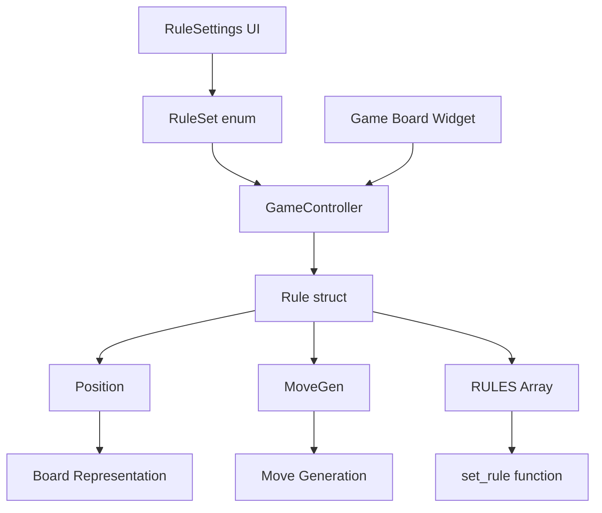

# Adding New Game Rules to Sanmill

## Overview

This guide demonstrates how to extend Sanmill with new game rule variants while maintaining optimal AI collaboration and semantic code organization. It serves as a comprehensive example of AI-friendly development practices for complex feature additions.

**Architecture Philosophy**: Sanmill uses a **configuration-based** approach for game rules, not inheritance-based. Rules are defined as data structures (`Rule` in C++, `RuleSettings` in Flutter) rather than class hierarchies.

## Table of Contents

- [Quick Start](#quick-start)
- [Architecture Overview](#architecture-overview)
- [Step-by-Step Implementation](#step-by-step-implementation)
- [AI Agent Collaboration](#ai-agent-collaboration)
- [Testing Strategy](#testing-strategy)
- [Documentation Requirements](#documentation-requirements)
- [Quality Assurance](#quality-assurance)
- [Examples](#examples)

## Quick Start

### For Human Developers
```bash
# 1. Use context optimizer for optimal AI assistance
python tools/context_optimizer.py \
    --task "add new game rule variant" \
    --target-file "src/rule.cpp" \
    --profile "deep"

# 2. Follow the generated context and this guide
# 3. Implement using semantic patterns described below
```

### For AI Agents
```json
{
  "task_type": "add_game_rule",
  "semantic_domain": "game_logic",
  "affected_components": ["Rule", "Position", "MoveValidator", "RuleSettings"],
  "context_profile": "deep",
  "required_expertise": ["cpp_specialist", "flutter_specialist", "tester"]
}
```

## Architecture Overview

### Semantic Domain Mapping

```
Game Rules Domain:
├── Core Abstractions
│   ├── Rule Structure (src/rule.h)
│   │   ├── Rule struct - Configuration data for game rules
│   │   ├── RULES[N_RULES] array - Predefined rule variants
│   │   └── set_rule(int ruleIdx) - Rule selection function
│   ├── Position Representation (src/position.h)
│   └── Move Validation (src/movegen.h)
├── Rule Implementations (src/rule.cpp)
│   ├── RULES[0] - Nine Men's Morris (default)
│   ├── RULES[1] - Twelve Men's Morris
│   ├── RULES[2] - Dooz
│   ├── ... (11 rule variants total)
│   └── [New Rule Variant] - Add as RULES[N]
├── UI Integration
│   ├── RuleSet Enum (lib/rule_settings/models/rule_settings.dart)
│   ├── RuleSettings Classes (lib/rule_settings/)
│   └── Rule Selection UI (lib/rule_settings/)
└── Testing Framework
    ├── Rule Unit Tests (tests/test_rule.cpp)
    ├── Integration Tests (tests/integration/)
    └── UI Tests (test/widget_tests/)
```

### Component Relationships



### Current Rule Architecture (C++)

The game engine uses a **struct-based configuration system**:

```cpp
// src/rule.h
struct Rule {
    char name[32];              // Rule name
    char description[512];      // Rule description
    int pieceCount;             // Number of pieces per player
    int flyPieceCount;          // Flying threshold
    int piecesAtLeastCount;     // Minimum pieces count
    bool hasDiagonalLines;      // Has diagonal lines
    // ... 30+ configuration parameters
};

constexpr auto N_RULES = 11;
extern const Rule RULES[N_RULES];   // Predefined rules array
extern Rule rule;                    // Currently active rule
extern bool set_rule(int ruleIdx);  // Rule selection function
```

### Current Rule Architecture (Flutter)

The Flutter UI uses an **enum-based rule selection system**:

```dart
// lib/rule_settings/models/rule_settings.dart
enum RuleSet {
  current,              // Current settings
  nineMensMorris,       // Nine Men's Morris
  twelveMensMorris,     // Twelve Men's Morris
  morabaraba,           // Morabaraba variant
  dooz,                 // Dooz variant
  laskerMorris,         // Lasker Morris
  oneTimeMill,          // One-time mill
  chamGonu,             // Cham Gonu (Korea)
  zhiQi,                // Zhi Qi (China)
  chengSanQi,           // Cheng San Qi (China)
  daSanQi,              // Da San Qi (China)
  mulMulan,             // Mul-Mulan (Indonesia)
  nerenchi,             // Nerenchi (Sri Lanka)
  elfilja,              // El Filja (Algeria)
}

class RuleSettings {
  final int piecesCount;
  final int flyPieceCount;
  final bool hasDiagonalLines;
  // ... 30+ configuration parameters
}

// Create configuration class for each rule set
class TwelveMensMorrisRuleSettings extends RuleSettings {
  const TwelveMensMorrisRuleSettings()
    : super(piecesCount: 12, hasDiagonalLines: true);
}
```

## Step-by-Step Implementation

### Phase 1: Core Rule Implementation (C++ Engine)

#### 1.1 Add Rule Configuration to Array

**Location**: `src/rule.cpp`
**Semantic Purpose**: Define new rule variant configuration

```cpp
// src/rule.cpp

// Example: Adding "Lasker Morris" variant
const Rule RULES[N_RULES] = {
    { /* Existing Rule 0: Nine Men's Morris */ },
    { /* Existing Rule 1: Twelve Men's Morris */ },
    { /* Existing Rule 2: Dooz */ },
    // ... other existing rules ...
    
    {                                        // New rule
     "Lasker Morris",                        // name
     "A variation by Emanuel Lasker with modified flying rules", // description
     10,                                     // pieceCount - 10 pieces per side
     3,                                      // flyPieceCount - fly when 3 pieces remain
     3,                                      // piecesAtLeastCount - minimum 3 pieces
     false,                                  // hasDiagonalLines - no diagonal lines
     MillFormationActionInPlacingPhase::removeOpponentsPieceFromBoard,
     // millFormationActionInPlacingPhase - remove opponent's piece when mill formed
     false,                                  // mayMoveInPlacingPhase - cannot move in placing
     false,                                  // isDefenderMoveFirst - defender doesn't move first
     false,                                  // mayRemoveMultiple - cannot remove multiple pieces
     false,                                  // restrictRepeatedMillsFormation - no restriction on repeated mills
     false,                                  // mayRemoveFromMillsAlways - cannot remove from mills freely
     false,                                  // oneTimeUseMill - mills not one-time use
     BoardFullAction::firstPlayerLose,       // boardFullAction - first player loses when board full
     StalemateAction::endWithStalemateLoss,  // stalemateAction - stalemate is loss
     kDefaultCaptureRuleConfig,              // custodianCapture - default custodian rules
     kDefaultCaptureRuleConfig,              // interventionCapture - default intervention rules
     kDefaultCaptureRuleConfig,              // leapCapture - default leap capture rules
     true,                                   // mayFly - flying allowed
     100,                                    // nMoveRule - 100 moves without capture is draw
     100,                                    // endgameNMoveRule - endgame 100 moves draw
     true},                                  // threefoldRepetitionRule - threefold repetition is draw
};
```

**Important**: 
- Update `N_RULES` constant in `src/rule.h` to reflect new count
- Array index becomes the rule identifier
- All parameters must be specified (no defaults)

#### 1.2 Update Rule Count

**Location**: `src/rule.h`
**Semantic Purpose**: Reflect new rule count

```cpp
// src/rule.h

// Update rule count (was 11, now 12 after adding one)
constexpr auto N_RULES = 12;  // Changed from 11 to 12
```

#### 1.3 Test Rule Loading

**Location**: Your test code or manual testing
**Semantic Purpose**: Verify rule loads correctly

```cpp
// Test code example
#include "rule.h"
#include <cassert>

void testLaskerMorrisRule() {
    // Assume Lasker Morris is RULES[11]
    bool success = set_rule(11);
    assert(success);
    
    // Verify rule parameters
    assert(rule.pieceCount == 10);
    assert(std::string(rule.name) == "Lasker Morris");
    assert(rule.hasDiagonalLines == false);
    assert(rule.mayFly == true);
}
```

#### 1.4 Update Position Initialization (if needed)

**Location**: `src/position.cpp`
**Semantic Purpose**: Handle rule-specific board setup

Most rule variants use the standard 24-square board. If your variant requires different board topology:

```cpp
// src/position.cpp

// Only modify if special board topology is needed
void Position::init() {
    // Most rule variants don't need to modify this function
    // Standard 24-point board applies to most variants
    
    // If special board is needed (e.g., 6-piece game uses 16-point board):
    if (rule.pieceCount == 6) {
        // Special initialization logic
        boardSize = 16;
        // ...
    }
}
```

### Phase 2: Flutter UI Integration

#### 2.1 Add RuleSet Enum Value

**Location**: `src/ui/flutter_app/lib/rule_settings/models/rule_settings.dart`
**Semantic Purpose**: Define UI-side rule identifier

```dart
// lib/rule_settings/models/rule_settings.dart

enum RuleSet {
  current,
  nineMensMorris,
  twelveMensMorris,
  morabaraba,
  dooz,
  laskerMorris,      // Already exists
  oneTimeMill,
  chamGonu,
  zhiQi,
  chengSanQi,
  daSanQi,
  mulMulan,
  nerenchi,
  elfilja,
  yourNewVariant,    // Add new variant
}
```

#### 2.2 Create RuleSettings Subclass

**Location**: `src/ui/flutter_app/lib/rule_settings/models/rule_settings.dart`
**Semantic Purpose**: Define UI configuration for new variant

```dart
// lib/rule_settings/models/rule_settings.dart

/// Your New Variant Rules
///
/// [Describe the rule's origin, characteristics, and references]
/// Reference: [link]
class YourNewVariantRuleSettings extends RuleSettings {
  const YourNewVariantRuleSettings()
    : super(
        piecesCount: 10,                    // Corresponds to C++ pieceCount
        flyPieceCount: 3,                   // Corresponds to C++ flyPieceCount
        piecesAtLeastCount: 3,              // Corresponds to C++ piecesAtLeastCount
        hasDiagonalLines: false,            // Corresponds to C++ hasDiagonalLines
        mayMoveInPlacingPhase: false,       // Corresponds to C++ mayMoveInPlacingPhase
        isDefenderMoveFirst: false,         // Corresponds to C++ isDefenderMoveFirst
        mayRemoveMultiple: false,           // Corresponds to C++ mayRemoveMultiple
        mayRemoveFromMillsAlways: false,    // Corresponds to C++ mayRemoveFromMillsAlways
        boardFullAction: BoardFullAction.firstPlayerLose,
        stalemateAction: StalemateAction.endWithStalemateLoss,
        mayFly: true,                       // Corresponds to C++ mayFly
        nMoveRule: 100,                     // Corresponds to C++ nMoveRule
        endgameNMoveRule: 100,              // Corresponds to C++ endgameNMoveRule
        threefoldRepetitionRule: true,      // Corresponds to C++ threefoldRepetitionRule
        millFormationActionInPlacingPhase:
            MillFormationActionInPlacingPhase.removeOpponentsPieceFromBoard,
        restrictRepeatedMillsFormation: false,
        oneTimeUseMill: false,
        // Capture rules (added in v6.8+)
        enableCustodianCapture: false,
        custodianCaptureOnSquareEdges: true,
        custodianCaptureOnCrossLines: true,
        custodianCaptureOnDiagonalLines: true,
        custodianCaptureInPlacingPhase: true,
        custodianCaptureInMovingPhase: true,
        custodianCaptureOnlyWhenOwnPiecesLeq3: false,
        enableInterventionCapture: false,
        interventionCaptureOnSquareEdges: true,
        interventionCaptureOnCrossLines: true,
        interventionCaptureOnDiagonalLines: true,
        interventionCaptureInPlacingPhase: true,
        interventionCaptureInMovingPhase: true,
        interventionCaptureOnlyWhenOwnPiecesLeq3: false,
        enableLeapCapture: false,
        leapCaptureOnSquareEdges: true,
        leapCaptureOnCrossLines: true,
        leapCaptureOnDiagonalLines: true,
        leapCaptureInPlacingPhase: true,
        leapCaptureInMovingPhase: true,
        leapCaptureOnlyWhenOwnPiecesLeq3: false,
      );
}
```

**Critical**: All parameters must exactly match the C++ `Rule` struct definition.

#### 2.3 Add to Rule Description and Properties Maps

**Location**: `src/ui/flutter_app/lib/rule_settings/models/rule_settings.dart`
**Semantic Purpose**: Enable UI display and selection

```dart
// lib/rule_settings/models/rule_settings.dart

/// Rule Set Descriptions
const Map<RuleSet, String> ruleSetDescriptions = <RuleSet, String>{
  RuleSet.current: 'Use the current game settings.',
  RuleSet.nineMensMorris: "Classic Nine Men's Morris game.",
  // ... other existing rules ...
  RuleSet.yourNewVariant: 'Your new variant description here.',  // Add this
};

/// Rule Set Properties
const Map<RuleSet, RuleSettings> ruleSetProperties = <RuleSet, RuleSettings>{
  RuleSet.current: RuleSettings(),
  RuleSet.nineMensMorris: NineMensMorrisRuleSettings(),
  // ... other existing rules ...
  RuleSet.yourNewVariant: YourNewVariantRuleSettings(),  // Add this
};
```

#### 2.4 Add Localized Strings

**Location**: `src/ui/flutter_app/lib/l10n/intl_en.arb`
**Semantic Purpose**: Provide user-facing text

```json
{
  "yourNewVariant": "Your New Variant",
  "@yourNewVariant": {
    "description": "Name of your new rule variant"
  }
}
```

For Chinese:
**Location**: `src/ui/flutter_app/lib/l10n/intl_zh_CN.arb`

```json
{
  "yourNewVariant": "Your New Variant (Chinese translation)"
}
```

Then run localization generation:
```bash
cd src/ui/flutter_app
flutter gen-l10n
```

#### 2.5 Engine Configuration Communication

**Location**: `src/ui/flutter_app/lib/game_page/services/engine/engine.dart`
**Semantic Purpose**: Send rule parameters to C++ engine

**Current Architecture**: The implementation uses **individual parameter transmission** rather than direct RULES array index mapping.

**How it works**:
1. User selects a `RuleSet` → corresponding `RuleSettings` saved to database
2. Engine calls `setRuleOptions()` → sends 20+ individual parameters to C++
3. C++ engine receives UCI options → updates global `rule` struct fields
4. No direct RULES array index selection needed

```dart
// lib/game_page/services/engine/engine.dart

Future<void> setRuleOptions() async {
  final RuleSettings ruleSettings = DB().ruleSettings;
  
  // Send individual parameters (20+ total)
  await _sendOptions("PiecesCount", ruleSettings.piecesCount);
  await _sendOptions("HasDiagonalLines", ruleSettings.hasDiagonalLines);
  await _sendOptions("FlyPieceCount", ruleSettings.flyPieceCount);
  await _sendOptions("MayFly", ruleSettings.mayFly);
  await _sendOptions("BoardFullAction", ruleSettings.boardFullAction?.index);
  // ... all other rule parameters
}
```

**Key Insight**: You don't manually map RuleSet to RULES array indices. The engine dynamically constructs rule configuration from individual parameters.

### Phase 3: Testing Implementation

#### 3.1 C++ Unit Tests

**Location**: `tests/test_rule.cpp`
**Semantic Purpose**: Validate rule configuration and behavior

```cpp
// tests/test_rule.cpp

#include "gtest/gtest.h"
#include "rule.h"

// Test loading new rule
TEST(RuleTest, LoadYourNewVariantRule) {
    const int newRuleIndex = 11;  // Assuming new rule is RULES[11]
    
    bool success = set_rule(newRuleIndex);
    ASSERT_TRUE(success) << "Failed to load new rule variant";
    
    // Verify rule parameters
    EXPECT_EQ(rule.pieceCount, 10);
    EXPECT_STREQ(rule.name, "Your New Variant");
    EXPECT_FALSE(rule.hasDiagonalLines);
    EXPECT_TRUE(rule.mayFly);
    EXPECT_EQ(rule.flyPieceCount, 3);
}

// Test rule array bounds
TEST(RuleTest, RuleArrayBounds) {
    // Test valid indices
    for (int i = 0; i < N_RULES; i++) {
        EXPECT_TRUE(set_rule(i)) << "Failed to load rule " << i;
    }
    
    // Test invalid indices
    EXPECT_FALSE(set_rule(-1)) << "Should reject negative index";
    EXPECT_FALSE(set_rule(N_RULES)) << "Should reject out-of-bounds index";
}

// Test rule-specific logic
TEST(RuleTest, YourNewVariantSpecificBehavior) {
    set_rule(11);  // Load new rule
    
    // Test rule-specific game logic
    // For example: piece count, flying rules, mill formation rules, etc.
    // These tests depend on your specific rule implementation
}
```

#### 3.2 Flutter Widget Tests

**Location**: `src/ui/flutter_app/test/rule_settings_test.dart`
**Semantic Purpose**: Test UI rule selection

```dart
// test/rule_settings_test.dart

import 'package:flutter_test/flutter_test.dart';
import 'package:sanmill/rule_settings/models/rule_settings.dart';

void main() {
  group('YourNewVariant RuleSettings', () {
    test('has correct configuration', () {
      const settings = YourNewVariantRuleSettings();
      
      expect(settings.piecesCount, equals(10));
      expect(settings.hasDiagonalLines, isFalse);
      expect(settings.mayFly, isTrue);
      expect(settings.flyPieceCount, equals(3));
    });
    
    test('is included in ruleSetProperties', () {
      expect(
        ruleSetProperties[RuleSet.yourNewVariant],
        isA<YourNewVariantRuleSettings>(),
      );
    });
    
    test('has description', () {
      expect(
        ruleSetDescriptions[RuleSet.yourNewVariant],
        isNotNull,
      );
    });
  });
}
```

#### 3.3 Integration Tests

**Location**: `src/ui/flutter_app/test/integration/rule_integration_test.dart`
**Semantic Purpose**: Test end-to-end rule selection flow

```dart
// test/integration/rule_integration_test.dart

import 'package:flutter_test/flutter_test.dart';
import 'package:integration_test/integration_test.dart';
import 'package:sanmill/main.dart' as app;

void main() {
  IntegrationTestWidgetsFlutterBinding.ensureInitialized();
  
  testWidgets('Select new rule variant and start game', (tester) async {
    app.main();
    await tester.pumpAndSettle();
    
    // Navigate to rule settings
    await tester.tap(find.text('Settings'));
    await tester.pumpAndSettle();
    
    await tester.tap(find.text('Rule Settings'));
    await tester.pumpAndSettle();
    
    // Select new rule
    await tester.tap(find.text('Your New Variant'));
    await tester.pumpAndSettle();
    
    // Go back and start game
    await tester.tap(find.byIcon(Icons.arrow_back));
    await tester.pumpAndSettle();
    
    await tester.tap(find.text('New Game'));
    await tester.pumpAndSettle();
    
    // Verify game uses new rule
    // (Specific verification depends on UI implementation)
  });
}
```

### Phase 4: Documentation Updates

#### 4.1 Update Knowledge Graph

**Location**: `docs/config/KNOWLEDGE_GRAPH.json`
**Semantic Purpose**: Register new rule variant

```json
{
  "entities": {
    "YourNewVariantRule": {
      "type": "data_structure",
      "category": "game_logic",
      "file": "src/rule.cpp",
      "description": "Rule configuration for Your New Variant",
      "array_index": 11,
      "responsibilities": [
        "Define piece count and board topology",
        "Specify mill formation behavior",
        "Configure win conditions"
      ],
      "dependencies": ["Rule", "Position", "set_rule"],
      "patterns": ["Configuration", "Data-Driven"],
      "related_docs": [
        "docs/guides/ADDING_NEW_GAME_RULES.md"
      ],
      "complexity": "low",
      "ai_importance": "medium"
    },
    "YourNewVariantRuleSettings": {
      "type": "class",
      "category": "ui_settings",
      "file": "src/ui/flutter_app/lib/rule_settings/models/rule_settings.dart",
      "description": "Flutter configuration for Your New Variant",
      "responsibilities": [
        "Mirror C++ Rule configuration",
        "Provide UI-side rule parameters",
        "Enable rule persistence"
      ],
      "dependencies": ["RuleSettings", "RuleSet"],
      "patterns": ["Value Object", "Data Transfer Object"],
      "related_docs": [
        "docs/guides/ADDING_NEW_GAME_RULES.md",
        "src/ui/flutter_app/docs/STATE_MANAGEMENT.md"
      ],
      "complexity": "low",
      "ai_importance": "medium"
    }
  }
}
```

#### 4.2 Update This Guide

Add your variant to the examples section with:
- Motivation for the variant
- Key rule differences
- Implementation challenges
- Testing insights
- Lessons learned

## AI Agent Collaboration Workflow

### Task Distribution

```yaml
orchestrator_plan:
  task: "Add New Game Rule Variant"
  
  phase_1_analysis:
    agent: architect
    deliverables:
      - Rule variant requirements analysis
      - Parameter mapping (C++ ↔ Flutter)
      - Array index allocation
      - Integration plan
    duration: "30 minutes"
  
  phase_2_implementation:
    parallel_tasks:
      cpp_implementation:
        agent: cpp_specialist
        deliverables:
          - Add rule to RULES[] array in src/rule.cpp
          - Update N_RULES in src/rule.h
          - Add C++ unit tests
        duration: "1 hour"
      
      flutter_implementation:
        agent: flutter_specialist
        deliverables:
          - Add RuleSet enum value
          - Create RuleSettings subclass
          - Update description/properties maps
          - Add localized strings
        duration: "1-2 hours"
  
  phase_3_integration:
    agent: integration_specialist
    deliverables:
      - Map RuleSet to C++ index
      - End-to-end testing
      - UI/Engine integration validation
    duration: "1 hour"
  
  phase_4_quality:
    agent: qa_specialist
    deliverables:
      - Code review
      - Test validation
      - Documentation updates
    duration: "30 minutes"
```

### Communication Protocol Example

```json
{
  "message_type": "task_handoff",
  "from": "architect",
  "to": "cpp_specialist",
  "task_context": {
    "primary_task": "Add rule configuration to RULES[] array",
    "specifications": {
      "rule_name": "Your New Variant",
      "array_index": 11,
      "piece_count": 10,
      "key_features": ["modified_flying", "standard_board"]
    },
    "integration_points": [
      "Update N_RULES constant to 12",
      "Ensure index 11 is used consistently",
      "Test with set_rule(11)"
    ],
    "quality_requirements": {
      "test_coverage": "Basic rule loading test",
      "documentation": "Inline comments for non-obvious parameters"
    }
  }
}
```

## Quality Assurance Checklist

### Code Quality
- [ ] C++ Rule struct properly initialized in RULES[] array
- [ ] N_RULES constant updated correctly
- [ ] Flutter RuleSettings class matches C++ Rule struct exactly
- [ ] All 30+ parameters specified (no defaults assumed)
- [ ] Includes comprehensive unit tests
- [ ] Passes all existing tests
- [ ] No performance regressions

### Integration Quality
- [ ] RuleSet enum value added
- [ ] Description and properties maps updated
- [ ] C++ index mapping correct
- [ ] Localized strings added (en + zh_CN at minimum)
- [ ] UI properly displays new rule variant
- [ ] Settings persist across app restarts
- [ ] Error handling for invalid rule index

### Documentation Quality
- [ ] Updated knowledge graph with new rule
- [ ] Added usage examples
- [ ] Documented parameter choices
- [ ] Updated this guide with lessons learned

### AI Collaboration Quality
- [ ] Clear semantic naming (rule name, class name)
- [ ] Proper component relationships documented
- [ ] Array index clearly documented
- [ ] Parameter mapping documented (C++ ↔ Flutter)

## Examples and Templates

### Example 1: Lasker Morris (Actual Implementation)

Lasker Morris is actually already implemented in the codebase as RULES[5]:

**C++ Side** (`src/rule.cpp`):
```cpp
const Rule RULES[N_RULES] = {
    // ... RULES[0-4]: other rules ...
    {                                        // RULES[5] - Lasker Morris
     "Lasker Morris",
     "Lasker Morris",
     10,    // pieceCount
     3,     // flyPieceCount
     3,     // piecesAtLeastCount
     false, // hasDiagonalLines
     MillFormationActionInPlacingPhase::removeOpponentsPieceFromBoard,
     true,  // mayMoveInPlacingPhase - key difference from standard rules
     false, // isDefenderMoveFirst
     false, // mayRemoveMultiple
     false, // restrictRepeatedMillsFormation
     false, // mayRemoveFromMillsAlways
     false, // oneTimeUseMill
     BoardFullAction::firstPlayerLose,
     StalemateAction::endWithStalemateLoss,
     kDefaultCaptureRuleConfig,  // custodianCapture
     kDefaultCaptureRuleConfig,  // interventionCapture
     kDefaultCaptureRuleConfig,  // leapCapture
     true,  // mayFly
     100,   // nMoveRule
     100,   // endgameNMoveRule
     true}, // threefoldRepetitionRule
    // ... more rules ...
};
```

**Flutter Side** (`lib/rule_settings/models/rule_settings.dart`):
```dart
enum RuleSet {
  // ... existing ...
  laskerMorris,  // Enum value
}

class LaskerMorrisSettings extends RuleSettings {
  const LaskerMorrisSettings()
    : super(
        piecesCount: 10,
        flyPieceCount: 3,
        mayMoveInPlacingPhase: true,  // Key difference from standard rules
        // ... other parameters matching C++ ...
      );
}

const Map<RuleSet, String> ruleSetDescriptions = {
  // ... existing ...
  RuleSet.laskerMorris: 'A variation introduced by Emanuel Lasker.',
};

const Map<RuleSet, RuleSettings> ruleSetProperties = {
  // ... existing ...
  RuleSet.laskerMorris: LaskerMorrisSettings(),
};
```

**Note**: No explicit index mapping needed. The Flutter app sends individual rule parameters to the engine through `setRuleOptions()`.

### Example 2: Simple 6 Men's Morris

If we were to add Six Men's Morris (simpler example):

**Key Differences**:
- 6 pieces per player (instead of 9)
- Smaller board (16 points instead of 24) - may need position.cpp changes
- No flying rule
- Simpler endgame

**C++ Side**:
```cpp
{
 "Six Men's Morris",
 "Simplified variant with 6 pieces on smaller board",
 6,     // pieceCount
 0,     // flyPieceCount - no flying in this variant
 3,     // piecesAtLeastCount
 false, // hasDiagonalLines
 MillFormationActionInPlacingPhase::removeOpponentsPieceFromBoard,
 false, // mayMoveInPlacingPhase
 false, // isDefenderMoveFirst
 false, // mayRemoveMultiple
 false, // restrictRepeatedMillsFormation
 false, // mayRemoveFromMillsAlways
 false, // oneTimeUseMill
 BoardFullAction::firstPlayerLose,
 StalemateAction::endWithStalemateLoss,
 kDefaultCaptureRuleConfig,
 kDefaultCaptureRuleConfig,
 kDefaultCaptureRuleConfig,
 false, // mayFly - flying not allowed
 50,    // nMoveRule - shorter draw rule
 50,    // endgameNMoveRule
 true}, // threefoldRepetitionRule
```

**Flutter Side**:
```dart
class SixMensMorrisRuleSettings extends RuleSettings {
  const SixMensMorrisRuleSettings()
    : super(
        piecesCount: 6,
        flyPieceCount: 0,     // No flying
        mayFly: false,        // Explicitly disable flying
        nMoveRule: 50,        // Shorter draw rule
        endgameNMoveRule: 50,
        // ... other standard parameters ...
      );
}
```

### Template: New Rule Variant Checklist

```markdown
## Adding [Variant Name]

### Pre-Implementation
- [ ] Identify unique rule parameters
- [ ] Determine array index (next available in RULES[])
- [ ] Document rule sources/references
- [ ] Map all 30+ Rule struct fields (including new capture rules added in v6.8+)
- [ ] Decide on capture rule settings (custodian, intervention, leap)

### C++ Implementation
- [ ] Add rule configuration to RULES[] array in src/rule.cpp
- [ ] Update N_RULES constant in src/rule.h (increment by 1)
- [ ] Add unit test in tests/test_rule.cpp
- [ ] Test with `set_rule(index)`
- [ ] Verify rule loads correctly
- [ ] (Optional) Update position.cpp if special board needed

### Flutter Implementation
- [ ] Add enum value to RuleSet
- [ ] Create RuleSettings subclass
- [ ] Update ruleSetDescriptions map
- [ ] Update ruleSetProperties map
- [ ] Add localized strings to all 60+ ARB files (intl_en.arb, intl_zh.arb, etc.)
- [ ] Run `flutter gen-l10n`
- [ ] Verify setRuleOptions() sends all parameters correctly (20+ parameters)
- [ ] Test capture rule integration if applicable
- [ ] Add widget tests

### Testing
- [ ] C++ unit tests pass
- [ ] Flutter widget tests pass
- [ ] Manual UI test: select rule from settings
- [ ] Manual UI test: start game with new rule
- [ ] Verify rule persists after app restart
- [ ] Integration test (optional but recommended)

### Documentation
- [ ] Update knowledge graph
- [ ] Add example to this guide
- [ ] Document any special considerations
- [ ] Note any UI implications

### Code Review
- [ ] Parameter consistency (C++ ↔ Flutter)
- [ ] Array index documented
- [ ] No magic numbers
- [ ] All tests passing
- [ ] Localization complete
```

## Troubleshooting

### Common Issues

#### Issue: Wrong piece count in UI
**Cause**: RuleSettings class doesn't match Rule struct
**Solution**: Verify `piecesCount` in Flutter matches `pieceCount` in C++

#### Issue: Rule doesn't load (set_rule returns false)
**Cause**: Invalid array index or N_RULES not updated
**Solution**: 
1. Check array index is within [0, N_RULES)
2. Verify N_RULES constant updated in rule.h
3. Rebuild C++ engine

#### Issue: Game crashes when selecting new rule
**Cause**: Missing parameters or incorrect parameter values in RuleSettings
**Solution**: Verify all parameters in RuleSettings subclass match C++ Rule struct exactly

#### Issue: UI shows old rule name
**Cause**: Localization not regenerated
**Solution**: Run `flutter gen-l10n` after updating ARB files

#### Issue: Rule parameters not saved
**Cause**: RuleSettings not in ruleSetProperties map
**Solution**: Add entry to `ruleSetProperties` map

#### Issue: Tests fail after adding rule
**Cause**: Tests may assume specific N_RULES count
**Solution**: Update test expectations to handle new rule count

### Debugging Tips

1. **Verify array index**: `set_rule(index)` should return true
2. **Check logs**: Look for rule loading messages in engine output
3. **Test incrementally**: Test C++ side first, then Flutter side
4. **Use assertions**: Add asserts in test code for parameter validation
5. **Compare with existing**: Look at similar existing rules (e.g., Twelve Men's Morris)

## Architecture Comparison: Configuration vs Inheritance

### Sanmill's Approach (Configuration-Based)

**Advantages**:
- ✅ Simple to add new rules (just add array entry)
- ✅ No code duplication
- ✅ Easy to serialize/persist
- ✅ Data-driven design
- ✅ Clear parameter visibility

**Trade-offs**:
- ⚠️ Limited runtime polymorphism
- ⚠️ All rules must fit same parameter set
- ⚠️ Complex rule logic handled elsewhere (movegen.cpp, search.cpp)

**Example**:
```cpp
// Configuration approach
const Rule RULES[] = {
    { "Nine Men's", 9, true, ... },
    { "Twelve Men's", 12, true, ... },
};

// Usage
set_rule(0);  // Load nine men's morris
```

### Alternative Approach (Inheritance-Based)

For reference, an inheritance-based design would look like:

```cpp
// NOT used in Sanmill, shown for comparison
class RuleEngine {
    virtual bool isValidMove() = 0;
    virtual GameResult evaluate() = 0;
};

class NineMensRuleEngine : public RuleEngine {
    bool isValidMove() override { /* implementation */ }
};

class TwelveMensRuleEngine : public RuleEngine {
    bool isValidMove() override { /* implementation */ }
};
```

**Why Sanmill doesn't use this**:
- Most mill variants differ only in parameters, not logic
- Configuration is simpler for AI agents to understand
- Easier to maintain consistency across variants
- Data-driven approach aligns with AI-friendly development

---

**Version**: 2.0.0  
**Maintainer**: Sanmill Context Engineering Team  
**Related**: [AI_FRIENDLY_DEVELOPMENT.md](../AI_FRIENDLY_DEVELOPMENT.md), [ARCHITECTURE.md](../../ui/flutter_app/docs/ARCHITECTURE.md)
